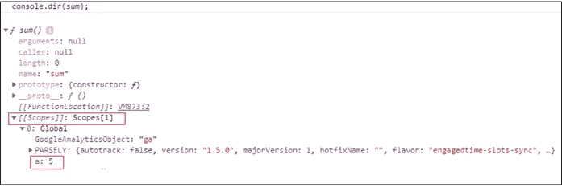
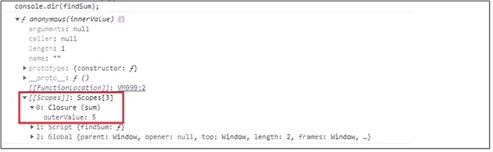

# JavaScript 中的闭包和词法范围

> 原文：<https://javascript.plainenglish.io/closures-and-lexical-scoping-in-javascript-9ebe8d353662?source=collection_archive---------9----------------------->


Photo by [Markus Spiske](https://unsplash.com/@markusspiske?utm_source=medium&utm_medium=referral) on [Unsplash](https://unsplash.com?utm_source=medium&utm_medium=referral)

JavaScript 中的变量有两种作用域，即局部和全局作用域。如果任何变量是在函数内部声明的，那么它就是局部变量，如果变量是在函数外部声明的，那么它就是全局变量。变量的范围由它们在代码中的位置定义。

# 词汇范围

JavaScript 遵循函数的词法范围。词法作用域意味着任何子作用域都可以访问父作用域中定义的变量，即内部函数可以访问全局变量。

```
var a = 5;function sum() {
  return a + 6;
}console.log(sum()); // 11
```

在上面的例子中，函数`sum()`使用全局变量`"a"`来执行加法。这意味着变量`"a"`在`sum()`的范围内。

# 关闭

```
var a = 5;function sum() {
  return a + 6;
}console.log(sum()); // 11
```

闭包是一个可以访问父作用域变量的函数。上面的函数可以访问全局变量`“a”`，所以它是一个闭包。

如果你要做`console.dir(sum)`，那么你可以在`[[scopes]]`属性中看到全局变量`“a”`的存在。这意味着函数`sum()`可以访问变量`“a”`。查看下面的片段。



jscurious.com

现在让我们看另一个关于内部函数的闭包的例子。

```
function sum(outerValue) {
  return function(innerValue) {
      return outerValue + innerValue;
  }
}const findSum = sum(5);console.log(findSum(10)); // 15
```

当你调用`sum(5)`时，它返回一个保存变量`outerValue`的函数。所以当你调用`findSum(10)`的时候，它把`outerValue`的值和`innerValue`的值相加。

即使在外部函数关闭后，内部函数仍保持`outerValue`，这称为关闭。如果你会做`console.dir(findSum)`，你可以在`[[scopes]]`属性里面看到，`outerValue`是存在的。这意味着内部函数可以访问变量`outerValue`。



jscurious.com

所以下次如果有人问你 JavaScript 中的闭包，你知道该怎么回答。

# 你可能也喜欢

*   如何在 JavaScript 中处理不可变数据
*   [JavaScript 中的 call()、apply()和 bind()是什么](https://jscurious.com/what-are-call-apply-and-bind-in-javascript/)
*   [JavaScript 中的 ES6 析构赋值是什么](https://jscurious.com/es6-destructuring-assignment/)

*感谢您的宝贵时间* ☺️
欲了解更多网络开发博客，请访问[jscurious.com](http://jscurious.com/)