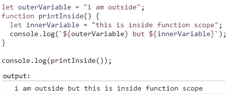
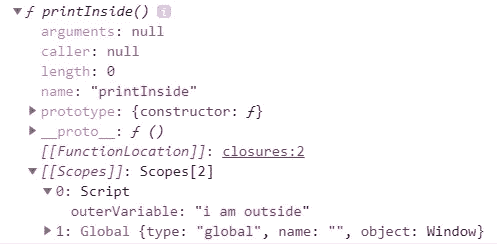
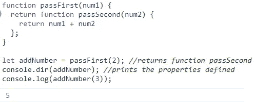
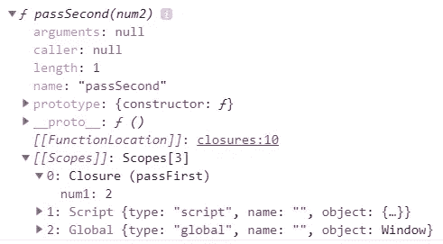
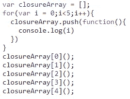
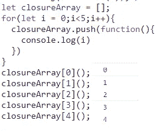
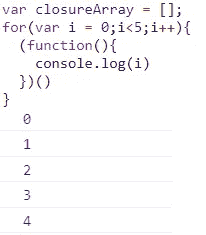

# 让我们来理解 JavaScript 中的“闭包”

> 原文：<https://javascript.plainenglish.io/closures-in-javascript-a2adada10cf1?source=collection_archive---------0----------------------->

Photo by [Pankaj Patel](https://unsplash.com/@pankajpatel?utm_source=medium&utm_medium=referral) on [Unsplash](https://unsplash.com?utm_source=medium&utm_medium=referral)

如果你曾经参加过 JavaScript 面试，那么你很可能会被问到，什么是**闭包**。

根据 Mozilla:*闭包*是一个函数和声明该函数的词法环境的组合。

* *在我们开始讨论闭包之前，让我们看看词法范围。*

JavaScript 遵循词法作用域，这意味着子块可以访问其父块甚至父块中声明的所有变量。

understanding lexical scope

上面的例子是为了让你熟悉词法范围是如何工作的。

但是首先，让我们看看函数的性质。我们之所以能够做到这一点，是因为在 JS 中，就连函数也被视为对象。我们可以使用 *console.dir* ()方法来显示属性。

Looking at the function properties

正如我们所看到的，“ *printInside* ”函数持有对“ *outerVariable* ”的引用，该变量是在 *printInside 的*函数范围之外声明的。

这就是*闭包*的一般含义，函数保存对所有属性的引用，这些属性在其父作用域中声明，但稍后将由函数本身使用。

让我们看一个传统的*闭包*例子，其中一个函数返回另一个函数，而不是一个值或对象:

A simple ***Closure***

让我们看看 *addNumber* 函数的属性:

addNumber properties

我们可以看到， *addNumber* 实际上指向了 *passSecond* 函数。 *passSecond* 函数保存了对参数“ *num1* ”的引用，即使它没有在其函数范围内声明。我们应该记住，函数将只保存那些在父类中定义的属性的引用，这些引用将被函数本身使用。

现在你已经基本了解了*闭包*是如何工作的，让我们看看*闭包*的另一个例子:

sample code

如果你认为输出是 0，1，2，3，4，再想想我解释的闭包。闭包不保存变量的值，而是保存对变量的引用。因此，如果我们要分析循环，在循环结束时" **i"** 的值为 5，它才能退出循环。所以 **i** 的最后一个引用会指向值 5。这就是每次函数调用都会打印 5 的原因。

那么我们实际上如何更新函数以获得期望的输出呢，简单的方法是使用**let(ES6**中引入的**)**而不是 **var** ，因为 **let** 提供了一个块范围。

updated code

如果您仍然想使用 **var** 方法，我们可以通过将代码改为**life**(立即调用函数表达式)来实现相同的输出。这将帮助我们创建一个块范围。

using **IIFE**

**闭包**是 JavaScript 的一个核心概念，理解它的工作原理可以帮助你写出更好的代码。我希望通过这些例子，你能够更好地理解 c *losures* 的世界。

*更多内容请看*[*plain English . io*](http://plainenglish.io/)*。报名参加我们的* [*免费周报*](http://newsletter.plainenglish.io/) *。在我们的* [*社区*](https://discord.gg/GtDtUAvyhW) *获得独家的写作机会和建议。*