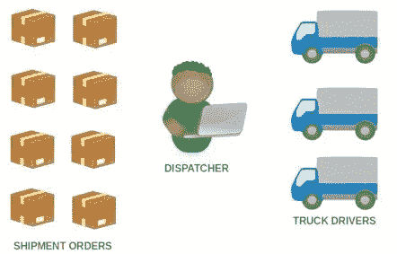
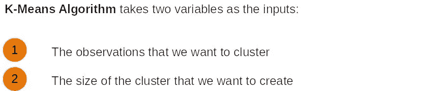
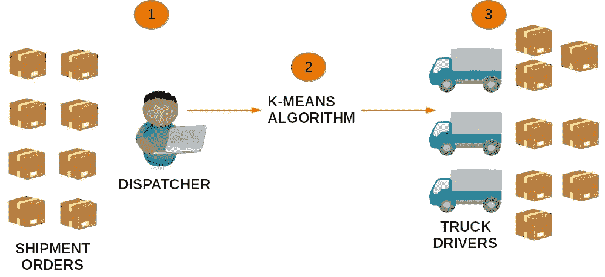
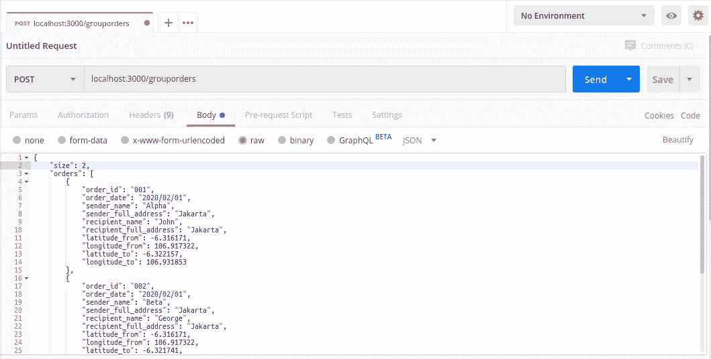
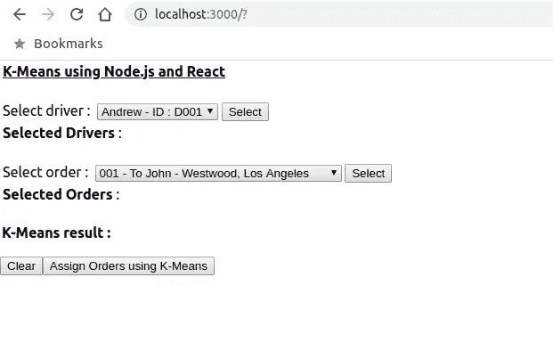
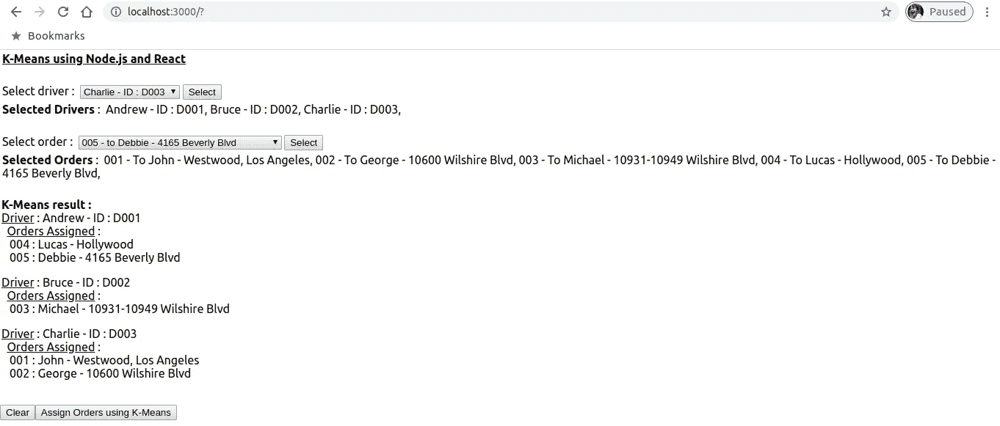

# Node.js + React 中使用 K-Means 算法对基于位置的数据进行聚类

> 原文：<https://javascript.plainenglish.io/cluster-location-based-data-using-k-means-algorithm-in-node-js-and-react-d92fc425dc55?source=collection_archive---------2----------------------->

## 地面运输管理实例实用指南


Picture by [Aksonsat Uanthoeng](https://www.pexels.com/id-id/@aksonsat-uanthoeng-393797?utm_content=attributionCopyText&utm_medium=referral&utm_source=pexels) from [Pexels](https://www.pexels.com/id-id/foto/bayangan-berbayang-berfokus-berkonsentrasi-1078850/?utm_content=attributionCopyText&utm_medium=referral&utm_source=pexels)

# 订单分配问题

我的客户经营一家地面运输公司，该公司从客户的仓库接收货运订单，用卡车将货物运送到目的地。每天，调度员必须给司机分配装运订单。首先，他必须仔细地将订单分组到相邻的目的地。然后，他将分组后的订单分配给司机，以便司机只交付彼此距离较近的订单。



Dispatcher assigns orders to drivers

当调度员必须处理大量的装运订单时，这就成了一个问题。手动将订单分组并逐个分配给司机会非常复杂。

# k-均值算法

K-Means 算法是一种聚类算法，用于将大量观察值划分为聚类，其中每个观察值属于具有最近均值的聚类。这个算法如何工作的细节是[这里是](https://en.wikipedia.org/wiki/K-means_clustering)。

K-means 以**两个变量**作为输入。第一个变量是我们想要聚集的观察值。第二个变量是集群的大小，也就是我们想要创建的集群的数量。



Inputs for K-Means Algorithm

# k-表示使用 node-kmeans 在 Node.js 中实现

我们将使用 Node.js 构建一个 API REST 服务器，并使用 K-Means 算法创建一个函数来对我们的观察值进行聚类。我们可以使用一个名为 **node-kmeans** 的库。你可以在这里了解更多关于库[的信息。](https://www.npmjs.com/package/node-kmeans)

在我们的例子中，调度员必须安排的装运订单包含目的地的经度**和纬度**信息。我们将把这一信息视为第一个变量。调度员必须将装运订单分配给的司机数量是我们的第二个变量。****

因此，如果有八个有三个司机的装运订单，那么订单中的**经度和纬度将是观察值**(第一个变量)**，而**司机的数量**将是聚类的大小**(第二个变量)**。**

K-Means 将订单分为三组。每个组可能包含不同数量的订单，但我们可以确定同一组中订单的目的地位置彼此接近。



Illustration of clustering orders using K-Means Algorithm. **Step 1** : Dispatcher selects orders that he wants to ship. **Step 2** : K-Means Algorithm clusters the orders based on longitude and latitude of destination of the orders. **Step 3** : Orders are assigned to the drivers. The orders assigned to a driver are close to each other.

# 我们要建造什么

我们将创建两个应用程序:

*   **Node.js API 服务器**。这个 API 服务器将包含实现 K-Means 算法**的函数。**
*   **React web 应用**。这将是我们发送装运订单和驱动程序的用户界面

## 我们开始吧

首先，为我们的 Node.js API 服务器创建一个名为`api`的空文件夹。在`api`文件夹中，创建一个`package.json`文件，如下所示:

File: package.json

在`api`文件夹中，使用**命令提示符** 或**终端**键入以下内容:

```
npm install
```

它会将所有需要的依赖项安装到`node_modules`文件夹中。在`api`文件夹中，创建如下三个文件`server.js, index.js,`和`apis.js` :

File: server.js

File: index.js

File: apis.js

`Server.js`是我们的基础文件，`index.js`和`apis.js`分别是我们注册函数和函数实现的文件。

## 创建一个测试函数

我们在`apis.js` 中创建一个测试函数叫做`groupOrders` *。*这是一个简单的函数，用于测试我们的 K-Means 算法，以了解**节点 kmeans** 如何工作以及输出会是什么样子。它将`orders`变量(**作为我们的观测值**)和`size`变量(**作为聚类的大小**)作为输入。这些变量采用 JSON 格式，如下例所示:

File: orders_and_size.json

`order_id, order_date, sender_name, sender_full_address, recipient_name, recipient_full_address`是订单发送方和接收方的基本信息。包含要发送的项目的数组。`Longitude_from`和`latitude_from`是起点仓库的坐标，而`longitude_to` 和`latitude_to`是订单目的地的坐标。

为了测试我们的功能，我们可以使用像 **Postman** 这样的工具作为我们 API 服务器的客户端。你可以在这里免费下载**邮差**[。接下来，我们需要运行 Node.js API 服务器。在`api`文件夹中，在**命令提示符**或**终端中，键入**如下 **:**](https://www.postman.com/downloads/)

```
node server.js
```

我们的 API 服务器现在运行在端口 1338 上。使用 **Postman** ，创建一个新的 API 调用`groupOrders`函数，如下图:



Call the *groupOrders* function using Postman

使用 **Postman** 调用函数的步骤如下:

1.  创建新请求。
2.  选择**发布**作为方法。
3.  在地址字段中，键入[http://localhost:1338/group orders](http://localhost:3000/grouporders)
4.  选择**正文**并选择 **raw** 开始创建正文消息。
5.  选择 **JSON** 作为正文消息的格式。
6.  将 **orders_and_size.json** 复制粘贴到正文内容中。
7.  点击**发送**按钮，向`groupOrders`功能发送请求。

我们的 API 调用的输出如下所示:

```
[ 
 {
   “centroid”: [
        106.924981,
        -6.3214015
   ],
   “cluster”: [
        [
          106.92533,
          -6.321741
        ],
        [
          106.924632,
          -6.321062
        ]
   ],
   “clusterInd”: [
          1,
          2
   ]
 },
 {
   “centroid”: [
        106.931853,
        -6.322157
   ],
   “cluster”: [
        [
          106.931853,
          -6.322157
        ]
   ],
   “clusterInd”: [
        0
   ]
 }
]
```

如果我们查看上面的输出，我们会看到**节点——k means**创建了两个集群——由两个**质心值——T33 表示，因为我们的`size`输入是 2。质心是位于聚类中心的数据点。第一个群包含由“clusterInd 1 和 2”指示的订单“002”和订单“003”。第二个群集仅包含单个订单“001”。**

在接下来的部分中，我们将创建我们的主函数和用户界面应用程序来访问我们的 API 服务器。

## 创建主要功能

让我们通过添加一个名为`assignDrivers`的新函数来修改`apis.js`文件，如下所示:

File: modified_apis.js

`assignDrivers`函数是我们的主要函数，它将使用 K-Means 算法对订单进行聚类，然后将订单自动分配给司机。

该函数将两个变量作为输入。第一个变量是`orders` ，与`groupOrders`函数中的格式相同。第二个变量是`drivers`，它包含来自所有驱动程序的信息。以下是以 JSON 格式发送给`assignDrivers`函数的数据示例:

File: orders_and_drivers.json

不要忘记修改`index.js`以注册`assignDrivers`功能，如下所示:

File: modified_index.js

添加函数后，让我们重启 Node.js 服务器。

## 创建用户界面应用程序

我们将创建一个简单的 web 应用程序，使用 React 作为用户界面来访问 Node.js 服务器。

使用**命令提示符**或**终端**，键入如下内容:

```
npx create-react-app ui
```

它将在`ui`文件夹中创建一个新的 React 应用程序。现在，让我们创建一个简单的用户界面来输入订单和司机的名字。将`ui` 文件夹中的`App.js` *修改如下:*

File: App.js

使用`ui`文件夹中的**命令提示符**或**终端**，如下运行应用程序:

```
npm start
```

浏览器中的应用程序现在将如下所示:



K-Means User Interface Application using React

作为我们的示例，我们创建了五个装运订单，并将订单分配给三个司机:**安德鲁**、**布鲁斯**和**查理**。首先，我们从下拉列表中选择驱动程序和订单。接下来，我们单击`Assign Orders using K-Means`按钮，该按钮将调用 Node.js 服务器中的`assignDrivers`函数。我们将得到如下输出:



K-Means output with all orders assigned to drivers

> **注**:五个出货订单位于**洛杉矶**，其中三个订单前往**西林区**，另外两个订单前往**好莱坞区**。我们假设所有订单都来自同一个来源；洛杉矶国际机场。

您可以看到，现在所有订单都根据相邻的目的地进行分组，并分配给我们的三个司机。您可以随时更改订单和驱动程序，以查看它如何更改驱动程序的分配。

# 结论

作为一个结论，K-Means 是一个基于质心的聚类算法，使我们能够解决司机分配问题，因为我们有以上。该算法简化了调度员的工作，尤其是在处理大量装运订单时。应用程序的源代码可在[这里](https://github.com/nadinugraha/k-means)获得。欢迎大家修改。

# **用简单英语写的便条**

你知道我们有四份出版物和一个 YouTube 频道吗？你可以在我们的主页[**plain English . io**](https://plainenglish.io/)找到所有这些——关注我们的出版物并 [**订阅我们的 YouTube 频道**](https://www.youtube.com/channel/UCtipWUghju290NWcn8jhyAw) **来表达你的爱吧！**