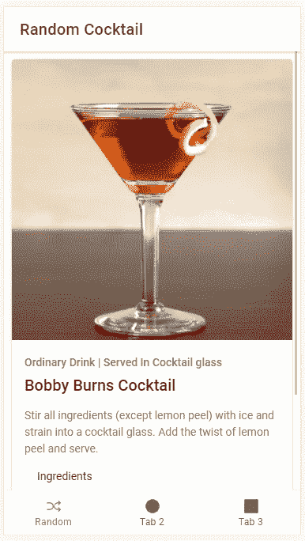
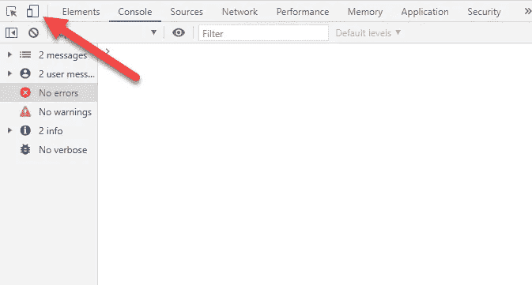
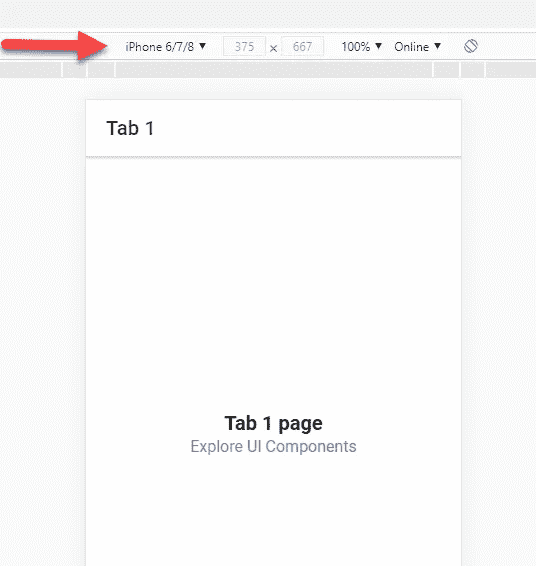

# 带 Ionic 和 Vue 3 的鸡尾酒配方移动应用

> 原文：<https://javascript.plainenglish.io/cocktail-recipe-mobile-app-with-ionic-and-vue-3-4a28986453f6?source=collection_archive---------14----------------------->

## 第 1 部分—应用程序设置和随机鸡尾酒标签


Image by [bridgesward](https://pixabay.com/users/bridgesward-6083077/?utm_source=link-attribution&utm_medium=referral&utm_campaign=image&utm_content=2578446) from [Pixabay](https://pixabay.com/?utm_source=link-attribution&utm_medium=referral&utm_campaign=image&utm_content=2578446)

几周前，Ionic 的团队宣布他们已经完成了与 T2 VueJs 的整合。如果你不熟悉 Ionic，它是一个框架，允许你用自己喜欢的 Javascript 框架/库(Angular、React 或 Vue)编写移动应用。现在，它不是一个原生的移动应用程序，但它允许您访问原生的功能，如 GPS、相机、联系人等。

Ionic 通过将你的应用程序包装在网络视图中来实现这一切。虽然它为快速编写跨平台应用程序提供了许多好处，但它的性能不如本机或其他跨平台应用程序( [React Native](https://reactnative.dev/) 和 [Flutter](https://flutter.dev/) )。也就是说，除非你正在创建一个比 [CRUD 操作](https://en.wikipedia.org/wiki/Create,_read,_update_and_delete)多得多或者有很多动画的尖端应用，否则这已经足够了。

# 演示

在我们开始之前，让我们看一下第 1 部分的演示。



Ionic Cocktail App Demo

# 项目设置

## 安装 Ionic CLI

我们要做的第一件事是安装[ion CLI](https://ionicframework.com/docs/cli)。为此，请打开终端并运行以下命令:

```
npm install -g @ionic/cli
```

## 创建应用程序

现在我们已经安装了 CLI，我们可以创建我们的应用程序。我们将通过运行以下命令来使用内置的选项卡模板:

```
ionic start ionic_cocktails_app tabs
```

然后选择以下选项:

1.  框架: **Vue**
2.  创建免费的离子帐户？:**由你决定**

## 启动应用程序

现在我们已经创建了我们的应用程序，在您最喜欢的代码编辑器中打开它(我将使用 [VS 代码](https://code.visualstudio.com/))。然后在根目录中打开一个终端(在 VS 代码中:Terminal = > New terminal)并运行以下命令:

```
ionic serve
```

这将启动一个新的浏览器窗口(我用的是 chrome)。要使浏览器看起来像电话，按 F12 启动开发工具，并点击设备切换按钮。



Chrome Dev Tools — Device Toggle

在浏览器顶部，选择您选择的电话。我将使用 iPhone 6/7/8，但你可以使用你喜欢的任何东西。您也可以点按“编辑”来添加其他设备的屏幕尺寸。



Chrome Dev Tools — Device Dropdown

# 应用程序接口


TheCocktailDB

为了让鸡尾酒进入我们的应用程序，我们将使用 [TheCocktailDB](https://www.thecocktaildb.com) API。这是一个免费的 API，有一些非常有用的端点。当用户启动应用程序时，我们将调用[随机鸡尾酒端点](https://www.thecocktaildb.com/api/json/v1/1/random.php)。我们还将有一个选项卡，允许用户使用[搜索端点](https://www.thecocktaildb.com/api/json/v1/1/search.php?s=margarita)按名称搜索鸡尾酒，另一个选项卡使用[按成分搜索端点](https://www.thecocktaildb.com/api/json/v1/1/filter.php?i=Gin)按成分浏览。

# 编写应用程序

## 选项卡 1 —随机鸡尾酒

**标签图标** 如上所述，我们 app 的登陆页面会向用户显示一个随机的鸡尾酒。我们要做的第一件事是更新第一个选项卡底部的图标和标题。为此，打开 src/views/Tabs.vue。在第一个选项卡中，我们将用随机图标替换图标，并将标题替换为随机。

首先，我们需要从 ionicons/icons 导入它。因为我们不再使用三角形，所以我们将用 shuffle 替换它:

```
*import* { ellipse, square, **shuffle** } *from* 'ionicons/icons';
```

然后在设置调用中替换 triangle it:

```
*setup*() {
 *return* {
  ellipse,
  square,
  **shuffle,**
 }
}
```

最后，替换图标并更改选项卡本身的标题:

```
<ion-tab-button *tab*="tab1" *href*="/tabs/tab1">
 <ion-icon **:*icon*="shuffle"**></ion-icon>
 <ion-label>**Random**</ion-label>
</ion-tab-button>
```

**随机鸡尾酒方法** 现在我们可以开始查看了。为了保持我们的状态，我们将从 Vue 导入 reactive 并创建一个状态对象。在状态对象内部，我们将保存一个用于加载的道具和另一个用于随机混合的道具。

```
*//top of script tag
import* { reactive } *from* "vue";//in setup
const *state* = *reactive*({
 *randomCocktail*:{},
 *loading*: *false*,
});
```

为了调用 API，我们将使用 [Axios](https://github.com/axios/axios) 。要安装它，请打开一个新的终端，并运行以下命令:

```
npm install axios
```

现在我们已经安装了 Axios，我们可以创建一个名为 *fetchRandomCocktail* 的新方法。因为我们将在初始页面加载时显示加载器，而不是在刷新时显示，所以我们将向该方法传递一个布尔值来控制它。在设置方法中添加以下内容:

```
*//top of script tag
import* { axios } *from* "axios";//in setup
const *fetchRandomCocktail* = *async* (*displayLoaderPage*: *boolean*)=>{
 if(*displayLoaderPage*){
  *state.loading* = *true*;
} const *res* = *await axios.get*(
  "https://www.thecocktaildb.com/api/json/v1/1/random.php"
 ); if(*res.data*){
  *state.randomCocktail* = *res.data?.drinks*[0];
 } *state.loading* = *false*;

};
```

既然我们已经有了 *fetchRandomCocktail* 方法，让我们创建另一个名为 *doRefresh* 的方法，用于我们拉取刷新。尽管我从文档中提取了代码，但还是有一个 Typescript 错误，所以我只是隐藏了它。

```
const *doRefresh* =(*event*: *CustomEvent*)=>{
 *fetchRandomCocktail*(*false*);
 // *eslint-disable-next-line @typescript-eslint/ban-ts-ignore* //*@ts-ignore
 event.target?.complete*();
};
```

我们在设置中要做的最后一件事是调用*fetchRandomCocktail*(true)并返回模板的设置数据。

**模板** 在模板标签中，我们将所有的饮料数据显示在一张卡片中。我们将有一个饮料，标题和类别的图像。在所有这些下面，我们将展示说明和配料。

*注意:您将看到 API 返回 15 种饮料成分和测量值，不管它是否为空。所以，我选择在模板上添加一个 v-if。这确实增加了模板的体积，但是我觉得遍历所有的属性有点麻烦。让我知道你的想法。

为了展示一切，我们将进口和使用大量的离子成分。我可以在模板中描述我们将要做的每一件小事，但是我会让代码自己说话。最终，您完成的文件应该如下所示:

# 视频教程

Video Tutorial

# 结论

因此，概括地说，我们已经为开发设置好了我们的应用程序，我们已经开发了用户将登陆的随机鸡尾酒页面。在[第 2 部分](https://diligentdev.medium.com/cocktail-recipe-mobile-app-with-ionic-and-vue-3-8a06008d4a13)中，我们将通过鸡尾酒名称和鸡尾酒成分页面连接我们的搜索。如果您有任何问题、意见或顾虑，请告诉我。下次再见，祝编码愉快！