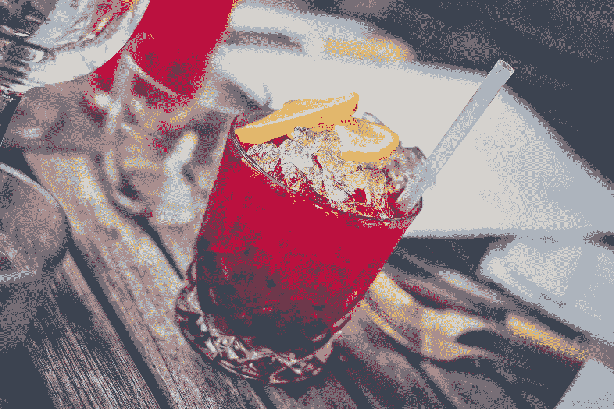
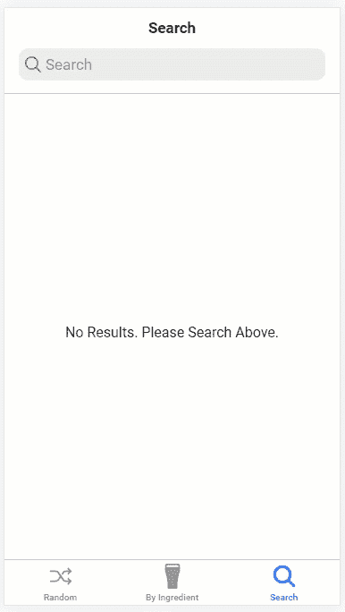

# 带 Ionic 和 Vue 3 的鸡尾酒配方移动应用

> 原文：<https://javascript.plainenglish.io/cocktail-recipe-mobile-app-with-ionic-and-vue-3-62015dfb61d6?source=collection_archive---------10----------------------->

## 第 3 部分—饮料搜索



Image by [Pexels](https://pixabay.com/users/pexels-2286921/?utm_source=link-attribution&utm_medium=referral&utm_campaign=image&utm_content=1853327) from [Pixabay](https://pixabay.com/?utm_source=link-attribution&utm_medium=referral&utm_campaign=image&utm_content=1853327)

在本系列的第 1 部分中，我们设置了应用程序并实现了随机鸡尾酒标签。在第 2 部分中，我们设置了按成分搜索选项卡和页面。在本教程中，我们将实现一个自由形式的搜索标签，以便用户可以按名称搜索饮料。



Tab 3 Demo

# 选项卡图标和名称

我们要做的第一件事是改变标签图标和名称。为此，请转到 src/views/Tabs.vue。用搜索图标替换导入中的方形图标，在设置方法中返回它，然后在模板中替换它，同时更改选项卡名称。

```
*//script
import* { **search**, square, shuffle } *from* 'ionicons/icons';*setup*() {
 *return* {
  **search,**
  square,
  shuffle,
 }
}//template
<ion-tab-button *tab*="tab2" *href*="/tabs/tab2">
 <ion-icon :*icon*="**search**" />
 <ion-label>**Search**</ion-label>
</ion-tab-button>
```

# 搜索

要搜索一种饮料，我们可以使用 [TheCocktailDB](https://www.thecocktaildb.com/api.php) API 搜索端点(https://www.thecocktaildb.com/api/json/v1/1/search.php？s =玛格丽塔)。要实现这一点，请访问 src/views/Tab3.vue。

正如我们对其他视图所做的一样，我们将删除 *< ion-content >* 标签内的所有内容，并在脚本标签的顶部添加以下导入:

```
*import* { reactive } *from* "vue";
*import* axios *from* "axios";
*import* DrinkCard *from* "@/components/DrinkCard.vue";
```

## 连接

接下来，我们要添加一个类型安全接口。由于我们的接口将与 src/views/Drink.vue 中的接口完全相同，因此将其抽象是有意义的。

在 src 中添加一个名为 interfaces 的新文件夹。在该文件夹中创建一个名为 IDrinkDetails.ts 的文件，然后复制 Drink.vue 中的饮料接口并粘贴到那里。我们还会将名称重构为 IDrinkDetails。

```
interface IDrinkDetails {
 idDrink: string;
 strDrink: string;
 strDrinkAlternate: string;
 strDrinkES: string;
 strDrinkDE: string;
 strDrinkFR: string;
 "strDrinkZH-HANS": string;
 "strDrinkZH-HANT": string;
 strTags: string;
 strVideo: string;
 strCategory: string;
 strIBA: string;
 strAlcoholic: string;
 strGlass: string;
 strInstructions: string;
 strInstructionsES: string;
 strInstructionsDE: string;
 strInstructionsFR: string;
 "strInstructionsZH-HANS": string;
 "strInstructionsZH-HANT": string;
 strDrinkThumb: string;
 strIngredient1: string;
 strIngredient2: string;
 strIngredient3: string;
 strIngredient4: string;
 strIngredient5: string;
 strIngredient6: string;
 strIngredient7: string;
 strIngredient8: string;
 strIngredient9: string;
 strIngredient10: string;
 strIngredient11: string;
 strIngredient12: string;
 strIngredient13: string;
 strIngredient14: string;
 strIngredient15: string;
 strMeasure1: string;
 strMeasure2: string;
 strMeasure3: string;
 strMeasure4: string;
 strMeasure5: string;
 strMeasure6: string;
 strMeasure7: string;
 strMeasure8: string;
 strMeasure9: string;
 strMeasure10: string;
 strMeasure11: string;
 strMeasure12: string;
 strMeasure13: string;
 strMeasure14: string;
 strMeasure15: string;
 strCreativeCommonsConfirmed: string;
 dateModified: string;
}*export* *default* IDrinkDetails;
```

**Drink.vue** 然后在 Drink.vue 导入界面上方的脚本标签并更新状态:

```
*import* IDrinkDetails *from* '../interfaces/IDrinkDetails'const *state* = *reactive*({
 *drink*:{} *as* **IDrinkDetails**,
 *loading*: *false*,
});
```

## 表 3

回到 Tab3.vue，我们还将导入接口:

```
*import* IDrinkDetails *from* '../interfaces/IDrinkDetails'
```

现在，我们将在 export default 中添加一个设置方法，并将我们的状态放入其中:

```
*setup*() {
 const *state* = *reactive*({
  *searchResults*: *[] as IDrinkDetails[]*,
  *loading*: *false*,
 });
}
```

接下来，我们将实现我们的搜索方法:

```
const *fetchSearchResults* = *async* (searchTerm: string)=>{
 *state.loading* = *true*; if(*searchTerm*){
  *state.searchResults* =[]; const *res* = *await axios.get*(
   `*https://www.thecocktaildb.com/api/json/v1/1/search.php?s=*${*searchTerm*}`
); if(*res.data*){
   *state.searchResults* = *res.data?.drinks*;
  }
 } *state.loading* = *false*;
};
```

我们在设置方法中要做的最后一件事是将状态和 *fetchSearchResults* 返回到模板:

```
*return* {
 state,
 fetchSearchResults,
};
```

在模板中，我们将添加一个 *ion-searchbar，以便*用户可以搜索饮料。搜索栏将触发我们的 change 和 debounce 方法，这样我们就不会不必要地调用 API。

当 API 获取结果时，我们将显示一个加载器。如果我们有搜索结果，我们将做一个 v-for 循环遍历我们的搜索结果，并显示每个结果的饮料卡。如果我们没有结果，我们将显示一条消息说明这一点。

最后，您的文件应该如下所示:

Tab3.vue

# 视频教程

Video Tutorial

# 包裹

这将为我们的 Ionic 框架和 Vue 鸡尾酒配方应用程序提供支持。概括地说，我们有 3 个选项卡。在[第 1 部分](https://medium.com/javascript-in-plain-english/cocktail-recipe-mobile-app-with-ionic-and-vue-3-4a28986453f6)中，我们建立了我们的项目和随机鸡尾酒应用程序。在[第 2 部分](https://medium.com/javascript-in-plain-english/cocktail-recipe-mobile-app-with-ionic-and-vue-3-8a06008d4a13)中，我们实现了按成分标签的搜索。这里，我们实现了我们的搜索选项卡。

现在，你可以对这个应用程序进行许多改进，我会把这些留给你。在[勤奋开发 YouTube 频道](https://www.youtube.com/channel/UCLrTZVMYP_VsEyzxTAMcIcQ)，我将拍摄第四个重构视频。所以，去那边看看。下次再见，祝编码愉快！