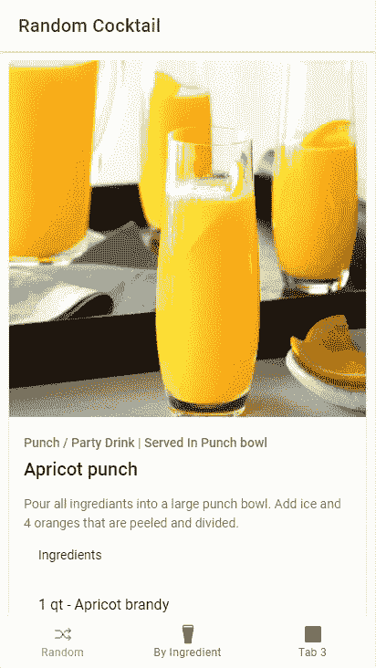

# 带 Ionic 和 Vue 3 的鸡尾酒配方移动应用

> 原文：<https://javascript.plainenglish.io/cocktail-recipe-mobile-app-with-ionic-and-vue-3-8a06008d4a13?source=collection_archive---------8----------------------->

## 第 2 部分—按配料标签搜索


Image by [Free-Photos](https://pixabay.com/photos/?utm_source=link-attribution&utm_medium=referral&utm_campaign=image&utm_content=1149171) from [Pixabay](https://pixabay.com/?utm_source=link-attribution&utm_medium=referral&utm_campaign=image&utm_content=1149171)

在[第 1 部分](https://medium.com/javascript-in-plain-english/cocktail-recipe-mobile-app-with-ionic-and-vue-3-4a28986453f6)中，我们设置了我们的应用程序，并完成了我们的第一个选项卡，当应用程序加载时，它会加载一个随机鸡尾酒。现在，我们将使用按成分搜索的功能。当用户点击“按成分搜索”标签时，我们将加载一个成分列表。当他们点击一种成分时，我们将显示含有该成分的饮料列表。最后，如果他们点击一种饮料，我们将显示该饮料的详细信息。



Search By Ingredient Demo

# 选项卡图标和名称

我们要做的第一件事是改变标签图标和名称。为此，请转到 src/views/Tabs.vue。用 pint 图标替换导入中的椭圆图标，在 setup 方法中返回它，然后在模板中替换它，同时更改选项卡名称。

```
*//script
import* { **pint** , square, shuffle } *from* 'ionicons/icons';*setup*() {
 *return* {
  **pint,**
  square,
  shuffle,
 }
}//template
<ion-tab-button *tab*="tab2" *href*="/tabs/tab2">
 <ion-icon :*icon*="**pint**" />
 <ion-label>**By Ingredient**</ion-label>
</ion-tab-button>
```

# 配料清单

为了获得配料列表，我们将使用配料列表端点(【https://www.thecocktaildb.com/api/json/v1/1/list.php?i=list】[)。要实现这一点，请访问 src/views/Tab2。我们需要在脚本标签的顶部从 vue 和 axios 导入 reactive:](https://www.thecocktaildb.com/api/json/v1/1/list.php?i=list)

```
*import* {reactive} *from* "vue";
import axios from "axios"
```

为了将用户从我们的配料列表导航到包含该配料的饮料页面，我们还需要在脚本标记的顶部导入路由器:

```
*import* { useRouter } *from* 'vue-router';
```

接下来，我们将在新的导入下为 API 结果添加一个接口:

```
interface Ingredient {
 strIngredient1: string;
}
```

然后，我们将添加路由器和一些状态:

```
const *router* = *useRouter*();const *state* = *reactive*({
 *lstIngredients*: [] *as Ingredient*[],
 l*oading*: *false* });
```

接下来，我们将在设置中创建一个方法，并使用 axios 来获取我们的配料列表。API 没有按字母顺序显示我们的结果。因此，如果我们得到一个成功的响应，我们将对结果进行排序。

```
const *fetchIngredients* = *async* ()=>{
 *state.loading* = *true*;
 const *res* = *await axios.get*(
  "https://www.thecocktaildb.com/api/json/v1/1/list.php?i=list"
 ); if(*res.data*){
  *state.lstIngredients* = *res.data?.drinks*;
  *state.lstIngredients.sort*(function(*a*, *b*){
   *return a.strIngredient1.localeCompare*(*b.strIngredient1*);
  });
} *state.loading* = *false*;
};
```

为了获得每种成分的图像，我们将创建另一种方法，因为我们需要进行一些数据操作:

```
const *ingredientImage* =(*ingredient*: *string*)=>{
 *return* `*https://www.thecocktaildb.com/images/ingredients/*${*encodeURI*(
   *ingredient* )}*-Small.png*`;
};
```

在 setup 方法中，我们需要做的最后一件事是调用 fetchIngredients 方法并返回模板的所有内容:

```
*fetchIngredients*();*return* {
 router,
 state,
 ingredientImage,
};
```

在模板中，我们将根据我们的装载状态显示一个装载器或我们的配料列表。当有人点击某个配料时，我们会将他们重定向到我们即将创建的页面。最终文件应该是这样的:

# 按成分分类的饮料

接下来，我们需要根据配料视图制作饮料。这将非常类似于我们的 Tab2 页面。它将由包含用户在 Tab2 上选择的成分的饮料离子列表组成。

要创建这个页面，请转到 src/views 并创建一个名为 DrinksByIngredient.vue 的新文件。确保在脚本标签中设置 lang="ts "。

## 路由器

现在，我们将前往 src/router/index.ts。在路由器内部，我们将按成分视图为我们的饮料创建一条新路线。注意，我们向我们的路线添加了一个*:成分*参数，这样我们就可以将它传递到我们的新视图中。

```
{
 *path*:'/drinks-by-ingredient/:ingredient',
 *component*:()=>import('@/views/DrinksByIngredient.vue')
}
```

## 视角

现在回到我们新创建的视图，在脚本标签的顶部导入以下内容:

```
*import* { reactive } *from* "vue";
*import* { useRoute, useRouter } *from* "vue-router";
*import* axios *from* "axios";
```

接下来，我们将创建一个接口，用于我们将从饮料成分 API 调用中获取的结果:

```
interface Drink {
 strDrink: string;
 strDrinkThumb: string;
 idDrink: string;
}
```

在脚本标签 export default 中，创建 setup 方法来保存我们的逻辑。我们要做的第一件事是通过调用从 vue 导入的 useRoute 方法来访问路由。有了路线后，我们就可以拿到选定的配料:

```
const *router* = *useRouter*();
const *route* = *useRoute*();
const *ingredient* = *route.params.ingredient as string*;
```

然后，我们将创建状态来保存数据:

```
const *state* = *reactive*({
 *lstDrinks*:[] *as Drink*[],
 *loading*: *false*,
});
```

接下来，我们将创建一个方法来调用 API 并获取我们的饮料:

```
const *fetchDrinksByIngredients* = *async* (*ingredient*: *string*)=>{
 *state.loading* = *true*;
 const *res* = *await axios.get*(
  `*https://www.thecocktaildb.com/api/json/v1/1/filter.php
   i=*${*encodeURI*(*ingredient*)}`
 ); if(*res.data*){
  *state.lstDrinks* = *res.data?.drinks*;
 }

 *state.loading* = *false*;
};
```

我们要做的最后一件事是在加载时调用我们的方法，并返回我们的路由器、成分和状态，以便模板可以访问它:

```
*fetchDrinksByIngredients*(ingredient);*return* {
 router
 ingredient,
 state,
};
```

在模板中，我们将根据加载状态显示加载程序或内容。我们还将为每种饮料准备一份*离子清单*和一个*离子项目*。每个项目都有一个图像和饮料的名称。我们将在标题中添加一个后退按钮用于导航。当有人点击饮料时，我们会将他们发送到我们将在下一步创建的饮料页面。

您的已完成饮料 bing redient 视图将如下所示:

# 饮料景观

我们需要的最后一件事是当有人点击特定饮料时的饮料视图。因此，转到 src/views 并创建一个名为 Drink.vue 的新文件。确保在脚本标签中设置 lang="ts "。

## 路由器

接下来，我们需要将这个视图添加到路由器中。回到 src/router/index.ts 并添加以下路由:

```
{
 *path*:'/drink/:id',
 *component*:()=>import('@/views/Drink.vue')
}
```

## 饮料景观

现在回到我们的饮料视图，我们将导入一些依赖项，我们将在脚本标签的顶部使用:

```
*import* { reactive } *from* "vue";
*import* { useRoute } *from* "vue-router";
*import* axios *from* "axios";
```

我们还将创建一个用于 API 调用的接口:

```
interface Drink {
 idDrink: string;
 strDrink: string;
 strDrinkAlternate: string;
 strDrinkES: string;
 strDrinkDE: string;
 strDrinkFR: string;
 "strDrinkZH-HANS": string;
 "strDrinkZH-HANT": string;
 strTags: string;
 strVideo: string;
 strCategory: string;
 strIBA: string;
 strAlcoholic: string;
 strGlass: string;
 strInstructions: string;
 strInstructionsES: string;
 strInstructionsDE: string;
 strInstructionsFR: string;
 "strInstructionsZH-HANS": string;
 "strInstructionsZH-HANT": string;
 strDrinkThumb: string;
 strIngredient1: string;
 strIngredient2: string;
 strIngredient3: string;
 strIngredient4: string;
 strIngredient5: string;
 strIngredient6: string;
 strIngredient7: string;
 strIngredient8: string;
 strIngredient9: string;
 strIngredient10: string;
 strIngredient11: string;
 strIngredient12: string;
 strIngredient13: string;
 strIngredient14: string;
 strIngredient15: string;
 strMeasure1: string;
 strMeasure2: string;
 strMeasure3: string;
 strMeasure4: string;
 strMeasure5: string;
 strMeasure6: string;
 strMeasure7: string;
 strMeasure8: string;
 strMeasure9: string;
 strMeasure10: string;
 strMeasure11: string;
 strMeasure12: string;
 strMeasure13: string;
 strMeasure14: string;
 strMeasure15: string;
 strCreativeCommonsConfirmed: string;
 dateModified: string;
}
```

现在，在我们的设置文件中，我们将使用导入的 getRoute 获取路由，并获得路由的 id:

```
const *route* = *useRoute*();
const *drinkId* = *route.params.id as string*;
```

然后，我们将添加我们的状态:

```
const *state* = *reactive*({
 *drink*:{} *as Drink*,
 *loading*: *false*,
});
```

接下来，我们将创建一个方法，通过 id 获取饮料:

```
const *fetchDrinkById* = *async* (*drinkId*: *string*)=>{
 *state.loading* = *true*;

 const *res* = *await axios.get*(
 `*https://www.thecocktaildb.com/api/json/v1/1/lookup.phpi=*${*drinkId}*`); if(*res.data*){
  *state.drink* = *res.data?.drinks*[0];
 }

 *state.loading* = *false*;
};
```

最后，我们将在页面加载时调用我们的方法，并将我们的状态返回给模板:

```
*fetchDrinkById*(drinkId);*return* {
 state,
};
```

# 饮料卡组件

由于显示饮料的卡片与我们在 Tab1 中使用的卡片完全相同，我们将把它重构为一个组件。为此，请转到 src/components 并创建一个名为 DrinkCard.vue 的新文件，然后将 Tab1 中离子卡内的所有内容复制并粘贴到新创建文件的模板中。

在脚本标签 export default 中，添加一个名为 drink 的新道具，并将其类型设置为 Object。你还需要导入相应的离子成分。完成后，您的文件应该如下所示:

DrinkCard.vue

# 表 1 视图

回到 Tab1，您需要导入 DrinkCard 组件，并在模板中用它替换该卡。确保将 state.randomCocktail 作为 DrinkCard 上的饮料道具进行传递。您的文件应该如下所示:

Tab1.vue

# 饮料景观

现在回到饮料选项卡，我们需要做的就是导入 DrinkCard 并传递我们的 state.drink 作为它的饮料道具。您的最终文件应该如下所示:

Drink.vue

# 视频教程

Video Tutorial

# 结论

在第 1 部分中，我们完成了随机鸡尾酒标签。现在，我们刚刚完成了“饮料成分”选项卡。在第三部分中，我们将实现一个自由形式的搜索来包装我们的应用。所以，一定要关注我，当那篇文章掉下来的时候你会收到通知。