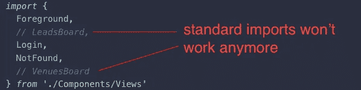
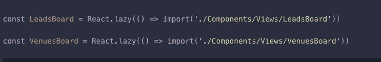
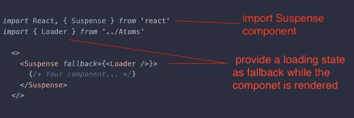
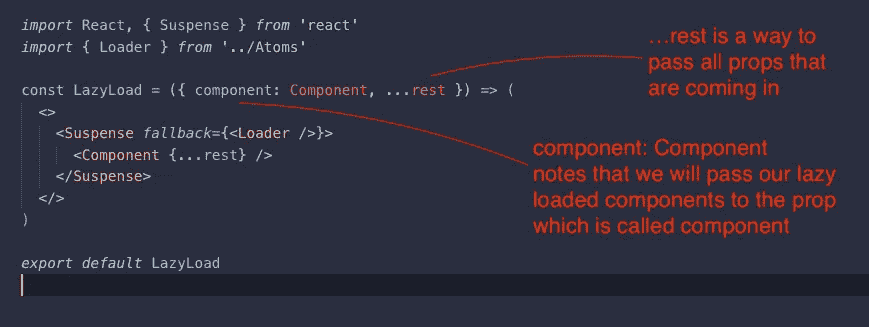
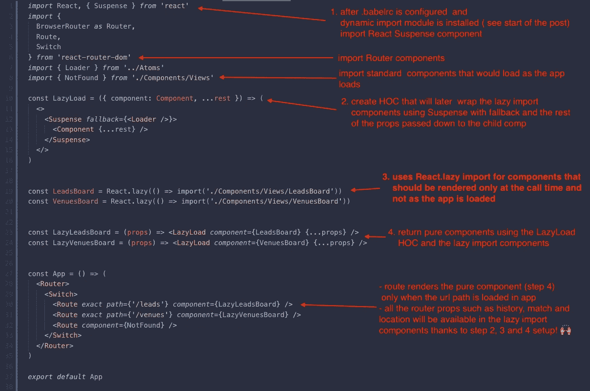

# 高效加载的代码分割:如何通过 HOC 使用 React 惰性导入和暂停

> 原文：<https://javascript.plainenglish.io/code-splitting-for-efficient-loading-how-to-use-react-lazy-imports-suspense-and-hoc-fabc8fb6525a?source=collection_archive---------0----------------------->

如果只需要加载一半的代码就能获得完整的用户体验(例如，应用程序服务于不同类型的用户路径:租房者和贷款者)，那么 React 惰性加载可能会很有用。下面是如何让它工作。

首先，您需要通过安装依赖项将动态导入添加到 React 项目中:

**纱加**[**@ babel/plugin-syntax-dynamic-imp**](http://twitter.com/babel/plugin-syntax-dynamic-imp)**ort**

或者

**npm 安装**[**@ babel/plugin-syntax-dynamic-imp**](http://twitter.com/babel/plugin-syntax-dynamic-imp)ort

然后你会想要添加插件扩展到**。babelrc** 文件— babel 插件设置数组:

**in .babelrc:** after installing dynamic imports, add the dynamic imports plugin to babel plugins array

接下来，让我们取消组件的标准导入的注释，只有当它们被显式“触发”时，我们才希望加载它们——例如，Route 在我们更改到确切路径(url 地址更改)时加载组件，而不是在整个应用程序加载时。

**in App.jsx:** preparing to import the components using lazy loading

我们将使用 React.lazy 导入组件，而不是 stands import:

**in App.jsx:** import components using React.lazy

以这种方式导入的组件需要使用 React 的**暂记组件**进行渲染，并提供回退道具。当内容完全加载时，回退控制显示:

**in HOC/LazyLoad.jsx:** wrap your lazy loaded component with react Suspense component and fallback prop

我们将创建一个更高阶的组件，这样该组件只有在被显式调用时才会被加载。将提供回退，以及传递给惰性导入组件的其余属性:

**in HOC/LazyLoad.jsx:** create the higher order comp. using the component prop pattern and pass all the props to the child (the lazy import component)

我们将使用我们创建的 LazyLoad HOC 来包装 lazy import 组件，并将所有的道具传递给它们。这是为了在以后的布线中维护组件属性模式，您将在后面看到):

1\. these components we imported earlier will need to be passed as component prop (see example below)

2\. then create pure functions for lazy imported components

我们创建了纯组件，它将所有的道具传递给懒惰导入组件的暂停渲染。现在，它们已经准备好按照相同的组件属性模式在路由器中进行设置。因此，到最后，我们的惰性导入、特设悬念渲染和路由的设置应该如下所示:

How to be lazy in 4 steps

希望你觉得这很有用。下次见！