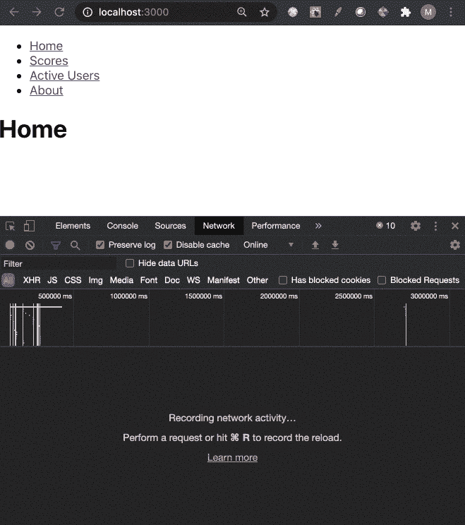

# 带悬念的 React 应用中的代码拆分

> 原文：<https://javascript.plainenglish.io/code-splitting-in-react-apps-with-suspense-2a6e780b703b?source=collection_archive---------13----------------------->

## 保持应用程序包较小的简单方法。


Photo by [Oscar Nord](https://unsplash.com/@furbee?utm_source=unsplash&utm_medium=referral&utm_content=creditCopyText) on [Unsplash](https://unsplash.com/s/photos/code-suspense?utm_source=unsplash&utm_medium=referral&utm_content=creditCopyText)

在本文中，我将演示如何使用 React 的悬念，向您展示实现代码分割是多么简单，并有助于保持您的整体包大小尽可能小。

# 为什么要进行代码分解？

如果你使用 *webpack* 来构建你的 React 应用，默认情况下 React 应用会创建 React 应用，那么它会在构建过程中将你的代码捆绑在一起。

随着应用程序的增长，您需要注意这个包的大小，尤其是在您添加外部库时。否则，随着包大小的增加，应用程序的初始加载会花费很长时间。

这就是代码拆分真正派上用场的地方。一旦实现 *webpack* 会自动将你的代码分割成更小的包。

很难确切地知道从哪里开始拆分代码，但是有一些合理的方法可以做到这一点。一个好的方法是在应用程序中为每条路线拆分。因此，您可以按照应用程序路由器中声明的每个路由来拆分这个包。

# 让我们构建一个示例应用程序

现在我们知道了为什么代码分割对开发有益，让我们直接开始构建一个例子。我们将一步一步来，并随时查看 [Github](https://github.com/mbrown3321/react-suspense-demo) 中完整的示例代码。

我们需要使用 Create React App 创建一个新的应用程序，并安装 React Router 来处理我们的演示应用程序中的路由。

```
npx create-react-app react-suspense-demo
cd react-suspense-demo
npm install react-router-dom
```

下一步，我们将为我们的路线创建一些组件。这些看起来都差不多。只是我们在下一步为应用程序创建的每条路线的占位符。

我们已经为应用程序的路线准备好了组件。我们已经将应用程序分为单独的部分:分数、主页、关于和活跃用户。

我们现在准备更新我们的 *App.js* 文件。接下来让我们看看这段代码。

所以让我们一步一步来。首先，我们用 *React.lazy.* 加载在上一步中创建的组件

这个 lazy 加载这些组件的代码。这意味着组件的 JavaScript 在被请求之前不会被加载，而不是预先加载。

使用悬念的另一部分是在每条路线中，我们将每个组件包装在一个*悬念*组件中。

我们为每个内容提供了一个 *fallback* 属性，它将一直显示到惰性加载的内容加载完毕。这使得在加载时提供加载消息或 spinner 变得很容易。

这就是我们完成演示应用程序所需的全部内容。现在让我们来看看我们的实际工作。



Screenshot by the author

您可以从屏幕记录中看到，或者如果您正在本地运行代码，当我们切换路由时，会有为每个路由加载不同包的请求。

这表明我们的悬疑代码完全按照我们的想法进行，并将代码分成多个包，而不是一个必须预先加载的大包。

*本文到此结束。我希望这能让你更好地理解 React 的悬疑，以及为什么你应该战略性地使用它。在*[](https://github.com/mbrown3321/react-suspense-demo)**上找到完整的代码示例。谢谢！**

*喜欢这篇文章吗？如果是这样，通过 [**订阅我们的 YouTube 频道**](https://www.youtube.com/channel/UCtipWUghju290NWcn8jhyAw) **获得更多类似的内容吧！***