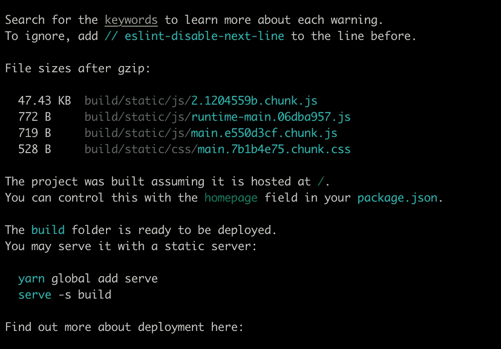
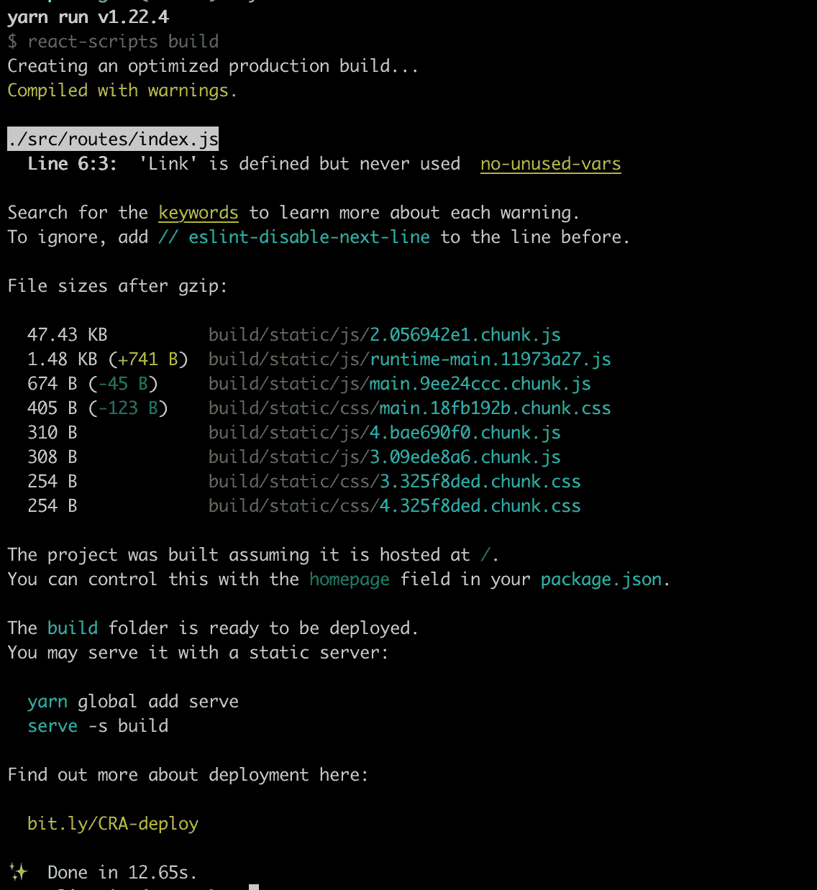

# 使用 React 进行代码拆分

> 原文：<https://javascript.plainenglish.io/code-splitting-with-react-31d76d3f64ab?source=collection_archive---------0----------------------->

## 用最少的努力提高您的 SPA 的性能

web 应用程序的性能很大程度上取决于它生成的包的大小。如果 React 应用程序的加载时间太长，这篇文章可能会对你有所帮助。

source: Giphy

# 什么是捆绑？

当用户试图访问您的 React 应用程序时，服务器会向他们的浏览器推送一个巨大的 JavaScript 文件。这个 JavaScript 文件包含了让您的 web 应用程序工作所需的所有代码。它包括您编写的代码，也包括您的项目使用的第三方库中的代码。这个文件被称为**包**。

有几个工具可以为您创建包。这种工具被称为捆扎机。一些流行的打包工具有 Webpack、Browserify、Rollup 等。任何用`create-react-app`构建的 React 应用都使用 Webpack 进行捆绑。

# 为什么我们需要捆绑包？

这些包最初是为了优化下载多个文件所需的 HTTP 请求数量而创建的。然而，捆绑器不仅仅将代码存放在一个文件中。此外，他们还转换代码，使浏览器能够运行您的应用程序，就像它是使用原始 JavaScript 编写的一样。

束和包的方式，让我们现在谈论代码分割和懒惰加载。

# 代码分割和延迟加载

随着产品中代码的增加，包的大小也会增加。较大的包需要较长的时间来下载，从而导致较差的用户体验和沮丧的用户。

代码分割是 bundler 的一个特性，它将你的代码分割成不同的更小的包文件。这些包文件只有在需要时才会被调用。这种在需要的时候加载项目的方法被称为延迟加载。

React 使用动态导入实现模块的延迟加载。按照惯例，当我们用 React 导入一个模块时，该模块会被立即添加和绑定。使用动态导入，当遇到导入语句时，执行代码拆分。

对于用`create-react-app`构建的应用，Webpack 支持开箱即用的代码拆分。

虽然动态导入触发了拆分，但是有一种不同的方法来拆分和延迟加载模块。

上面第`12`行的代码缓慢地导入了`Home`组件。懒惰成分应该存在于`Suspense`内部

悬念有一个属性`fallback`，这个属性取一个分量作为它的值。这是在加载惰性模块时呈现的。在上面的例子中，当`Home`组件将被加载时，用户将被显示为“正在加载…”

必须注意，到目前为止，只有**默认导入**可以被延迟加载。如果您想延迟加载一个命名导入，您将必须创建一个模块来导入命名实体，然后将它作为缺省值重新导出。

多个惰性组件可以放置在单个悬念之间。下面是一个路由惰性导入的例子。

当我们使用 npm 或 yarn 构建应用程序时，没有延迟加载，

带有惰性导入的相同项目

希望有所帮助:)