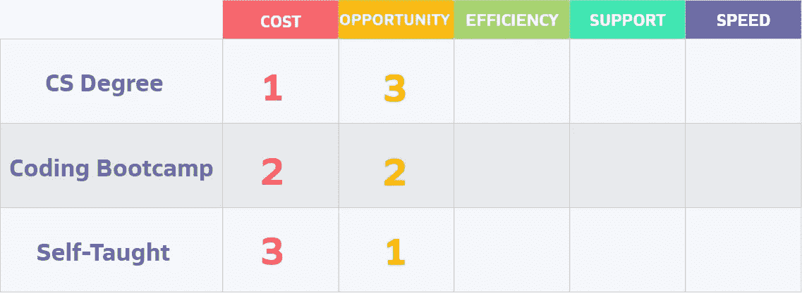
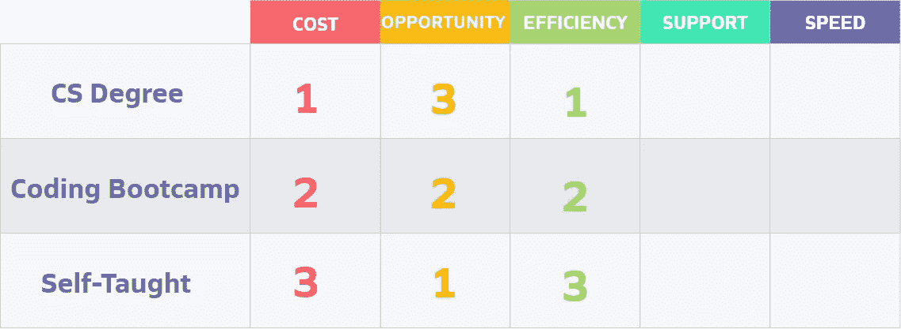
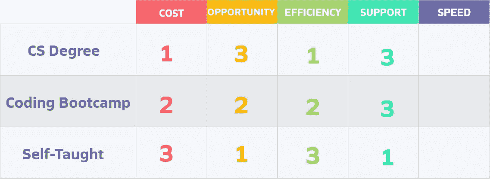
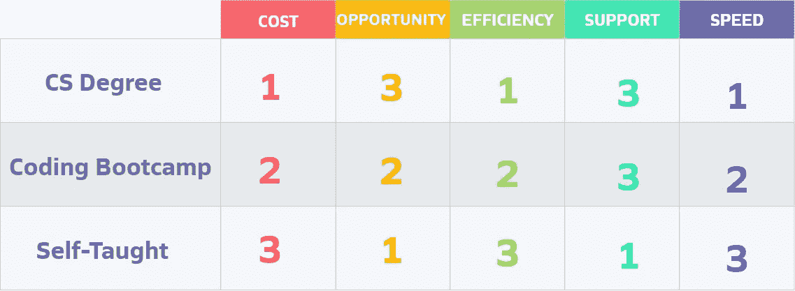
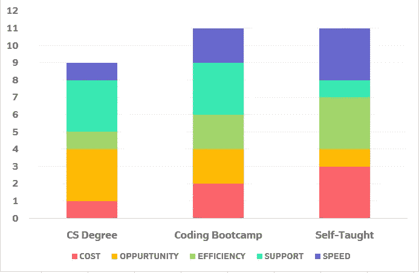

# 编码训练营与计算机学位和自学:哪一个最适合你

> 原文：<https://javascript.plainenglish.io/coding-bootcamp-vs-computer-science-degree-vs-self-taught-developer-ab7b31d58842?source=collection_archive---------16----------------------->

## 帮助您找到学习编码方法的全面指南

Photo by [ThisisEngineering RAEng](https://unsplash.com/@thisisengineering?utm_source=unsplash&utm_medium=referral&utm_content=creditCopyText) on [Unsplash](https://unsplash.com/s/photos/coding?utm_source=unsplash&utm_medium=referral&utm_content=creditCopyText)

# **简介**

你想学习如何编码吗？但是你不知道这几种方式哪一种才是适合你的？继续读下去。我抓住你了！

想要学习如何编码，基本上有 **3 种可能性**可供选择:攻读**计算机科学学位**，成为**自学软件工程师**，或者参加**编码训练营。**

我决定根据 **5 个不同的标准**来比较这些选项:*成本*、*机会、*、*支持、*和*速度。*我将为不同参数的三条路径中的每一条分配一个从 1 到 3 的分数(1 为最差，3 为最佳)。

这篇分析的主要目的是帮助你找到学习如何编码的之路，并最终成为一名合格的软件工程师。

免责声明:这个建议完全是我的，不代表该出版物的观点。

# 1.费用

第一个标准是**成本**。你要花多少钱？我们大概都同意，在这种情况下，最好的选择是**自考**路径(3 分)，最贵的是**计算机科学学位** (1 分)。

有了大量的免费资源，你实际上可以免费学习如何编码。无论如何，我都建议在网上学习平台上购买一些课程，比如 Udemy 的课程、Edx.org 的课程、Coursera.org 的课程，因为这些课程可以给你一个很好的结构，以及你应该遵循的道路。

这里的**编码训练营**得了 2 分，因为它不像自学途径那么便宜，也不像上大学那么贵。美国的[全日制编码训练营](https://www.coursereport.com/reports/coding-bootcamp-market-size-research-2019)平均费用**13584 美元，学费从 7800 美元到 21000 美元不等。**

**大学的费用甚至更高，在 T2，公立大学的平均总费用是州内 25290 美元，州外 40940 美元。私立学校的总费用平均为 50，900 美元。**

**然而，请注意，还有许多其他因素需要考虑。关于大学费用，有可能获得奖学金。而如果在欧洲留学，大部分大学都是免费的。训练营也更容易进入，因为其中一些有延期学费或提供 isa。**

**再一次，通过这个分析，我不想宣布一个赢家，而是帮助你思考做出最佳选择。**

# **2.机会**

**第二个标准是**机会。**这是什么意思？我指的是一个人找到软件工程师工作的可能性。虽然这三种方式都可以让你在这个行业找到工作，但在某些方面肯定比其他方面更容易。也就是说，我给**自考**路线只分配了 **1 分**，给 **CS 学位分配了 **3 分**。****

****

**我给 **CS 学位**加了 3 分，因为拥有 CS 学位有非常正面的形象，给你很高的可信度。**

**好的编码训练营也会为你创造不同的机会。他们与不同的公司合作，组织招聘会，并在你进入就业市场时为你提供支持。**

**我认为很明显，如果你是自学的，你会更难找到工作。获得机会和建立关系网将变得更加困难，你必须比别人更多地证明你的知识。**

**我所指的是目前的情况，但我认为在未来会有越来越多的机会获得与学位同等价值的在线证书。这方面的一个例子是谷歌最近开发的[六个月职业证书](https://grow.google/certificates/)，它将被视为*“相当于四年制学位”***

# **3.效率**

**第三个标准是**效率**，理解为*“把事情做好、做成功、不浪费的能力。”*再一次，**自学路线**得 **3 分**最好， **CS 学位 1 分**效率最低。**

****

**作为一名自学成才的开发人员，你可以自学现在需要的技能，这样你就可以尽快被录用。我强烈推荐[这本由资深软件开发人员 Andrei Neagoie 编写的指南](https://zerotomastery.io/blog/learn-to-code-in-2020-get-hired-and-have-fun-along-the-way/)。他解释了如果你想学习如何编程以及如何在5 个月内被雇佣，你应该采取的步骤。**

**我给**训练营**打了 2 分，因为在这种情况下，你学到的东西非常具体，旨在让你尽快被录用。但是，该计划不像自学路径那样可定制。**

**效率最低的是 CS 中的**传统学位，这是因为它的持续时间长，而且有几门课没有实际用途。****

# **4-支持**

**第四个标准是**支持。我所说的支持是指你在学习期间可以得到的帮助。在这种情况下，我将 **1 分**分配给了**自考路径**，将 **3 分**分配给了**大学**和**编码训练营。******

****

**训练营和大学都有很好的支持网络，因为你可以随时从教授或同行那里得到帮助。**

**对于**自学路径，**支持度几乎为零。如果你在理解一个主题上有困难，你唯一的选择就是谷歌你的问题或者在 Stack Overflow 这样的平台上搜索答案。如果你感到停滞不前、情绪低落或没有动力，缺乏支持可能会让你迷失方向，看不到自己的目标。**

# **五速**

**第五个也是最后一个标准是**速度。从零编程知识到成为一名可雇佣的软件工程师需要多长时间？在这种情况下，我把 **3 分**授予了**自考路径**而仅仅把 **1 分** **分**授予了 **CS 学位。******

****

**自学路线是最快的，因为你真的可以在几个月内从零知识到有工作能力。当然，你需要正确的决心、纪律和专注于学习最需要的技能。**

**第二个位置和 2 分归**编码训练营**。它同样紧张和快速，但不可定制(即使你比你的同学更快，你仍然必须坚持训练营的计划)。
最后一名是 **CS 学位**，因为在大多数情况下，你需要长达 4 年的时间才能毕业。**

# **结论**

**各有 **11 个总积分**的**编码 bootcamp** 和**自学路线**在本次分析中占据首位。**

****

**但正如我之前所说，这种比较的目的不是宣布一个赢家。归根结底，这完全取决于你对这些变量的重视程度。**

**例如，如果钱对你来说不是问题，那么你当然应该参加一个好的编码训练营。如果你训练有素，有良好的自学方法，那么你可以选择成为一名自学成才的工程师。如果你刚从高中毕业，正在决定上大学，那么你应该去攻读计算机科学学位。**

**没有比另一个更好的方法，但这完全取决于找出哪个选项最适合你。有许多软件工程师为大公司工作，他们都有各种不同的背景。**

**他们只有一个共同点:他们真的很努力才走到这一步！**