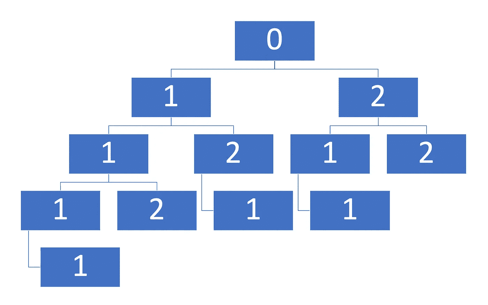

# 编码采访:用 JavaScript 解决“N 步楼梯”问题

> 原文：<https://javascript.plainenglish.io/coding-interviews-solving-the-staircase-with-n-steps-problem-41eea030ea99?source=collection_archive---------4----------------------->

Photo by [Jake Hills](https://unsplash.com/@jakehills?utm_source=medium&utm_medium=referral) on [Unsplash](https://unsplash.com?utm_source=medium&utm_medium=referral)

# **关于编码面试的一般说明**

编码面试非常类似于参加 SAT 或 GRE 考试；有时候，它们不一定是你在工作中或大学里表现的最佳反映，但更多的是你的准备和资源的反映。

只要公司还在使用这些类型的问题，你就需要为它们做好准备。

# **问题来源/灵感**

[https://www.dailycodingproblem.com](https://www.dailycodingproblem.com/levels)
*提问者:亚马逊*

# **问题描述**

有 N 级台阶的楼梯，一次可以爬 1、2 级。给定 N，写一个函数，返回你爬楼梯的唯一方式的数量。步骤的顺序很重要。

例如，如果 N 是 4，那么有 5 种独特的方式:

*   1, 1, 1, 1
*   2, 1, 1
*   1, 2, 1
*   1, 1, 2
*   2, 2

如果你能从一组正整数 X 中爬出任意数，而不是一次只能爬 1 或 2 步，会怎么样？例如，如果 X = {1，3，5}，你可以一次爬 1、3 或 5 级台阶。推广你的函数来接受 x。

# **问题解决方案**

这些问题有时很难概念化，尤其是在使用递归时。因此考虑到这一点，我决定在下面为`n = 4`说明问题的初始部分。

A tree diagram of all possible step permutations for 4 total steps and a maximum step size of 2

正如你从上面看到的，为了解决这个问题(不需要成为数学家)，我们可以把它想象成一个树状结构，遍历它来找到满足我们标准的分支。我没有显示所有失败的分支，但是你可以想象一个像 1–2–2 这样的分支，它不符合我们的正好采取 4 个步骤的标准。

**解决方案第一部分** 我们来分解一下问题第一部分的解决方案。

A recursive solution with step sizes of only 1 or 2

1.  当我们递归时，我们是在一个标准上归巢，每次连续调用我们的函数。在我们的问题中，我们通过步长来减少剩余的总步数，直到没有剩余的步数。
2.  我们的递归例子可以在第 7 行看到。这里我们分别用`n — 1`和`n — 2`调用我们的函数。然后，我们将这些后续调用的返回值相加。
3.  我们仍然必须处理我们采取太多步骤的情况。我们在第 2 行和第 3 行通过返回 0 来处理这个问题，如果`n`是负的(也就是说，如果我们采取了太多的步骤)。

**解决方案第二部分**

现在让我们看看更复杂的场景。

1.  在这种情况下，我们现在期望一个有效步长的数组。因为我们事先不知道步长，所以我们不能像以前一样硬编码我们的步长缩减。
2.  相反，我们将遍历`stepSizes`数组，应用我们的递归标准，然后返回我们生成的值的总和。为此，我们将使用`[Array.prototype.reduce](https://developer.mozilla.org/en-US/docs/Web/JavaScript/Reference/Global_Objects/Array/Reduce)`,因为它允许我们声明性地迭代一个数组并累加一个值。
3.  我们的案例类似于第一部分中的案例。我们在第 3 行和第 4 行处理过多步骤的情况，在第 5 行和第 6 行处理基本情况，在第 7 行和第 8 行处理递归情况。
4.  在递归的情况下，我们再次调用我们的函数，剩余的步骤数等于`n — stepSize`。然后，我们将函数调用的返回值添加到我们的`sum`变量中。

# 结论

这些问题的解决方案并不冗长；我们用 11 行易读的代码解决了这个问题中更复杂的部分。主要的挑战是将问题识别为一个可以遍历所有可能路径的问题，并确定每条路径是否满足标准。

【https://codingbootcampguides.com】最初发表于**。**

**更多内容请看*[***plain English . io***](http://plainenglish.io)*