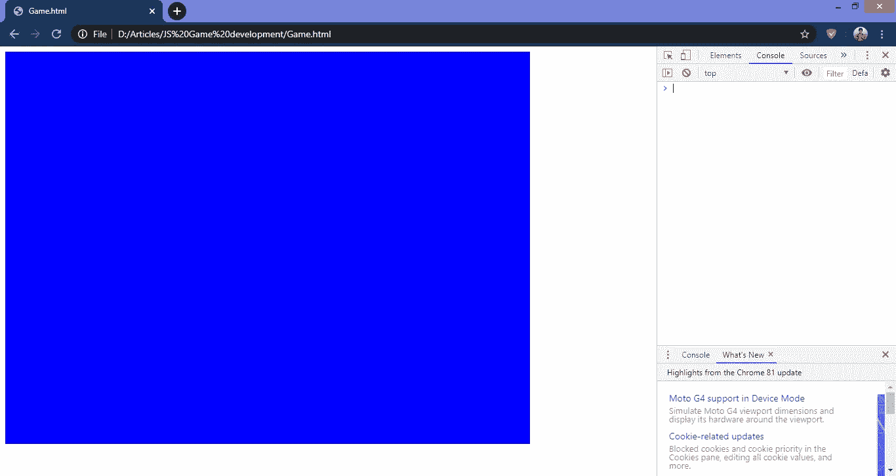

# 用纯 JavaScript 编写简单的游戏

> 原文：<https://javascript.plainenglish.io/coding-simple-games-with-pure-javascript-76fdf322cf98?source=collection_archive---------7----------------------->

## 你所需要的只是一个文本编辑器和一个网络浏览器！


Photo by [Fatos Bytyqi](https://unsplash.com/@fatosi?utm_source=medium&utm_medium=referral) on [Unsplash](https://unsplash.com?utm_source=medium&utm_medium=referral)

本文将讨论对任何基本游戏概念的设计有用的关键要素。我们将只使用 JavaScript 和 HTML5！阅读完本文后，掌握一些关于 JavaScript 的知识就足以构建自己的游戏了。这个实现绝对不需要下载任何外部资源。只要‘记事本’和‘谷歌浏览器’就够了。就这么简单！

## 步骤 1 —创建源文档

从最简单的“记事本”开始，你可以使用任何类型的文本编辑器。我个人推荐 [Notepad++](https://notepad-plus-plus.org/) 或 [Visual Studio Code](https://code.visualstudio.com/) ，因为它们允许选项卡式编辑、语法高亮显示，而且代码缩进会自动处理，这些都是简单的“记事本”所不具备的有用功能。但是我用记事本完成了整个开发过程，因此，你也可以毫无问题地使用它！

为自己选择好合适的文本编辑器后，首先打开文本编辑器，新建一个文本文档。无需在其中编写任何代码，您可以简单地用您想命名的任何名称保存该文档，**但请记住用扩展名'保存它。“html”。**比如，假设你想把它命名为‘我的游戏’。然后你应该把文件保存为`My Game.html`。因为我们正在创建一个将在浏览器上执行的 HTML 文档，所以源文件的扩展名应该是。“html”。

## 步骤 2——创建显示游戏的“画布”

“canvas”元素是 HTML5 的一部分，它为您提供了一种简单而强大的方法来绘制动态图形以及 2D 形状和位图图像的脚本化呈现。我们将创建一个具有首选尺寸和背景颜色的画布，游戏将在这里呈现。

既然我们写的是 HTML 代码，那么源代码应该分别以`<html>`和`</html>`标签开始和结束。第二行显示了如何使用 canvas 元素创建 HTML5 画布。您可以使用任何名称作为画布的 id(身份),应该在双引号(“…”)中提及。然后，您可以为画布的宽度和高度提供像素值。不要忘记包含画布的结束标记`</canvas>`。我们的 JavaSript 代码将从此开始。

首先，我们将指示程序每次加载窗口时必须做什么。这些指令在`window.onload = function() {…}` *里面都有提到。*在这个函数的第一行中，一个变量名被分配给先前创建的画布，这样我们就可以通过使用分配给它的变量名来调用创建的画布的属性。`canvas.getContext()`方法返回画布上的绘图上下文，如果不支持上下文标识符，则返回 null，并将返回值赋给一个变量。这里的上下文类型应该是“二维”，而不是“2d”。接下来的两行代码是一段关键的代码，将在整个开发过程中大量使用。这两条线负责绘制矩形对象并用特定的颜色填充它们。第一行，`canvasContent.fillStyle = ‘blue’` 告诉程序在绘制图像时使用蓝色。请注意，您也可以使用 [RGB 颜色代码](https://www.rapidtables.com/web/color/RGB_Color.html)。下一行，`canvasContent.fillRect(0,0,canvas.width,canvas.height)`指示程序绘制一个矩形，其起始坐标为 0，0，即画布的左上角，接下来的两个参数分别以像素值表示矩形的宽度和高度。因此，这个矩形将被绘制在整个画布上，以便您可以了解画布的大小。

在已经创建的 HTML 文本文件上键入上述代码行之后，您可以保存该文件。然后只需打开你的浏览器，将文件拖放到浏览器上，你就可以看到我们创建的矩形。请随意复制并粘贴我的代码，亲自体验一下。



What we have achieved so far!

## 步骤 3 —在浏览器中打开控制台，以便于调试

在程序员中使用`console.log(…)`来澄清是一种常见的做法。控制台也很有帮助，因为它显示了 bug 或语法错误在代码中的位置。因为我们都是人，所以我们都容易犯错。因此，在浏览器上运行代码时打开控制台总是一个好习惯。阅读[此处](https://webmasters.stackexchange.com/questions/8525/how-do-i-open-the-javascript-console-in-different-browsers)了解如何在浏览器上打开控制台。

## 第四步——执行你的游戏创意

到目前为止，我们已经建立了编程环境，剩下的就是用 JavaScript 编写你的游戏创意。我将解释一些对设计任何游戏都有用的关键组件。

## 绘制矩形、正方形、水平线和垂直线

```
function drawRect(clr, startX, startY, width, height) {
   canvasContent.fillStyle = clr;
   canvasContent.fillRect(startX,startY,width,height);
}
```

我们可以定义一个通用函数，用上面的特定颜色画一个矩形。我以前解释过与绘制矩形相关的代码段。一些有用的特殊注释:

*   `startX`和`startY`是您计划绘制的矩形的左上角坐标
*   您可以使用 [RGB 颜色编码系统](https://www.rapidtables.com/web/color/RGB_Color.html)输入矩形的颜色
*   您可以通过为宽度和高度提供类似的值来绘制一个正方形
*   您可以通过提供矩形的宽度(a)和高度(1)来绘制一条长度为(a)的水平线。(不要使用 0 作为高度，因为零高度在逻辑上将不会绘制任何东西)
*   类似地，通过将矩形的宽度设为 1，高度设为(h ),可以绘制一条高度为(h)的垂直线

下面是如何使用上面定义的函数在画布中心绘制一个宽和高为 100 像素的红色正方形:

```
drawRect('#ff0000',canvas.width-100/2,canvas.height-100/2,100,100);
```

请记住，在绘制时，新图像会与之前绘制的图像重叠。因此，请务必组织您的图像，以便最底层的形状首先编码，应该出现在其他形状之上的形状随后编码。

## 画圆形

```
canvasContent.fillStyle = 'red';
canvasContent.beginPath();
canvasContent.arc(originX, originY, radius, startRad, endRad, bool);
canvasContent.fill();
```

通过将颜色填充到预定义的弧形路径中来绘制圆形或半圆形。第一行代码对我们来说已经很熟悉了。它定义了图像应该填充哪种颜色。第二条线开始绘制圆弧。第三条线负责画弧线的过程。arc 函数的属性描述如下:

*   `originX` —圆心的 X 坐标
*   `originY` —圆心的 Y 坐标
*   `radius` —圆的半径
*   `startRad` —圆弧的起点，以弧度表示
*   `endRad` —以弧度表示的圆弧的终点
*   `bool` —该属性只接受布尔值(真或假)。True 表示从`startRad`到`endRad`沿逆时针方向画圆弧，false 表示沿顺时针方向画圆弧


The radian chart of a circle

如果我们想画一个蓝色的完整圆，原点在(200，100)，半径为 30 个像素:

```
canvasContent.fillStyle = 'blue';
canvasContent.beginPath();
canvasContent.arc(200, 100, 30, 0, Math.PI*2, true);
canvasContent.fill();
```

尝试自己为`startRad`、`endRad`和`bool`变量输入不同的值，以获得对实际情况的合理理解。

## 对绘制的图像应用移动

对象的运动可以以两种方式发生，编程的运动和根据用户输入的运动。在这两种情况下，每次刷新屏幕时，对象的移动都是通过改变其原点来实现的。下面是如何通过编码实现的:

正如你所看到的，我们现有的代码中有一些小的增加，其中一些我们已经讨论过了。在`window.onload` 函数中，我们添加了一个名为`setInterval`的新函数，它负责每 50 毫秒调用一次`draw`函数。我们还创建了一个名为`draw`的新函数，并将所有与绘制图像相关的代码都移到了这个函数中。在代码的开头，你一定已经注意到我们声明了一个名为`XBall`的变量，它保存了圆形物体的 X 坐标的值。在 draw 函数中，我们执行了一个算术运算，因此每次调用函数`draw`时,`XBall`的值都会增加 10，因此我们将能够看到圆形对象的位置每 50 毫秒向右移动 10 个像素。程序运动就是这样实现的。

现在让我们来看看我们如何实现与用户的鼠标移动相对应的对象移动。

在这个实例中，我们添加了一个名为`calMousePos`的新函数。这个函数的职责是计算并返回鼠标在可播放空间内的 X 和 Y 坐标，而不管画布位于页面的哪个位置。

接下来，每当鼠标移动时，我们必须设置球的位置值。为了实现这一点，我们必须添加一个事件监听器来响应`mousemove`事件。在这里，我定义了一个内嵌函数来从`calMousePos()`获取鼠标的 X 和 Y 坐标，并将它们分配给球的 X 和 Y 坐标。因此，每次调用`draw`函数时，球的中心都会与画布内的鼠标位置重叠。

## 单击鼠标时执行操作

大多数游戏需要点击鼠标来执行特定的动作。下面是如何简单地执行一个动作来响应用户的鼠标点击

实现这一步所需的代码修改比处理鼠标移动简单得多。正如我们前面所做的，我们必须添加一个事件监听器来处理`mousedown`事件。和以前一样，我定义了一个内嵌函数，每次鼠标点击画布区域时，这个函数都会增加球的半径。类似地，您可以编写与鼠标单击事件相对应的任何要执行的操作。

## 添加文本元素

文本是几乎每个游戏中用来显示分数、输赢状态、游戏结束消息等的关键元素之一。这是您将文本添加到屏幕任意位置的方法:

```
canvasContent.fillText("Type your text here",posX,posY);
canvasContent.font = "20px Verdana";
```

*   `posX` —文本在画布上的位置的 X 坐标
*   `posY` —文本在画布上的位置的 Y 坐标

`20px Verdana`分别代表字体大小和字体样式。

这些元素可以用来创建简单的游戏，如[乒乓球](https://classical-ping-pong.en.aptoide.com/app)或[碎砖](https://www.puzzleplayground.com/g/brick-breaker)，甚至可以扩展自己来创建一些有创意的益智游戏。如果你有创造性的头脑，可能性是无限的，这可能是你人生漫长旅程的开始。

我感谢你花宝贵的时间阅读我的文章和快乐编程！但最重要的是，保持安全！

## **简单英语的 JavaScript**

通过 [**订阅我们的 YouTube 频道**](https://www.youtube.com/channel/UCtipWUghju290NWcn8jhyAw) **来表达爱意吧！**