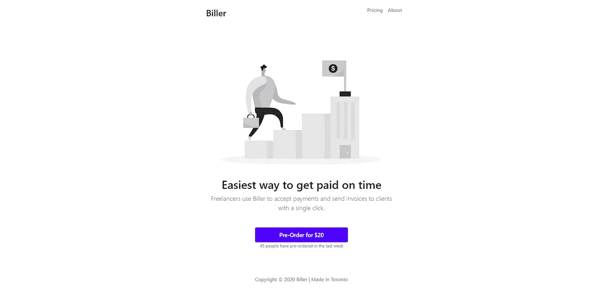
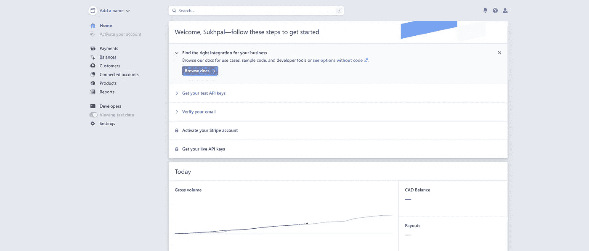
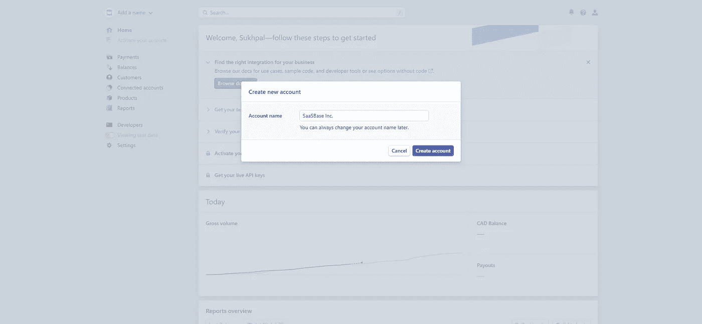
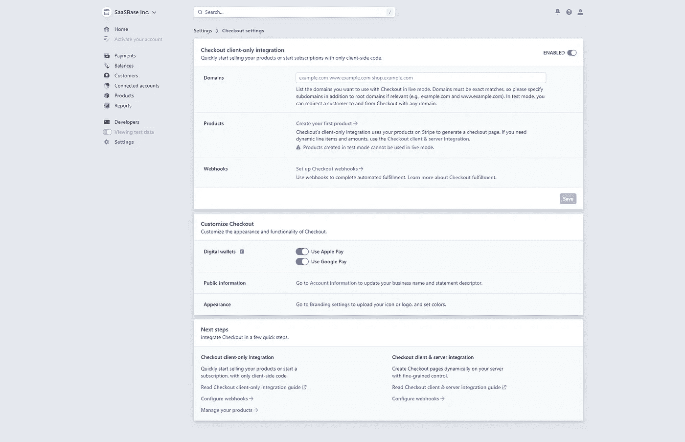
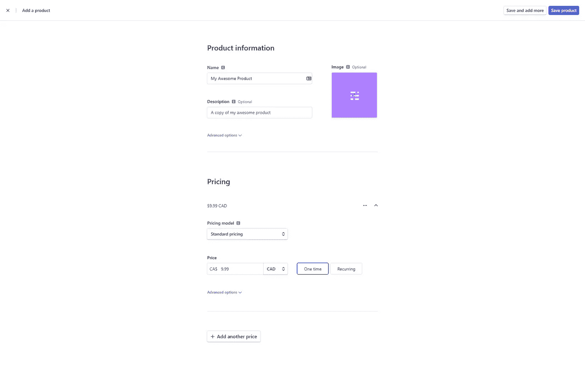
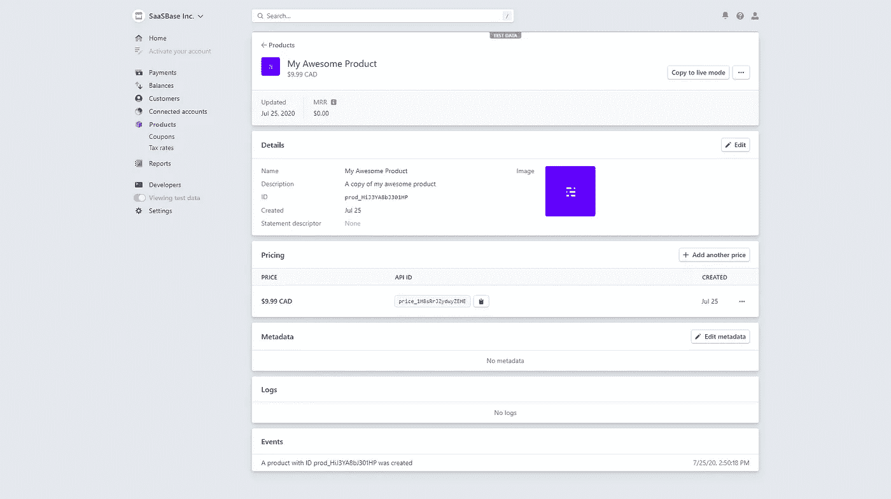
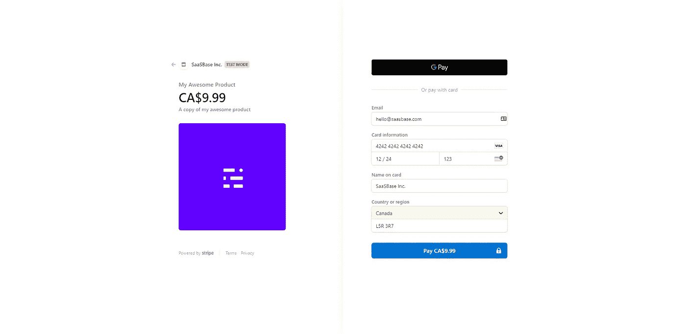
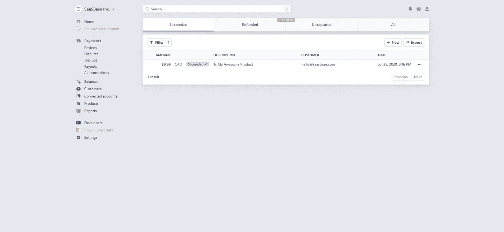
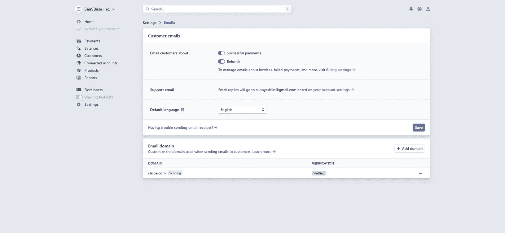

# 使用 Stripe API 向早期采用者收取售前收入

> 原文：<https://javascript.plainenglish.io/collect-pre-sales-revenue-from-early-adopters-using-stripe-api-6de086d38281?source=collection_archive---------5----------------------->

## 预售收入

## 在你承诺生产一个产品之前收集收入是验证一个想法的最好方法

收集售前收入是验证产品创意的最佳方式。Stripe 使得在一个非常简单的静态 HTML 网站上设置一次性支付变得很容易。在本指南中，我们将实现一个带条纹的预购按钮，以便我们的访问者可以请求预购我们的产品。

【https://lucid-ramanujan-f21cd3.netlify.app/】现场试玩:

**源代码:**[https://github . com/BD corps/one-time-payments-html-landing-page](https://github.com/bdcorps/one-time-payments-html-landing-page?utm_source=saasbase_dev)

我们开始吧！

# 创建 HTML 登录页面

首先，我们需要一个针对我们目标市场的登陆页面。这意味着拥有，

1.  我们产品的描述
2.  关于产品将提供什么价值的价值主张
3.  闪亮的支付按钮，这样我们就可以安全地收取款项

我们可爱的 SaaSBase 团队决定在这里[构建一个你可以使用的超级简单的现成项目](https://github.com/bdcorps/one-time-payments-html-landing-page)。你可以随意使用它，无论是个人用途还是商业用途。



它包括一个标题和一个副标题，您可以根据您的产品进行编辑。最重要的是，它包含一个预购按钮，当点击时，应该触发条纹支付过程。

```
<button	class="btn btn-outline-secondary"
    type="submit"
    id="order-btn"> Pre-Order for $20</button>
```

# 注册 Stripe 帐户

在此创建一个新的条带账户[。](https://dashboard.stripe.com/register?utm_source=saasbase_dev)

> 默认情况下，新创建的条带帐户被放入`Test Mode`中。这使得测试支付系统变得更加容易，而不需要实际付费。一旦您准备好进入生产阶段，请将您的帐户切换到`Live Mode`。有关 Stripe 测试与实时模式的更多信息，[单击此处](https://stripe.com/docs/keys#test-live-modes)。



点击左上角的`Add a name`按钮，为你的账户添加一个名字。



# 启用仅客户端集成

在“设置”>“结帐设置”下启用仅客户端集成。



> *记住，一旦你投入生产，就要把我们的托管 URL 添加到域名中，以保护你的支付网关。*

# 在条带上创建产品

要添加新产品，请点击产品>添加新产品。添加有意义的名称、图标和价格。务必将价格设置为`One time`。



复制定价下的`API ID`。



通过粘贴之前的`API ID`编辑预购按钮。

```
<button
            class="btn btn-outline-secondary"
            style="width: 50%;"
            type="submit"
            id="order-btn"
            data-checkout-mode="payment"
            data-price-id="price_1H8sRrJZydwyZEHEvdH1j1r1"
          >
            Pre-Order for $20
</button>
```

# 添加条带库

让我们将库添加到页面主体中。

```
<body><script src="https://cdnjs.cloudflare.com/ajax/libs/jquery/3.5.1/jquery.min.js"></script>
    <script src="https://js.stripe.com/v3/"></script>
    <script src="js/main.js"></script>
</body>
```

创建一个名为`js/main.js`的新文件。将`PUBLISHABLE_KEY`替换为开发者提供的> API 密钥。

```
var PUBLISHABLE_KEY ="pk_test_51H8rt4JZydwyZEHEJVKNfKacIDRxR0i7YuprjgpREhVNUKr8v2a9yz8S9ZAiWdGKN8vM2KFHYukjTU0eAOzrk1Qe00KyY6NxL4";

var DOMAIN = location.href.replace(/[^/]*$/, "");

var stripe = Stripe(PUBLISHABLE_KEY);

var handleResult = function (result) {
  if (result.error) {
    console.log(result.error.message);
  }
};

$(document).ready(function () {
  var urlParams = new URLSearchParams(window.location.search);
  if (urlParams.has("success")) {
    var success = urlParams.get("success") == "true";
    if (success) {
      $("#payment").hide();
      $("#status").text(
        "Thank you for purchasing Biller! Your order will arrive within the hour."
      );
    } else {
      $("#status").text(
        "There was an error processing your payment. Please try again."
      );
    }
  }

  $("#order-btn").click(function (event) {
    var checkoutMode = $(event.target).data("checkoutMode");
    var priceId = $(event.target).data("priceId");
    var items = [{ price: priceId, quantity: 1 }];

    stripe
      .redirectToCheckout({
        mode: checkoutMode,
        lineItems: items,
        successUrl: DOMAIN + "main.html?success=true",
        cancelUrl: DOMAIN + "main.html?success=false",
      })
      .then(handleResult);
  });
});
```

# 尝试测试付款

整合到此为止。我们可以用测试信用卡试试我们的支付系统。

点击预购按钮。使用卡号`4242 4242 4242 4242`。更多关于那个[这里](https://stripe.com/docs/testing?utm_source=saasbase_dev)。



如果一切顺利。您的付款将通过并显示在仪表板上。



# 启用电子邮件回执

默认情况下，成功的条带支付不会向客户发送确认。让我们通过启用电子邮件回执来改变这种情况。在设置>电子邮件>客户电子邮件下打开成功支付和退款。



> 电子邮件收据功能仅在`Live Mode`中有效。

我们走吧！现在，我们有了一个响应性的登录页面，早期采用者可以前往该页面并为产品的早期访问付费。我们节省了大量时间！现在去收集你的收入:)

**现场演示:**[https://lucid-ramanujan-f21cd3.netlify.app/](https://lucid-ramanujan-f21cd3.netlify.app/?utm_source=saasbase_dev)

**源代码:**[https://github . com/BD corps/one-time-payments-html-landing-page](https://github.com/bdcorps/one-time-payments-html-landing-page?utm_source=saasbase_dev)

在 [Twitter](https://twitter.com/sssaini_) 上找到我，我们聊聊:)

*发现这个有用吗？在*[*SaaS base . dev*](https://saasbase.dev/)访问更多指南，更快地构建您的 SaaS