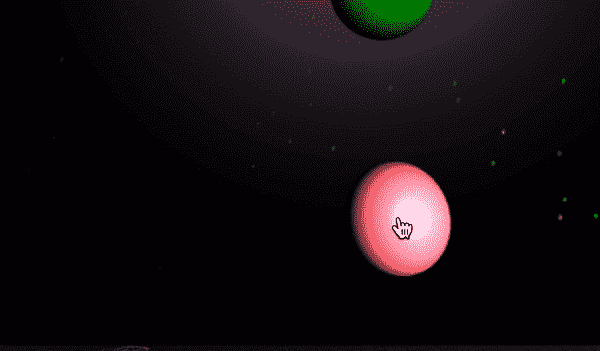
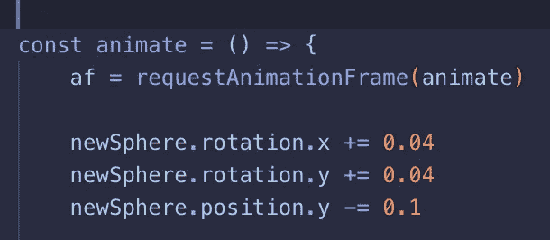
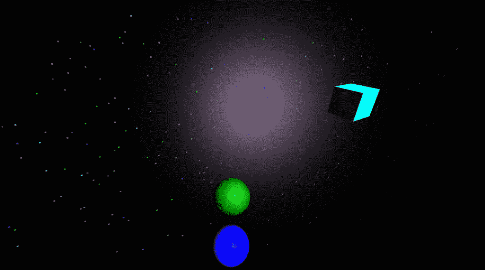

# Three.js 中的冲突“事件监听器”

> 原文：<https://javascript.plainenglish.io/collision-event-listener-in-three-js-12055fcb2b4a?source=collection_archive---------2----------------------->

## 当两个对象碰撞时，在 JavaScript 中产生某种效果

我最近用 Three.js 做了一个游戏，它很大程度上依赖于两个 3D 物体碰撞时发生的事情。得知以下代码不起作用时，我非常难过:

```
**sphere**.addEventListener('bonk', (**e**) => {
  **e**.target.explode
}
```



Game behavior

*“哎呀，这可能比想象的要难，”*我心想。实际上，这相当简单，我终于明白了如何在不使用另一个 Three.js 插件的情况下创建这个行为**。这个秘密存在于一个你在 Three.js 中可能已经熟悉的方法中…**

**DOM 不同于画布**

“以什么方式，”你问？画布只是一个可以呈现 Three.js(以及其他动画作品)的 DOM 元素。这意味着向它添加事件侦听器与向按钮或整个窗口添加事件侦听器没有什么不同。长话短说，`.addEventListener()`不会给我们想要的东西，因为我们需要`sphere`来“听”碰撞，而不是整个画布。另外，*画布上呈现的 3D 形状不是 DOM 元素！*也许可以解释为什么我上面的迷因代码不起作用…

## 秘密就在动画方法中

在我的游戏中，只有当你的滑动物体的形状和/或颜色与你的滑块的轮廓相匹配时，下落的物体才会被你的滑动物体摧毁。这是一个基本的匹配游戏。你的游戏可能不同，但概念大多是相同的。

在 Three.js 中，`animate()`函数用于在画布上移动 3D 对象。这个方法中的代码每秒运行 60 次，或者更恰当地说，以 60fps 的*帧速率运行。*这意味着无论你在动画函数中写什么，每秒钟都会执行 60 次*。当我意识到这一点时，一切都明白了。我不需要一个事件监听器，我只需要一个逻辑来计算下落物体相对于滑块的位置。*

**

*requestAnimationFrame*

*我并不是说这是一个 Three.js 教程，因为互联网上已经有了更好的教程，但是这个方法内置在 JavaScript 中，可以在页面上显示对象。在 Three.js 中，这意味着你可以让物体旋转，翻转，以及其他一些很棒的东西。这也意味着你可以让它每秒钟检查 60 次它的位置！*

*我用来实际创建您在上面看到的行为的代码对您来说很可能看起来像意大利面条，所以我将只在 Three.js 中介绍创建碰撞“事件侦听器”的基础知识:*

```
*function animate(){//af is a hoisted variable for our animation frame **af** = requestAnimationFrame(animate)//declare your variables, it'll make your code cleaner
//here, we declare our variables of X and Y position on the page, //you may do this for Z if necessary as well
//our sliding object (see gif above) is abstracted to a variable called **slider** var **xDif** = **slider**.position.x - **newSphere**.position.x
  var **yDif** = **slider**.position.y - **newSphere**.position.y// these will update 60 times per second// our spheres have a radius of 3, so we use |3| as upper and lower // bounds since the position is determined from the center pointif (**yDif** < 3 && **yDif** > -3 && **xDif** < 3 && **xDif** > -3){
 *stuff you want to do when there is a collision*cancelAnimationFrame( **af** ); // animation frame stops**scene**.remove(**newSphere**); //sphere is removed from the scene, it has made contact with the slider}}*
```

*不要再用废弃的库碰壁了。在 Three.js 中处理碰撞“事件”实际上并没有那么糟糕！*

## *这难道不会表现得很糟糕吗？*

*这并不像你想象的那么糟糕，但是如果你有一个程序同时在屏幕上显示成百上千个对象，那么是的，它可能不能很好地运行。对于我的游戏来说，它运行得相当流畅。顺便提一下，背景中的星星都在旋转，发光的立方体用三个. js 渲染，它们在 Z 轴上非常远，所以实际上屏幕上同时有很多项目…*

**

## *把这个逻辑放在 Slider 类中会不会更好？*

*这会让游戏运行得更快吗？也许吧。很难说。不是每个下落物体都检查它自己相对于滑块的位置，而是滑块必须检查它相对于所有下落物体的位置。这个设计选择取决于你。但这不是你点击这篇文章的原因！您只是想知道如何为对象碰撞创建一个事件监听器！*