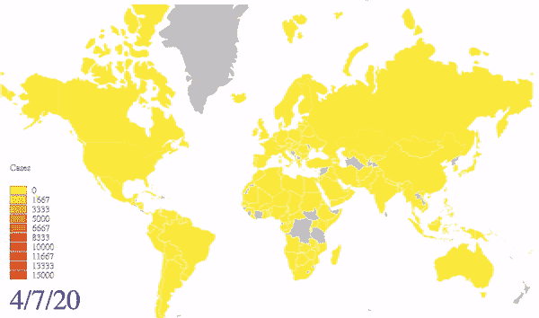
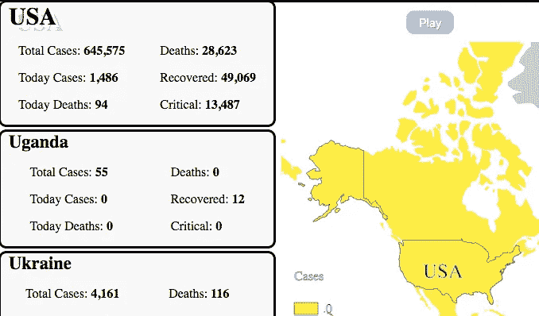
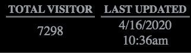
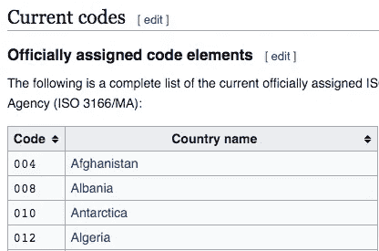
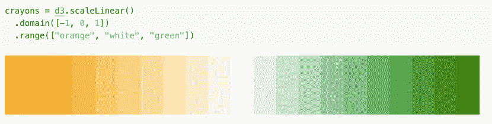
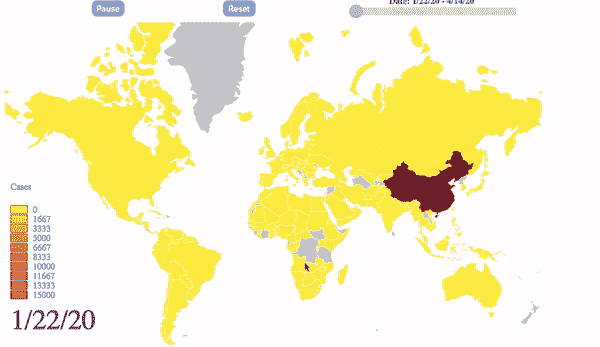
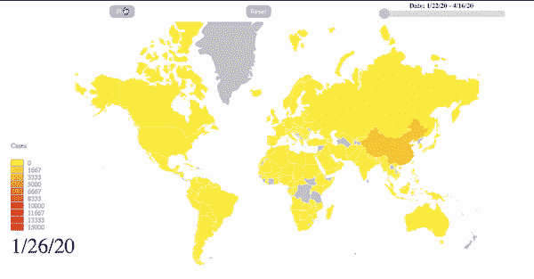
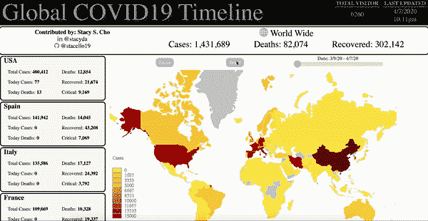

# 用 D3.js 从新冠肺炎身上学到的 10 件事

> 原文：<https://javascript.plainenglish.io/combining-what-i-learned-from-covid-19-with-d3-js-2c03d9df521e?source=collection_archive---------11----------------------->

## 制作开源项目的指南


Global Timeline of Covid19 by Stacy S. Cho

# 概观

**全球 Covid19 时间轴**已经赚了不少了💌 👏 😍从很多人那里。我非常感谢大家的支持

> 截至 2020 年 4 月 16 日，
> 
> 全球 Covid19 时间表赢得
> 
> - 9K+用户流量
> 
> - 58 个赞& 15 条评论来自 [*LinkedIn 帖子*](https://www.linkedin.com/feed/update/urn:li:activity:6651510551711109120/)
> 
> *- 100+访问& 25+克隆自* [*Github 库*](https://github.com/stacello19/Covid19-D3)


Photo by [Priscilla Du Preez](https://unsplash.com/@priscilladupreez?utm_source=medium&utm_medium=referral) on [Unsplash](https://unsplash.com?utm_source=medium&utm_medium=referral)

《银河系漫游指南》的作者道格拉斯·诺埃尔·亚当斯曾经说过，

> 编程让事情得以完成


在 Corona 病毒席卷纽约和新泽西之前，我一直在纽约积极寻找软件工程师的工作。我已经安排了很多面试，我非常有希望和动力开始我的软件工程师生涯。

病毒席卷了美国，尤其是纽约，我收到了许多电子邮件和信息，关于面试过程因病毒而被搁置和拒绝。纽约人被要求呆在家里，我的求职期也停止了，直到另行通知。

在我的身份从**求职者**变成**失业者的头几天，约翰·霍普斯金的** Covid 网站& **谷歌的**冠状病毒(新冠肺炎)地图成了我的网飞。我每小时都在查看图表和世界地图，希望趋势下降，一切恢复正常，但趋势与我希望的相反。

# 我需要一个遥控器


Photo by [freestocks](https://unsplash.com/@freestocks?utm_source=medium&utm_medium=referral) on [Unsplash](https://unsplash.com?utm_source=medium&utm_medium=referral)

受害者和确诊病例的数量每天都在增加。每天都有数千例确诊病例增加，图表向右上方呈线性&世界地图变得越来越暗

有一天，我想看看世界地图比两周前变暗了多少，但我无法从约翰·霍普斯金的 Covid 网站和谷歌的冠状病毒(新冠肺炎)地图中获得趋势信息。我做了更多的研究，发现 **HealthMap** 制作了一个图形网站，显示病毒在世界各地传播的趋势。但是，我不能控制图形；这是不可阻挡的，直到视频结束像兰博基尼跑车没有休息

> 我就像“我需要一个遥控器”来看看新冠肺炎传播的趋势，那里的全球 COVID19 时间轴项目已经开始

# 全球 COVID19 时间表

**全球 COVID19 时间轴中的特性**

*   Covid19 在该时间段内的传播显示在世界地图上



*   时间线上的控制器。用户可以**播放**、**暂停**、**选择某个日期**


*   用户可以在世界地图上点击一个国家，并获得所选国家的信息



*   数据每 10 ~ 15 分钟更新一次



# >技术概述

## -技能堆栈

*   D3.js
*   香草 JS
*   半铸钢ˌ钢性铸铁(Cast Semi-Steel)
*   超文本标记语言

# 技术成就

## 1:数据预处理

## **来自 API 的国家/时间数据(时间数据)**

*   我需要一份日期时间内国家和地区的确诊病例和伤亡数据**伊森·温特斯** & **沃尔特·科拉莱斯**做出了伟大的[**covid 19 时间轴 API**](https://github.com/NovelCOVID/API)

## 来自 API a.k.a .的国家/地区大纲数据(地区数据)

*   我从 [***地形图&世界地图***](https://bl.ocks.org/piwodlaiwo/3734a1357696dcff203a94012646e932) 中获取国家领土在世界地图上的经纬度
*   它由`MultiPolygon`类型和数字组成的一组地图上的经度&纬度

## 在国家 id 和国家名称之间建立关系

*   `"id": "840"`代表美国
*   国家领土轮廓经纬度数据表示为`country id`；因此，我需要将`country id`转换为`country name`

换句话说，我需要在国家 id 和国家名称之间建立关系，因为

```
**Time data API** represents a country using its `country name` in plain English &**Territory data API** represents a country using `country id`
```

## **ISO 3166–1 个数字**

*   **ISO 3166-1 数字**(或数字-3)代码是三位数的国家代码，代表国家、属地和特殊地理区域



在[维基百科的](https://en.wikipedia.org/wiki/ISO_3166-1_numeric) **当前代码**表中，我找到了关于**代码&国家名称**的表格

我创建了一个名为`country_id.txt`的文件，并在 IDE 中通过拖拽和粘贴的方式将表格的内容复制到`country_id.txt`中

```
// country_id.txt004 Afghanistan008 Albania010 Antarctica012 Algeria
...
// 249 lines
```

## 用于读写文件的 JS fs 模块

在 JavaScript 中将它转换成`object`(key-pair)类型

*   虽然我和其他软件工程师一样懒惰，但我使用 Regex 和 fs 模块将纯文本转换成 JavaScript 对象

```
// public/output.txt{
    004:Afghanistan,
    008:Albania,
    010:Antarctica,
    012:Algeria,
}
```

## 转换数据格式

因为我想显示给定日期在**全世界确诊病例的数量，所以我想要这个格式**

```
{
 date1 : [ {country-A: # }, {country-B: # } {...} ],
 date2 : [ {country-A: # }, {country-B: # } {...} ]
}
```

而不是(原始数据格式)

```
country: [ { date1 : # } , { date2 : # } {...} ]
```

因此，

我使用上面使用`fs`模块创建的国家名称-国家 id 对象来转换数据

## **1 reformatData 对象**

*   **如果在对象中没有找到关键字(日期)，**创建一个空对象，并最初为`C`(确诊病例)& `D`(死亡)创建关键字-值对

```
if (!reformatData[date]) { // 1              
    reformatData[date] = {};          
  }reformatData[date][countryName] = { // 1
  'C': country.timeline.cases[date],
  'D': country.timeline.deaths[date]          
}
```

*   **目不斜视，**传递到`cleanData`功能。`cleanData`函数聚合键`C` & `D`的值

```
if (country.country === countryName && prev === country.country) {

cleanData(countryName, 
          country.timeline.cases, country.timeline.deaths, 
          reformatData) // 1  
}**// cleanData function** function cleanData(country, timelineC, timelineD, obj) { for(let date in timelineC) { let value = obj[date] value[country]['C'] += timelineC[date] value[country]['D'] += timelineD[date] }};
```

# 2:给世界地图着色

我想根据确诊病例数在地图上给个颜色。换句话说，确诊病例越多，颜色就变得越深

*   `d3.scaleLinear()`D3 . js 中的方法有我想要的

## d3 .线性标度

## 示例 1

这个简单的代码产生了这个美丽的色谱


pictures from Observable

## 示例 2

您也可以将它与域范围一起使用



picture from Observable

同样的，

*   我给出一个数字范围(0 ~ 15000)和一个颜色范围(黄色`rgb(252,237,69)` &红色`rgb(226,21,21)`

> 有人可能会问:如果数据超过了最大值 15，000，会发生什么呢？答案是颜色变成了“**黑色”。接得好。**

## 将颜色“填充”到国家的“更新”功能

`update`功能使用上面定义的`linearV`变量

## 每 0.5 秒启动一次“更新”功能

`update`函数给地图一种颜色，我使用`setInterval`函数每 0.5 秒调用一次`update`函数

> 塔-达！🙌
> 
> 最后，地图的颜色不断变化



# 3:控制地图

就像我上面说的，我想给用户**遥控器**，这样用户就可以播放、暂停和移动到某个日期


Photo by [Glenn Carstens-Peters](https://unsplash.com/@glenncarstenspeters?utm_source=medium&utm_medium=referral) on [Unsplash](https://unsplash.com?utm_source=medium&utm_medium=referral)

> 我认为网络浏览器很酷，很有趣，因为用户可以与组件互动。

用户已经有了这么多遥控器，也就是所谓的事件

**点击、Keyup、MouseOut、滚轮、拖动&Drop……这么多事件**

我想给用户提供交互式世界地图信息图的完整体验

## **暂停，启动时间轴**

用户可以**暂停** & **启动**时间轴

我使用`clearInterval`暂停时间线，使用`setInterval`恢复时间线

## 重置时间线

用户还可以回到 Covid19 爆发的第 1 天

## 在时间线中选择某个日期

> 网络环境之美！！😍许多事件，许多遥控器

我监听滑块的`input`、`mouseup`、`click`事件，我将最后一个索引作为**结束日期**

```
slider.setAttribute('max', dateArr.length-1);
```

> 塔-达！🙌
> 
> 你可以控制时间线
> 
> 使用 2 个按钮和 1 个滑块



# 4:在全国上空盘旋

最后但同样重要的是，当鼠标悬停在世界地图上时，我会给出一个国家地图工具提示

## 最初声明工具提示

我最初在世界地图上全局声明 tooltip，并通过给出一个类名`hidden`来隐藏它

```
// css
.hidden {
 display: none;}
```

## d3 .鼠标悬停事件的鼠标事件

*   当`mouseover`事件发生时，换句话说，当鼠标悬停在某个国家时，我计算鼠标的位置`mouse`并删除类`hidden`

## 1 画出所选国家的轮廓

*   将光标改为指针，并给所选国家的`black`添加一种笔画颜色

```
d3.select(this).style("cursor", "pointer") .style("stroke", "black");
```

## 2 制作工具提示

*   工具提示显示**国家名称**在

`currentMousePosition X` + 20 & `currentMousePosition Y` + 30，哪一点点`down right`


```
tooltip.classed('hidden', null)  
       .attr('transform', 
             `translate(${(mouse[0]+20)}, ${(mouse[1]+30)})`)
      .attr('fill', 'black')
      .attr('fill-stoke', 5)
      .attr('font-size', '25px')
      .html(`${country}`);
```

# 最终产品

## 全交互式世界地图信息图



[网址](https://s3.amazonaws.com/covid20.today/index.html)

LinkedIn 帖子

[Github](https://github.com/stacello19/Covid19-D3)

# 结论

从 2019 年 11 月开始，我在 4 个月内争分夺秒地找工作，直到病毒蔓延。许多采访已经消失，沉默已经到来。作为一名求职者，这是一段不幸的时期，但作为一名软件工程师，我非常享受这段时期。我重新开始学习 D3.js，并制作了 **Global Covid19 Timeline** ，这赢得了许多好评、喜欢和用户流量。

希望病毒很快结束，这样世界就可以回归正常&希望很快有机会在纽约和许多有才华的软件工程师一起工作🏢 👊 🙏

最后但同样重要的是，我真的很感谢医生、护士、志愿者和所有与病毒作斗争并无私为社区服务的人


Photo by [Wilhelm Gunkel](https://unsplash.com/@wilhelmgunkel?utm_source=medium&utm_medium=referral) on [Unsplash](https://unsplash.com?utm_source=medium&utm_medium=referral)

## **用简单英语写的 JavaScript 笔记**

我们推出了三种新的出版物！通过以下方式表达对我们新出版物的热爱:[](https://medium.com/ai-in-plain-english)**[**【UX】**](https://medium.com/ux-in-plain-english)[**【Python】**](https://medium.com/python-in-plain-english)**——谢谢您，继续学习！****

****我们也一直对帮助推广高质量内容感兴趣。如果您有文章想提交给我们的任何出版物，请用您的中用户名在[**submissions @ plain English . io**](mailto:submissions@plainenglish.io)**发邮件给我们，我们会将您添加为作者。另外，请告诉我们您想添加到哪个出版物中。******