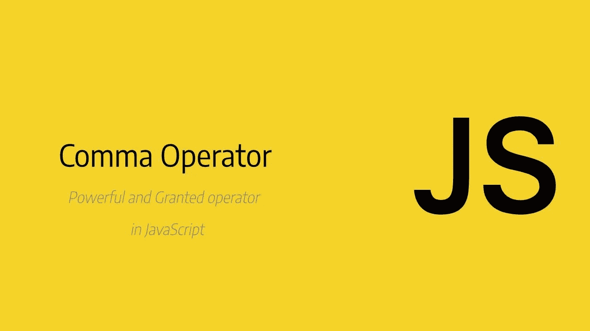
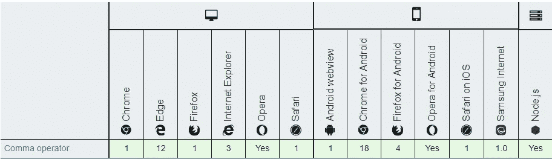

# JavaScript 中的逗号运算符

> 原文：<https://javascript.plainenglish.io/comma-operator-in-javascript-cfe170f5b4d3?source=collection_archive---------1----------------------->



## JavaScript 鲜为人知的特性之一

逗号操作符适合一组表达式操作符，它可能是有用的，但是它有可能被用于混淆而不是澄清。部分原因是因为它是一个逗号，逗号在 JavaScript 中还有其他含义。为了 100%清楚起见，当逗号作用于两个表达式时，它只是一个逗号运算符:

***左手表达式，右手表达式***

其中*表达式*是涉及其他运算符、变量和函数的东西。

# 它有什么作用？

它用于顺序执行两个表达式。它首先从左到右计算每个操作数，然后最后一个操作数的值将作为结果返回。

这里需要注意的重要一点是，它不同于数组、对象和函数参数中的逗号。

```
let num = 10;num = (num--, num);console.log(num);
// expected output: 9num = (20, 30);console.log(num);
// expected output: 30
```

在上面的例子中，我们必须使用括号，因为逗号操作符在所有 JavaScript 操作符中优先级最低。如果没有括号，表达式将被解析为:

```
x = (20), 30;
```

上面的语句最终在 x 中存储了 20，并丢弃了右边表达式的结果。这里自然想到的问题是，为什么要用括号赋值呢？直接分配就行了。

答案是，一些操作符以及大多数功能都有副作用。举个例子，

`varr = (console.log(1),console.log(2),console.log(3),4);`

你会看到 1，2，3 印在控制台上，4 存储在`varr`中。在上面的例子中，我们也可以使用分号来代替逗号运算符，如下所示-

`console.log(1); console.log(2); console.log(3); varr = 4;`

但是，这里的重点是， ***分号分隔语句*** where as ***逗号分隔表达式*** ，而且在某些情况下语句也是表达式。

# 几个例子

```
var var1, var2, var3;var1 = var2 = 10, var3 = 20; // Returns  in console
console.log(var1); // 10 (left-most)var1 = (var2 = 30, var3 = 40); // Returns 6 in console
console.log(var1); // 40 (right-most)
```

属性键的计算:这个例子比较复杂。

```
const map = {
  [1 << 0]: "Batman",
  [1 << 1]: "Superman",
  [1 << 2]: "Flash"
};console.log(map);
// { '1': 'Batman', '2': 'Superman', '4': 'Flash' }
```

# 用例

下面列出了一些常用的逗号运算符

*   一次声明多个变量:`var x = 0, y = 0, z = 0;`
*   数组文字中的列表元素:`[2, 4, 8, 10, 20, 32]`
*   对象文字的单独属性:`{ min: 0, max: 100 }`
*   定义多个函数参数:`function multiply(a, b) { return a * b; }`
*   调用带有多个参数的函数:`multiply(2, 6)`
*   析构数组:`const [lower, upper] = [0, 1];`
*   析构对象:`const { min, max } = { min: 0, max: 100 };`
*   导入多个模块成员:`import { open, close } from "fs";`
*   导出多个模块成员:`export { mkdir, rmdir };`

*上面所有的例子都是语法正确的，并且包含一个逗号，但是* ***none*** *使用了实际的* ***逗号*** *运算符。我能想到的一些实际用例是-*

*   允许我们在需要一个表达式的地方放多个表达式。由逗号分隔的多个表达式的结果值将是最后一个逗号分隔的表达式的值。
*   在用 JavaScript 编写函数代码时，它也非常有用。
*   另一个最常见的用法是在一个`for`循环中提供多个参数。

```
// j is initialized to some other value
// as the for loop executes both i and j are incremented
// because the comma operator allows two statements to be put in place of one
for (var i = 0; i < items.length; i++, j++) {
    // loop code here that operates on items[i] 
    // and sometimes uses j to access a different array
}
```

在上面的例子中，`i++, j++`可以放在允许一个表达式的地方。在这种特殊情况下，多个表达式用于副作用，因此复合表达式采用最后一个表达式的值没有关系，但在其他情况下，这可能会有实际影响。

# 浏览器兼容性



## 参考

[Mozilla 网络文档](https://developer.mozilla.org/en-US/docs/Web/JavaScript/Reference/Operators/Comma_Operator)