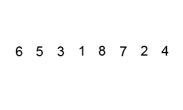

# 你必须知道的常见 JavaScript 算法

> 原文：<https://javascript.plainenglish.io/common-javascript-algorithms-you-must-know-9ca569ddf46f?source=collection_archive---------3----------------------->


今天我们要学习一些每个开发者都应该知道的基本算法。算法是面试中常见的话题。所以你要专注于这个话题。对算法有很好的理解可以管理好一份开发者的工作。

# 阶乘

这是基本算法之一。但有时你可能会被问到寻找一个数的阶乘。那么什么是阶乘数呢？

> 任何数字的阶乘是**那个数字**乘以**的阶乘(那个数字减 1)。你把这个数字乘以每个连续的数字减一。**

那么数字 5 的阶乘是多少呢？

```
5! = 5 * 4 * 3 * 2 * 1
```

## 迭代实现

## 递归实现

# 斐波那契数

在数学中，斐波纳契数列是以下整数序列中的数字，称为斐波纳契数列，其特征在于前两个数字之后的每个数字都是前两个数字之和:

```
0, 1, 1, 2, 3, 5, 8, 13, 21, 34, 55, 89, 144, ....
```

## 迭代实现

## 递归实现

# 线性搜索

在计算机科学中，线性搜索或顺序搜索是一种在列表中查找目标值的方法。它按顺序检查目标值列表中的每个元素，直到找到匹配项或搜索完所有元素。


**时间复杂度:** `O(n)` -因为在最坏的情况下，我们只检查每个元素一次。

## 履行

# 二进位检索

在计算机科学中，二分搜索法也称为半区间搜索、对数搜索或二进制截断，是一种在排序数组中查找目标值位置的搜索算法。

> **要实现二分搜索法，必须对数组进行排序**


**时间复杂度:** `O(log(n))` -因为我们为每一次迭代将搜索区域一分为二。

## 履行

# 冒泡排序

冒泡排序，有时也称为下沉排序，是一种简单的排序算法，它重复遍历要排序的列表，比较每对相邻的项目，如果它们的顺序错误(升序或降序排列)，则交换它们。重复遍历列表，直到不需要交换，这表示列表已排序。

**时间复杂度:** `O(n^2)`



## 履行

# 选择排序

选择排序是一种排序算法，特别是就地比较排序。

**时间复杂度:**


## 履行

# 插入排序

插入排序是一种通过将数组分为“已排序”部分和“未排序”部分来排序数组的方法。然后，我们比较未排序的项目，看它是否大于前一个元素，如果不是，我们插入新的项目。基本上，我们是从左向右看，边看边排序。

**时间复杂度:** `O(n^2)`


## 履行

今天到此为止。感谢阅读。