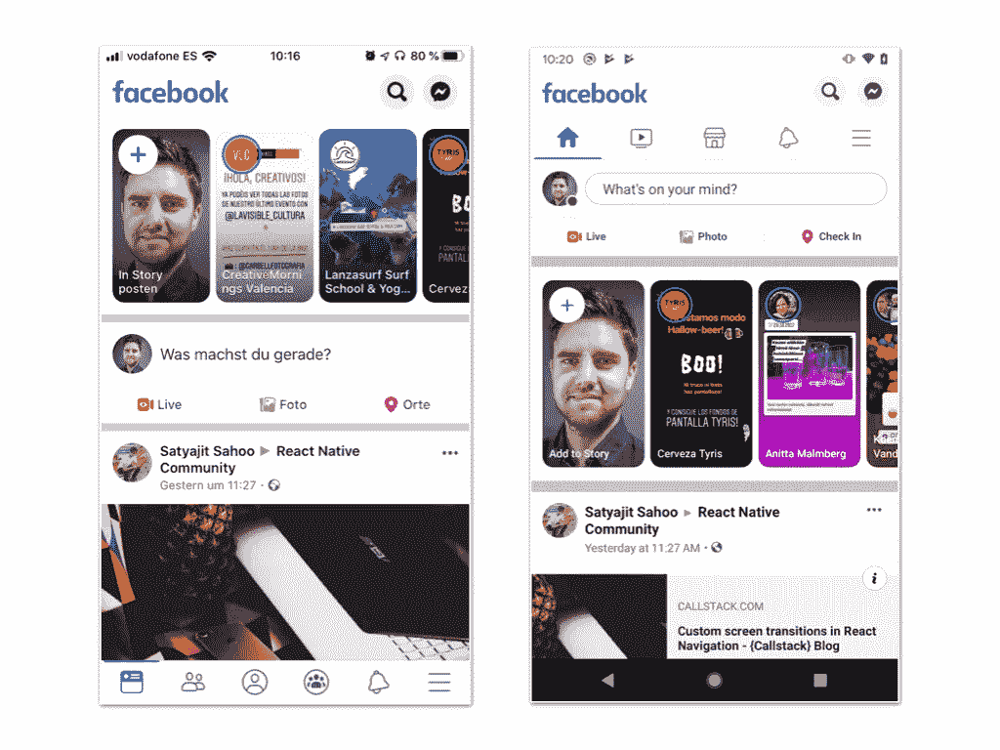
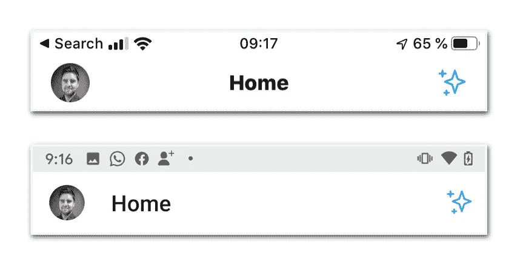
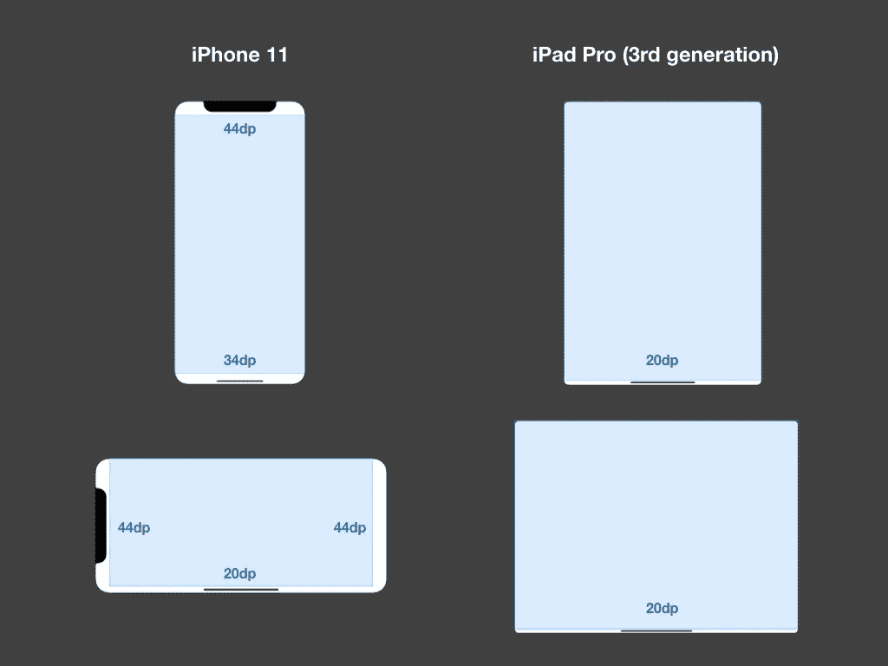

# React Native 中要避免的常见跨平台陷阱

> 原文：<https://javascript.plainenglish.io/common-pitfalls-i-run-into-on-every-react-native-project-7ea2e7c1d88?source=collection_archive---------1----------------------->

Photo by [Artem Maltsev](https://unsplash.com/@art_maltsev?utm_source=medium&utm_medium=referral) on [Unsplash](https://unsplash.com?utm_source=medium&utm_medium=referral)

## 人们在为 iOS 和 Android 开发应用程序时经常犯的三个错误

我在 React Native 中构建移动应用时经常遇到的最大麻烦之一不一定是技术上的:而是人们为 Android 设计 iOS 应用，或者反之亦然。

许多公司选择 React Native 而不是 native development，因为它的学习曲线很浅。但是经常被忽略的是，您仍然在为两个完全不同的环境进行开发。

我们应该按照每个平台各自的设计准则精心打造用户体验。

对于那些不熟悉手机的人来说，你应该看看 Android 的[材料设计](https://material.io/design/)指南和 iOS 的[人机界面指南](https://developer.apple.com/design/human-interface-guidelines/ios/overview/themes/)。您不需要对它们了如指掌，但是看一看并熟悉其核心原则是值得的。

如果你是一名 React 本地(或任何类型)移动开发人员，你也经常没有影响力、权威或技能来积极地塑造设计过程，所以你可能想向你团队中的设计师提出一些问题，以确保他们关注最关键的平台差异:

*   我们是在创造平面设计还是基于纸张的设计？
*   我们是否坚持默认的导航行为，包括过渡和手势？
*   我们是否考虑了视觉层次在每个平台上的不同表达方式？
*   iOS 和 Android 上的图标和排版通常是什么样子的？
*   每个平台上的表单元素(单选按钮、开关)有何不同？

关于 iOS 和 Android 之间差异的详尽列表，我还可以推荐以下文章:

 [## Android 与 iOS:比较 20 种 UI 组件和模式(第 1 部分)

### 在设计跨平台应用时，你应该知道的 Android 和 iOS 的 20 个区别

medium.com](https://medium.com/@chunchuanlin/android-vs-ios-compare-20-ui-components-patterns-part-1-ad33c2418b45)  [## Android 与 iOS:比较 20 种 UI 组件和模式(第 2 部分)

### 在设计跨平台应用时，你应该知道的 Android 和 iOS 的 20 个区别

medium.com](https://medium.com/@chunchuanlin/android-vs-ios-compare-20-ui-components-patterns-part-2-3edba2076b25) 

记住这一点，让我向您介绍一下我在几乎每个 React 原生项目中遇到的跨平台开发的一些常见陷阱。

# 航行

在 Android 上，标签栏位于屏幕顶部比在 iOS 上更常见。让我们以脸书应用程序为例。

The Facebook app on iOS (left) and Android (right)

这是故意的，因为一些应用程序不希望你意外地点击 Android 上的原生底部栏。

The native bottom bar on Android

另一个与导航相关的重要细节是标题栏。在 Android 上，它的内容通常是左对齐的。让我们来看看 Twitter 应用程序:

The navigation header bar on iOS (top) and Android (bottom)

许多不熟悉 Android 的手机设计师认为这是一个 bug，并会告诉你如何修复它。但是除非你有一个强有力的理由，否则坚持默认设置通常是安全的。

# **安卓返回键**

当添加自定义屏幕，如模态、底部表单或任何其他可以导航到的自定义屏幕时，大多数 Android 用户会希望他们可以使用默认的 Android back 按钮来放弃它。

再来看看原生底吧。

The back button in the native Android bottom bar

我见过 React 原生应用程序，点击它会把你带回到覆盖图下面的先前路线*，或者更糟的是——退出应用程序！*

现在，每当你创建一条不依赖于你的导航栈的*默认*行为(通常由`react-navigation`提供)的路线时，你必须非常清楚你在做什么。

虽然看起来您只需将缺少的 [BackHandler](https://facebook.github.io/react-native/docs/backhandler) 添加到新组件中，但这通常需要更多的工作:由于屏幕不会被添加到底层导航堆栈中，它也不会出现在**导航历史**中，因此当您在导航堆栈中来回移动并以这种方式包含自定义路线时，可能会发生许多意想不到的事情。

实际上，您可能希望熟悉[自定义 Android 后退按钮处理](https://reactnavigation.org/docs/en/custom-android-back-button-handling.html)以及如何[构建您自己的导航器](https://reactnavigation.org/docs/en/custom-navigator-overview.html)，以便更深入地理解这个主题。

# 安全区域

同样令人困惑的是所谓的安全区域，但这次是在 iOS 上。

自从 iPhone X 推出以来，在屏幕上有几个区域你应该避免放置任何关键或互动的内容。原因是这些是为原生手势保留的，比如从底部向上滑动以在应用程序之间切换。

Hardware constraints on iOS: safe areas on iPhone 11 (left) and iPad Pro (right)

通过使用`SafeAreaView`作为*所有*屏幕的包装器，很容易避免这些问题(例如使用包装器)。但是这也导致了糟糕的用户体验，因为受保护的区域现在完全是空的。

如果你仍然想利用闪亮的全屏体验，同时确保不干扰手机的原生手势(实际上，这可能会导致应用程序商店拒绝)，你必须考虑如何处理安全区域。

我强烈建议您在这个过程中尽快掌握它，因为稍后再处理它会导致许多痛苦的重构。

**安卓显示屏剪影**

最重要的是，你可能会遇到安卓手机，它们有着相似的布局特点:安卓显示屏的镂空。

The Anroid display cut-out on phones like the Pixel 3 XL

为了处理这个特殊的问题，您实际上需要更深入一层，深入到原生层。但是在我继续深入之前，让我给你看一下布鲁诺·莱默斯的一篇文章，这篇文章很好地解释了...

# 设计，设计，设计！

考虑到这些因素，作为一名 React 原生开发者，你已经可以在 iOS 或 Android 上打造更好的原生用户体验了。

但这并不妨碍我们从一开始就必须*在 iOS 或 Android 中思考*，而不仅仅是将 iOS 设计扔给 Android，或者反过来。

React 原生生态系统提供了大量的工具和库来为这两个平台设计出色的用户体验，但它不是一个自动将您的设计从一个平台的 UI 转换到另一个平台的银弹解决方案。

**非常感谢你的阅读！如果你对上面提到的跨平台怪癖有任何反馈，欢迎在下面发表评论，或者通过** [**Twitter**](https://twitter.com/marcelkalveram) **与我联系。**