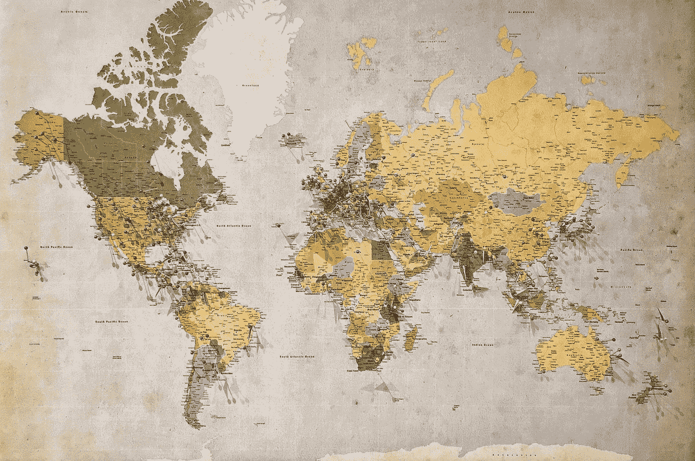

# 常见的 Vue 问题—地图和集合、传递方法等等

> 原文：<https://javascript.plainenglish.io/common-vue-problems-maps-and-sets-passing-methods-and-more-5473a329e609?source=collection_archive---------9----------------------->



Photo by [Andrew Stutesman](https://unsplash.com/@drewmark?utm_source=medium&utm_medium=referral) on [Unsplash](https://unsplash.com?utm_source=medium&utm_medium=referral)

Vue.js 让开发前端应用变得简单。然而，我们仍有可能遇到问题。

在这篇文章中，我们将看看一些常见的问题，并看看如何解决它们。

# Vue 应用程序中的地图和集合

Vue 看不到地图和布景。

我们可以使用`v-for`，从它们创建一个计算属性，使用观察器，模板表达式等等。

我们必须创建该结构的可序列化副本，并将其暴露给 Vue。

这意味着我们必须将它转换成一个数组，并与另一个变量组合。

例如，我们可以写:

```
{
  ...
  data() {
    changeTracker: 1,
    mySet: new Set(),
  },

  computed: {
    setAsList() { 
      return this.changeTracker && [...this.mySet];
    },
  },

  methods: {
    add(item) {
      this.mySet.add(item);    
      this.changeTracker += 1;
    }
  }
  ...
}
```

我们添加了一个`changeTracker`状态，Vue 会监视它，以便在我们更新集合时计算我们的计算属性。

此外，Vue 跟踪赋值，所以当 map 或 set 更新时，我们可以将它重新赋值给同一个变量。

例如，我们可以写:

```
methods: {
  add(item) {
    this.mySet = new Set(this.mySet.add(item));
  }
}
```

每当我们的设置更新时，我们分配给`this.mySet`，所以 Vue 将观看它。

# 将方法从父组件传递到子组件

我们可以通过 props 将一个方法直接从父节点传递给子节点。

例如，我们可以写:

```
<child-component :test="test"><child-component>
```

我们将一个`test`方法作为`test`道具的值传递给`child-component`。

# 将 ES6 代码与 IE11 一起使用

ES6 代码不运行 IE 11。因此，我们需要在我们的 Babel 配置中特别针对 IE 11，以便编译的代码将是 ES5。

例如，我们可以写:

```
{
  "presets": [
    [
      "@vue/app",
      {
        "targets": {
          "ie": "11"
        }
      }
    ]
  ]
}
```

在`.babelrc`中。

上面的配置是针对巴别 7 的。

如果我们使用巴别塔 6，我们可以写:

```
{
  "presets": [
    ["env", {
      "targets": {
        "browsers": [ ">0.25%"]
      }
    }],
    "vue"
  ]
}
```

根据 browserlist 显示的全球用户覆盖率。

这将转换代码，使其覆盖 IE 11。

# 在 Vue CLI 项目中使用引导程序

要在 Vue 项目中使用普通引导程序，我们可以将其作为节点包安装，

所以我们可以运行:

```
npm install bootstrap
```

来安装它。

然后我们可以运行:

```
npm install sass-loader node-sass --save-dev
```

添加 SASS 加载程序和节点 SASS。

然后在我们的 Webpack 配置中，我们可以通过编写以下内容来添加 SASS 配置:

```
sassLoader: {
  includePaths: [
    path.resolve(projectRoot, 'node_modules/bootstrap/scss/'),
  ],
},
```

现在，我们可以通过编写以下代码来导入引导 CSS:

```
<style lang="scss">
  @import "bootstrap";
</style>
```

在我们的组件中。

此外，我们可以使用 BootstrapVue，这是一个包含由 Bootstrap 构成的 Vue 组件的包。

# 观察 Vue 组件中的本地存储变化

我们可以通过添加`localStorage.getItem`作为 getter 来观察 Vue 组件的变化。

例如，我们可以写:

```
new Vue({
  el: '#app',
  data() {
    return {
      get count() {
        return localStorage.getItem('count') || 0;
      },
      set count(value) {
        localStorage.setItem('count', value);
      }
    };
  }
});
```

我们用`get`为`localStorage.getItem(‘token’)`添加了一个 getter。

同样，我们添加了一个带有`set`的 setter 来设置令牌。

然后在我们的模板中，我们可以写:

```
<div id="app">
  {{token}}
  <button @click="count++"> + </button>
</div>
```

我们可以因为 setter 而更新`count`变量。

它采用现有值，并将其增加 1。

# 复制对象并将其添加到 Vue 组件的数组中

我们可以复制一个对象，然后通过浅层或深层克隆将其添加到 Vue 数组中。

要做浅层克隆，我们可以用`Object.assign`。

例如，我们可以写:

```
addItem(e) {
  this.items.push(Object.assign({}, this.newItem));
}
```

我们也可以通过使用`JSON.stringify`和`JSON.parse`写来进行深度克隆:

```
addItem(e) {
  this.items.push(JSON.parse(JSON.stringify(this.newItem)));
}
```

此外，我们可以使用对象传播来制作对象的副本。

例如，我们可以写:

```
addItem(e) {
  this.items.push({...this.newItem});
}
```


Photo by [Jonathan Borba](https://unsplash.com/@jonathanborba?utm_source=medium&utm_medium=referral) on [Unsplash](https://unsplash.com?utm_source=medium&utm_medium=referral)

# 结论

我们可以通过使用`Object.assign`、扩展操作符或`JSON`方法将一个对象的副本添加到一个数组中

此外，我们可以用 getters 和 setters 来观察本地存储状态。

我们必须专门为 IE 编译。

## 简单英语的 JavaScript

你知道我们有四份出版物和一个 YouTube 频道吗？在 [**plainenglish.io**](https://plainenglish.io/) 和 [**找到它们订阅我们的 YouTube 频道**](https://www.youtube.com/channel/UCtipWUghju290NWcn8jhyAw) **！**