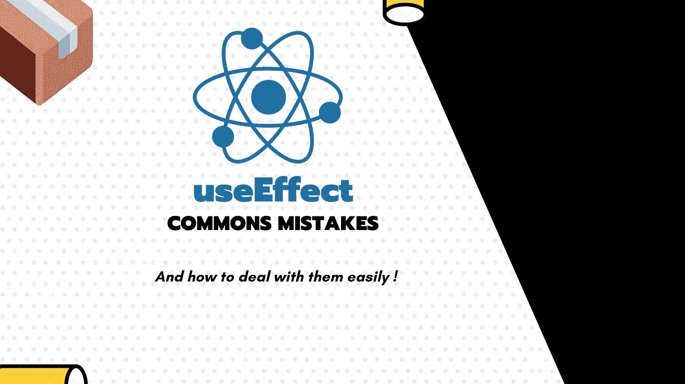

# React useEffect hook 的常见错误及其预防。

> 原文：<https://javascript.plainenglish.io/commons-mistakes-with-react-useeffect-hook-and-how-to-prevent-them-d0ca253fb1f7?source=collection_archive---------1----------------------->

## 技术提示

## 我在使用`useEffect`时遇到了一些问题，我会试着给你一些快速的模式，让你不会陷入同样令人失望的状态。



`useEffect`是一个强大的工具，但你需要在清楚了解它如何工作的情况下使用它。否则，您可能会陷入令人失望的境地，出现一些难以调试的意外错误。

# 在`useEffect`返回一个承诺而不是一个函数

我想说的第一个错误是`useEffect`期望你返回`undefined`或者一个`cleanup function`。但是如果你使用了一个`async`函数，你实际上是在一个期望函数的地方返回了一个承诺(有时是一个解析为函数的承诺)，这解释了为什么你的清理没有工作。

这是如何发生的完美例子，以后我们会看到处理这种情况的正确方法:

```
const App = () => {   
  useEffect(async () => {
    const unsubsribe = await dummySubscriber(); return () => {
       unsubscribe()
     }
   }, []) return null
}
```

上面的例子是错误的，因为在闭包生成的时候，unsubscribe 函数是未定义的。

我已经在下面的文章中解释了如何处理异步代码:

[](https://medium.com/javascript-in-plain-english/how-to-use-async-function-in-react-hook-useeffect-typescript-js-6204a788a435) [## 如何在 React hook use effect(Typescript/JS)中使用异步函数？

### 💡默认情况下，react 的 useEffect 挂钩不支持异步函数，了解如何解决这个问题💪🏻

medium.com](https://medium.com/javascript-in-plain-english/how-to-use-async-function-in-react-hook-useeffect-typescript-js-6204a788a435) 

还要记住，即使使用异步代码，效果也只是在触发和忘记模式下触发，而不需要等待您的异步代码。否则会有灾难性的用户界面后果。

# useEffect 和异步或条件订阅:如何正确清理它们？

大多数人认为他们正在正确地取消订阅或附加到其节点的事件侦听器，但有时他们是错误的…

虽然当代码是同步的并且没有条件块时，一切都很简单，但当它不是同步的时，可能会变得有点棘手。

考虑下面的事件订阅者，它被给定一个`callback`并返回`unsubscribe`函数。

```
function dummySubscriber(callback) {
  const interval = setInterval(() => callback("ticked"), 1000);

  return function unSubscribe() {
    clearInterval(interval);
  };
}
```

我已经看过太多次下面的代码，让开发人员期望取消订阅。

```
const App = () => {   
  useEffect(() => {
     let unsubscribe = () => undefined async function playEffect() {
       await someAsyncCode()
       unsubsribe = dummySubscriber()
     }
     playEffect() return () => {
       unsubscribe()
     }
   }, []) return null
}
```

事实是上面的代码不会退订，不会产生内存泄漏，因为在生成返回函数的那一刻，`unsubscribe`还有`() => undefined`值。

通过在异步代码中重新分配它，我们替换了引用。这是一个比赛条件，因此有时可能不会发生，这就是为什么它很棘手，但它一点也不安全。

有两种方法可以克服这个问题:

*   使用一个对象并修改它的一个属性，这将保持对源对象的引用。
*   再次使用一个对象，但是通过使用`useRef` hook from React。

两者都有相同的好处，但是使用`useRef`允许您从其他地方编辑这段代码。

简单地说，`useRef`用`.current`返回一个对象，这允许我们重新赋值并保留对源对象的引用。

```
const App = () => {   
  useEffect(() => {
     const subscription = {unsubscribe: () => undefined} async function playEffect() {
       await someAsyncCode()
       subscription.unsubsribe = dummySubscriber()
     }
     playEffect() return () => {
       subscription.unsubscribe()
     }
   }, []) return null
}
```

或者使用反应参考

```
const App = () => {   
  const unsubscribe = useRef(() => undefined) useEffect(() => {
    async function playEffect() {
       await someAsyncCode()
       unsubscribe.current = dummySubscriber()
     }
     playEffect() return () => {
       unsubscribe.current()
     }
   }, []) return null
}
```

现在，当生成返回函数时，它保留了一个对对象的引用，在上面的例子中，该对象的属性`current`或`unsubscribe`被更新。这样，我们的 clean 函数就被正确地调用了。

# useEffect 非预期触发和无限循环

用`useEffect`实现无限循环最简单的方法就是当一些状态改变时触发效果，当这个状态改变时，你运行一些代码触发这个相同的状态改变。

虽然当您只有这样的代码时，这看起来很明显:

```
const App = () => {
   const [state, setState] = useState(); React.useEffect(() => {
     setState(Math.random());
   }, [state])
 }
```

当`deps`数组有多个值时，这非常方便。我看到很多(太多)的`useEffect`函数在做太多的事情。

总是倾向于使用多个`useEffect`并保持单一责任原则的有效性。在`useEffect`第二个参数中，依赖关系越少，出现的错误就越少。

此外，如果你觉得你的效果中有太多的代码，花些时间重构并提取完成工作的函数。

我已经为`useState`钩子写了一篇类似的文章，你可能会感兴趣。

[](https://medium.com/javascript-in-plain-english/commons-mistakes-with-react-usestate-hook-and-how-to-prevent-them-43c811ca7451) [## React useState 钩子的常见错误以及如何防止它们。

### 我在各种 react 项目中看到了一系列棘手的错误，而开发人员没有意识到这些错误可能会破坏他们的整个…

medium.com](https://medium.com/javascript-in-plain-english/commons-mistakes-with-react-usestate-hook-and-how-to-prevent-them-43c811ca7451) 

## [**🇫🇷为法国人🥖**我提议将⚡️ **编码 Spark** 并以简讯的形式发布，以获得相关技术的报酬！](https://codingspark.io/?referral=medium)