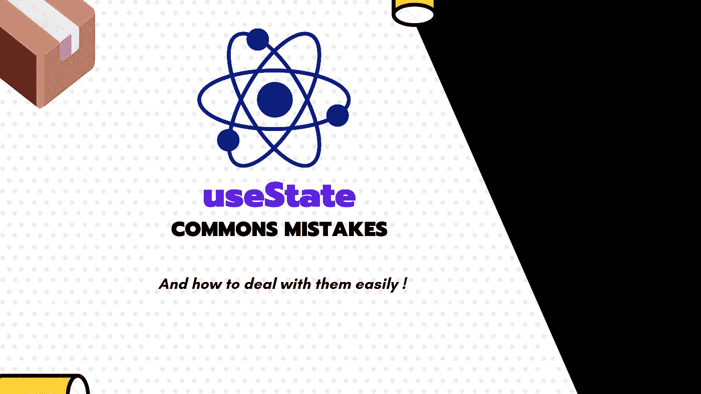

# React useState 钩子的常见错误以及如何防止它们。

> 原文：<https://javascript.plainenglish.io/commons-mistakes-with-react-usestate-hook-and-how-to-prevent-them-43c811ca7451?source=collection_archive---------2----------------------->

## 技术提示

## 我在各种 react 项目中看到了一系列棘手的错误，而开发人员没有意识到这些错误可能会破坏他们的整个应用程序！



React `useState`是现代 React 应用程序的核心部分，然而，许多开发人员在使用它时并不真正知道它在做什么。

虽然很容易将它用于原始类型，如*字符串*、*布尔*或*数字*，但当使用引用类型，如*对象/地图*或*数组*时，它可能会变得更方便。

这些错误会产生一些常见的问题，比如:

> 为什么更改 React 状态后，我的 UI 不显示最新状态？

或者另一个相近的:

> 我更新了我的反应状态，但我看不到变化，为什么？

**你可能处于这种状态，甚至自己都不知道，因为这可能是一个假阳性的情况，一切似乎都正常，但这只是一个成功的随机案例。**

# 基于以前的状态时不使用以前的值

这里要问的真正问题是:

> 如何从前一个状态计算出反应状态？

这可能是最常见的错误，直到今天我还能看到这样的代码:

```
const App = () => {
  const [counter, setCounter] = useState(0);

  return (
    <button onClick={() => setCounter(counter + 1)}>
      Increment me {counter}
    </button>
  );
};
```

好吧，它可能随机工作，但这是坏代码！即使你可能在 React 官方文档中看到过它。这可以工作，是的，这可能在大多数情况下是可行的，但是这是不安全的，因为 React 可以将状态更新排队并计算到一个批处理中，以减少与 dom(或 React Native 中的等效对象)的交互。对于怀疑论者来说，看看这个:

Conventional setState vs Functional setState

如果发生这种情况，与先前的值没有关系，您可能会得到不正确的计算值。

只要你依赖于先前的状态，**你就需要使用一个被给定先前状态并返回新状态的函数。**React 的方式是简单地链接这些函数调用以获得最新的状态。

```
const App = () => {
  const [counter, setCounter] = useState(0);

  return (
    <button onClick={() => 
      setCounter(prevCounter => prevCounter + 1)}
    >
      Increment me {counter}
    </button>
  );
};
```

虽然我们可以在 Javascript 中使用闭包来处理作用域并传递值，但大多数时候，如果允许的话，最好还是编写依赖注入代码。

使用闭包是强大而有用的，尤其是使用工厂函数来隐藏公共 API 中的一些变量。**但这不是银弹模式。**

# 更新状态引用，而不是重新分配它

最常见的错误是理解 useState 的工作方式，尽管在文档的不同地方都有描述。

useState 的工作原理是在改变时对值进行浅层比较，这意味着如果使用对象或数组，就需要改变引用。

以下代码导致应用程序 UI 不被刷新:

```
const App = () => {
  const [state, setState] = useState({ a: null }); return (
    <button 
      onClick={() =>
        setState((previousState) => {
          previousState.a = "newValue";
          return previousState;
        })
      }
    >
      ChangeMe {state.a}
    </button>
  );
};
```

正如你所看到的，`previousState`仍然是相同的引用，我们只是编辑了它的一个嵌套属性。这样，该算法就不能检测到变化，因为它只在使用对象/数组时寻找引用。

一种方法是创建一个新的引用并使用现有的值

```
const App = () => {
  const [state, setState] = useState({ a: null });return (
    <button 
      onClick={() =>
        setState((previousState) => {
          return Object.assign({}, previousState, {a: "newValue"})
          // Or return {...previousState, a: "newValue"}
        })
      }
    >
      ChangeMe {state.a}
    </button>
  );
};
```

不是说我们得到了一个新的参考，一切都得到更新。这是 React 中使用不变性的一种非常常见的模式。看看这个图书馆，它真的很酷。

[](https://github.com/rtfeldman/seamless-immutable) [## rtfeldman/无缝-不可变

### JavaScript 的不可变数据结构，向后兼容普通的 JS 数组和对象。…

github.com](https://github.com/rtfeldman/seamless-immutable) 

您也可以对数组使用流行的函数式编程函数，比如返回新数组的`filter`或`map`。

# 想要存储一个函数作为状态来改变它

出于某种原因，我也试图这样做……问题是:这是一个软件设计和思考的问题。

这样做你是命令式思考，而 React 是声明式思考。首先，如果你正在使用一个函数，你将在我们之前讨论的第一个错误解决方案中结束，其中 React 提供前一个值。

要覆盖这种行为，我们需要给一个函数，返回一个函数，从那里开始，它闻起来真的像狗屎代码，但让我们试试。

```
const App = () => {
  const [callback, setCallback] = useState(() => () => "Hello world"); return (
    <button
      onClick={() => {
        *// Execute the callback code* setCallback(() => () => "Hello WORLD"+ Math.random())
      }}
    >
      Click me {callback()}
    </button>
  );
};
```

好吧，这是可行的，尽管它对开发者并不友好。在我们的例子中，我们可以用一个`useState`来代替它，然后按需计算值，但是假设我们出于某种原因想要保留一个函数。

您应该使用`useCallback/useMemo`并基于某种状态进行回调更改。这样你就可以说，我希望这个函数取 X 的名字，只要 Y 不变，就用这些值来执行

```
const App = () => {
  const [clickId, setClickId] = React.useState(0);
  const callback = useCallback(() => "Hello WORLD"+ Math.random(), [clickId]) return (
    <button
      onClick={() => {
        *// Make the callback stale* setClickId(prev => prev + 1)
      }}
    >
    Click me {callback()}
    </button>
  );
};
```

下面的代码是我们上面写的内容的另一种写法。我们使用声明式编程，只使用一个计数器来使回调的缓存无效。

## [🇫🇷对法国人来说🥖我提议用⚡️编码火花和一份时事通讯来收取技术费用！](https://codingspark.io/?referral=medium)