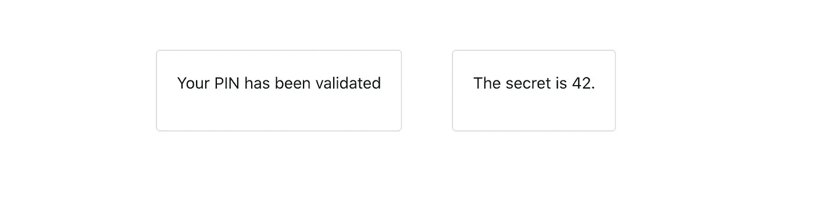
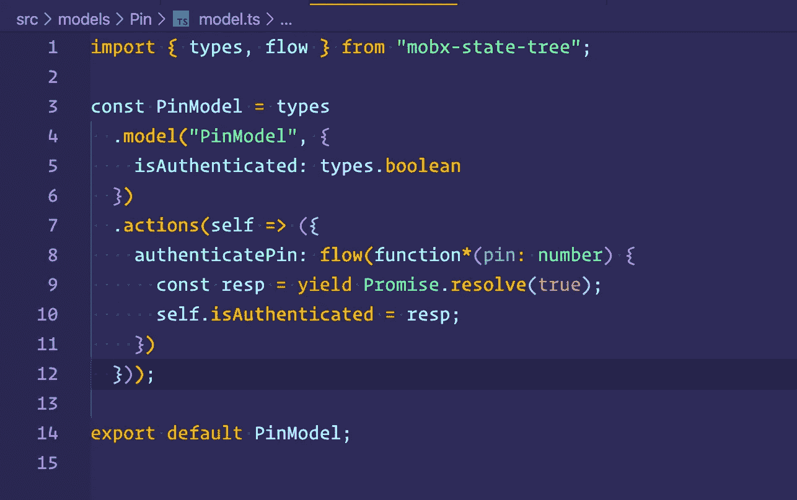
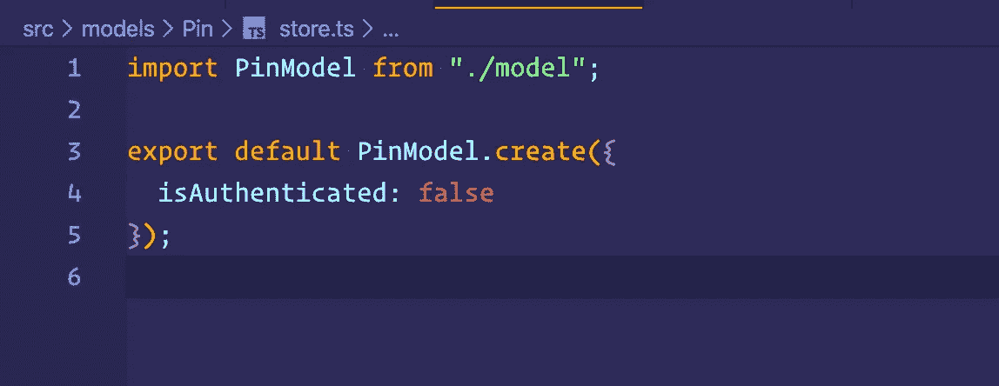
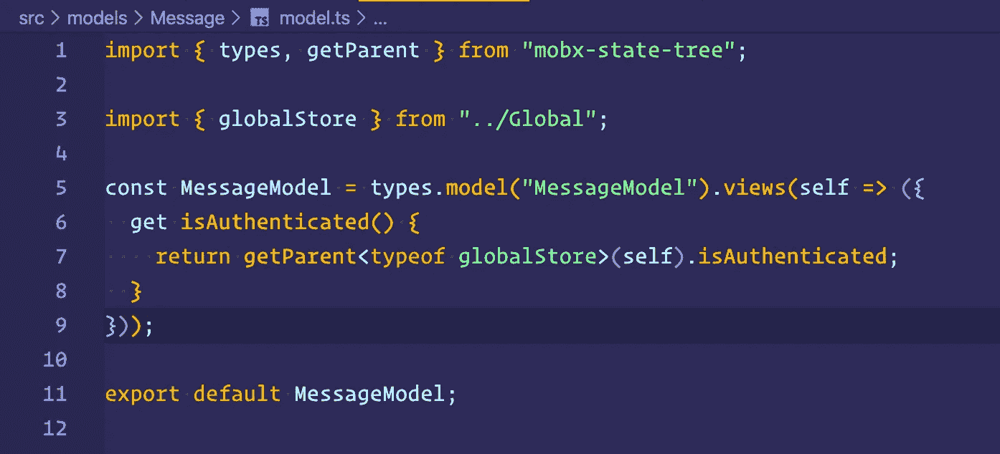
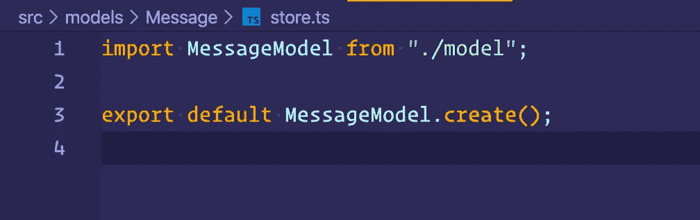
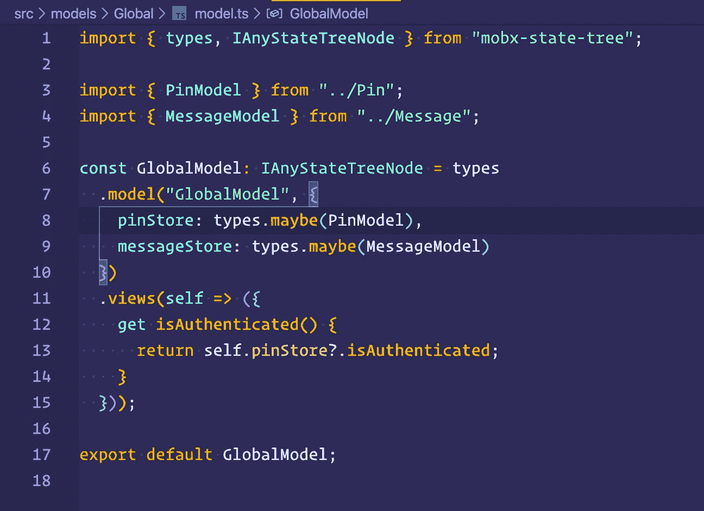
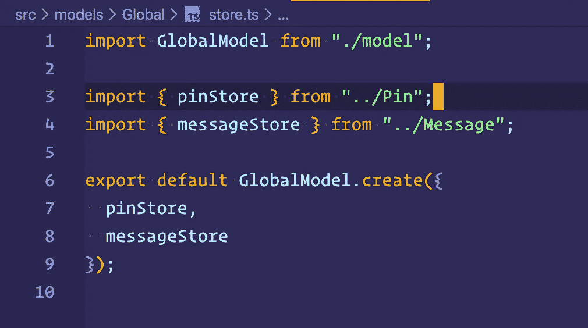
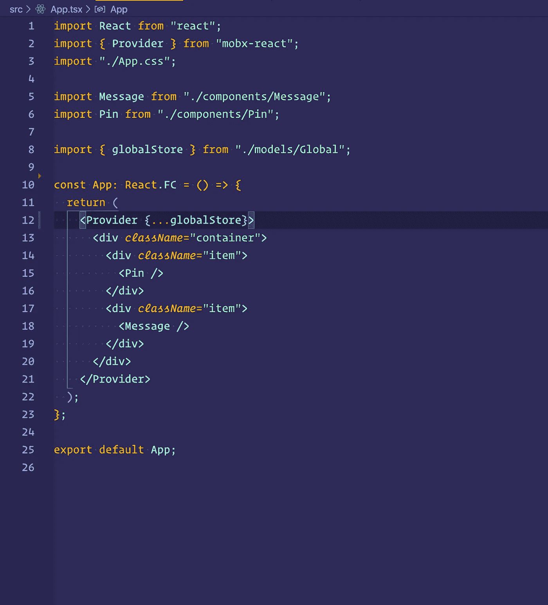

# 使用 React 和 TypeScript 在 MobX-state-tree 中的存储之间进行通信

> 原文：<https://javascript.plainenglish.io/communicating-between-stores-in-mobx-state-tree-with-react-and-typescript-24d103001b32?source=collection_archive---------3----------------------->

# 介绍

当使用 MobX-state-tree 管理状态时，您可能会遇到尝试跨存储进行通信的问题。从一个存储中需要一个计算属性，并需要在另一个存储中使用它，这种情况并不罕见。这就是今天的文章将涵盖的内容。

概括我们的问题，我们有如下的陈述:

> 给定存储 A，属性 X 表示为 A.X，我们希望能够对存储 b 使用 A.X。

# 演示设置

在我创建的一个演示项目中，用户可以看到两张卡片。在初始状态下，一张卡需要用户的 PIN。另一张卡包含一条信息，这条信息对没有通过 PIN 认证的用户是隐藏的。

Simple Demo UI

这些卡中的每一个都有自己的组件，称为`Pin`和`Message`。这些组件的状态在它们自己的状态树模型中处理。当用户提交 PIN 后，他们会看到以下秘密消息:

UI when validated

# 模型和商店

## `PinModel`和 pinStore

Source code for PinModel

PinModel 是我们在 Pin 组件中使用的状态的蓝图。在这个虚构的例子中，我们的模型`isAuthenticated`中只有一个属性，它是一个布尔变量，指示当前用户是否已经过身份验证。我们还向一些认证服务添加了异步请求的模拟，但实际上这只是一个始终兑现的承诺。让我们记住，这是一个人为的例子，显示商店之间的沟通！

Source code for pinStore

`pinStore`简单地创建模型的一个实例，我们将其导出以供消费。

## 消息模型和消息存储

Source code for MessageModel

MessageModel 应该是定义消息组件所需状态的位置；然而，为了让这个组件知道用户是否已经被认证，它需要从 pinStore 中借用`isAuthenticated`字段。我们如何做到这一点？从图中可以看出，我们使用了 MobX-state-tree 中的一个名为`getParent`的函数。该功能允许我们在状态树中向上，并访问该级别的商店。

Source code for messageStore

这种情况下的 messageStore 编写如下，因为不需要为 MessageModel 初始化任何东西。

## 全球模型和全球商店

允许商店之间进行这种通信的关键是构造父商店。在我们的例子中，我们称之为全球商店。

Source code for GlobalModel

我们在右边看到的 GlobalModel 被定义为包含子商店。在这种情况下，我们有两个子存储:pinStore 和 messageStore。在子商店之间共享属性方面，我们需要在 GlobalModel 中定义*视图*来公开子商店中的状态变量。我们可以看到，我们从 pinStore 中公开了`isAuthenticated`变量，这样这些子存储中的任何一个都可以通过`getParent`函数访问该属性。

Source code for globalStore

globalStore 是通过传入存储的实例来定义的。

# 事物反作用的一面

既然我们已经为我们的模型建立了所有的逻辑，我们需要将它们与我们的组件集成。

## App.tsx

我不完全确定这是否是将商店注入提供商的最佳方式。我肯定会接受建议！

App.tsx

要将 MobX-state-tree 与 React 一起使用，我们必须将存储注入到提供者组件中。我们通过导入 globalStore，然后将这些值传播到一个对象中，作为 props 到 Provider 组件中。

## 向组件中注入存储。

为了将存储注入到组件中，我们在这里遵循相同的模式。我们注入商店的名称，并将组件包装为观察者。通过这样做，我们可以访问商店作为组件的道具。鉴于我对 TypeScript 还不熟悉，我注意到的一件事是，我们需要将 store 设置为可选的，否则我们会被期望将 store 作为一个道具显式地钻取。

# 结论

对于源代码，我包含了一个到[库](https://github.com/ja153903/mobx-state-tree-parent-child-demo)的链接。我希望听到一些最佳实践方面的反馈。MobX-state-tree 是一个很好的状态管理工具。我强烈建议试一试！