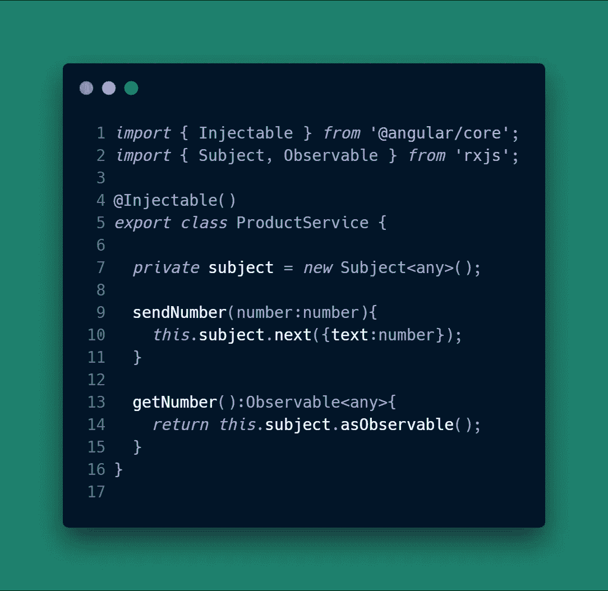
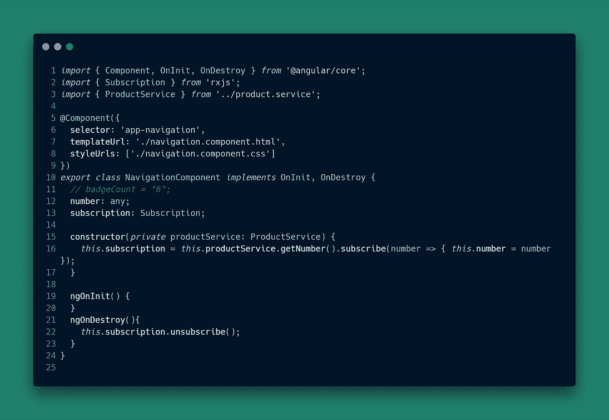
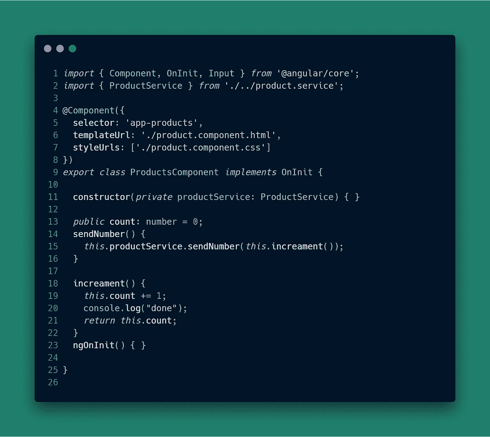

# 两个组件之间的通信，可观察对象-角度 2/6

> 原文：<https://javascript.plainenglish.io/communication-between-two-components-with-observable-subject-angular-2-5-b501a2cf8f25?source=collection_archive---------1----------------------->

## 这是一个快速的帖子，展示了一个让我陷入困境的例子——如何在 Angular 2/6 中的组件之间进行通信。

解决方案是使用一个可观察对象和一个主题(这是可观察对象的一种类型)，这里我不会过多讨论可观察对象如何工作的细节，我们感兴趣的有两种方法: **Observable.subscribe()** 和 **Subject.next()** 。

# Observable.subscribe()

observable subscribe 方法用于订阅发送给可观察对象的消息。

# Subject.next()

subject next 方法用于向一个可观察对象发送消息，然后将这些消息发送给该可观察对象的所有订户。

see on StackBlitz ( [https://stackblitz.com/edit/cart-badge](https://stackblitz.com/edit/cart-badge))

File Structure of Project:

# 角度 2/6 产品服务

产品服务支持从应用程序中的任何组件订阅号码和发送号码。

重要提示:如果您将这样的服务添加到您的应用程序中，不要忘记将它添加到您的`app.module.ts`文件的`providers: [...]`部分。

product.service.ts

# 接收数字的角度 2/6 导航组件

导航组件使用产品服务来订阅新号码，并通过号码属性使它们可用于导航组件模板。

navigation.component.ts

# 发送数字的角度 2/6 产品组件

产品组件使用号码服务向应用组件发送号码。

product.component.ts