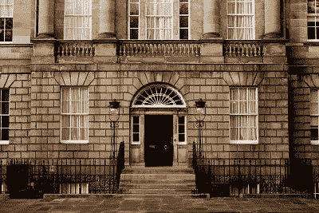

# 将 Node.js 中的图像与 JIMP 进行比较

> 原文：<https://javascript.plainenglish.io/comparing-images-in-node-js-with-jimp-4e98659e08c3?source=collection_archive---------2----------------------->

## 发现图像的意外复制或故意窃取

Image: [Pixabay](https://pixabay.com/illustrations/detective-searching-man-search-1424831/)

JIMP npm 包为我们提供了比较图像文件的方法，以识别无意的重复或故意的抄袭。在这篇文章中，我将演示如何使用它们，在这个过程中，我们将发现两个图像必须有多相似才能被认为是相同的。

## JIMP 及其图像比较方法

JIMP 是 JavaScript 图像处理程序，你可以在它的 npm 页面上阅读完整的文档。

如果您只想为这个项目安装它，那么运行:

`npm install --save jimp`

我将使用三种方法来比较图像:

*   `hash`:返回一个图像的 64 位感知哈希。与您可能熟悉的加密哈希不同，感知哈希的变化与输入的差异大致成比例，因此相似图像的哈希也将是相似的。
*   `distance`:两个图像哈希之间的汉明距离，即。不同的位数。
*   `diff`:两幅图像之间的百分比差异。

上面链接的 JIMP 文档推荐使用`distance`和`diff`来比较图像。如果任一个小于 0.15，则可以认为图像是相同的。他们声称 99%的成功率只有 1%的假阳性。

然而，对于这个过程，我心中有几个未解的问题:

*   如果其中一张图片被转换成黑白的，它还能工作吗？
*   如果图像大小不同，是否有效？
*   如果其中一个图像被稍微增强了，比如锐化了，它还能工作吗？
*   它是否适用于繁重的编辑工作，例如，如果一幅图像高度像素化？

为了不吊你胃口，我发现它在所有这些情况下都工作得很好。我创建了四个按照上述要点编辑的图像，所有图像都与未编辑的原始图像具有完全相同的哈希(因此具有相同的汉明距离),尽管百分比差异确实有相当大的变化。然而，根据推荐的方法，只要至少一个测量值小于 0.15，图像就被标记为相同。

在这篇文章中，我将使用下面的图片展示用于测试这些案例的源代码。还有一个完全不同的图像，我只是想看看会发生什么。

*edinburgh_original.jpg*

edinburgh_sharpened.jpg

edinburgh_bw.jpg

edinburgh_pixelized.jpg

edinburgh_small.jpg

london.jpg

源代码由一个名为 **comparingimages.js** 的文件组成，您可以从 [Github 库](https://github.com/CodeDrome/comparing-images-node-jimp)中获取该文件。这是清单。

`compare`功能是`async`,因为我已经用`await`打开了图像。因为这只是一个实验，所以我省略了错误处理，当然，任何与外界交互的产品代码，例如文件系统，都应该处理错误。

图像打开后，输出原始图像的`hash`。当不带参数调用时，`hash`函数返回一个基数为 64 的数字，但是你也可以指定一个基数。这里我也打印了二进制或基数为 2 的等价物。

剩下的代码是重复的，计算原始图像和每个编辑图像之间的`hash`、`distance`和`diff`。

这里使用的函数相对来说是资源密集型的，运行这个程序，即使只有六张小照片也需要 2-3 秒。如果您正在编写代码来比较大量的图像，请记住这一点。

现在让我们运行代码…

`node comparingimages.js`

…这给了我们这个:

正如我上面提到的，爱丁堡照片的哈希和汉明距离是相同的，尽管百分比差异越来越大。注意“百分比”是误导性的；这些数字实际上是小数，例如，0.5 = 50%。

毫不奇怪，无论从哪方面来看，伦敦的照片都非常不同。