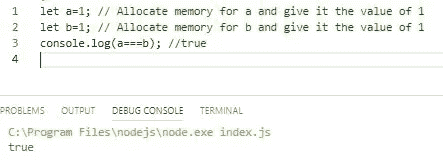
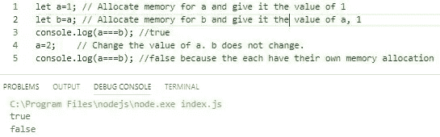
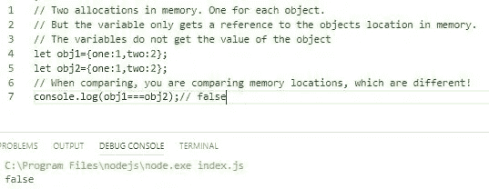
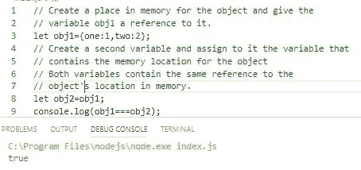
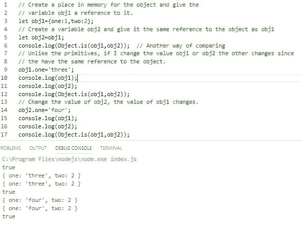

# 比较 JavaScript 中的对象

> 原文：<https://javascript.plainenglish.io/comparing-objects-in-javascript-ce2dc1f3de7f?source=collection_archive---------0----------------------->

## 什么可行，什么不可行，为什么。

Photo courtesy of theubercloud.com

> 比较对象是否相等很容易，但判断它们是否包含相同的键和值就不那么容易了。但是为什么呢？

> 我的目标是解释为什么确定两个对象是否包含相同的值会很困难。

## 为什么解释一个问题。就给我解决方案？

因为了解什么是困难的或不起作用的，可以让我们更深刻地理解为什么，并经常引导我们寻找或开发将起作用的解决方案。这个故事的结尾有一个很棒的视频链接。

## 原始数据类型与引用(非原始)类型

本质上，它与 JavaScript 原语和 JavaScript 非原语(对象)有关。

> 正如我将要演示的，通过代码和类比，包含原始类型的变量在内存中被赋予一个**值**。包含非原始类型的变量在内存中被赋予一个**引用**。

## **原语类型和内存分配**

**例 1**

简单来说，基本类型是数字、字符串、布尔、未定义和空。完整列表可在[这里](https://developer.mozilla.org/en-US/docs/Glossary/Primitive)找到。

Primitives have a value in memory

发生什么事了？对于任何原语，都会分配内存，原语的值存储在该内存位置。

借用一个常见的类比，假设我把数字 1 写在一张便笺条上，并把它放在白板上。它提醒我自己，我今天有一个任务。(当然，我可以编写任务，但让我们保持简单。)

我的办公室伙伴在便利贴上写下数字 1 来提醒自己开会的时间，并把它写在白板上。

便笺是不同的，每个便笺都包含自己的值。

*把每张便笺想象成分配的内存，把数字想象成存储在分配的内存中的值。在这种情况下，进行比较时，它们包含相同的值 1。*

> 当我们比较原语时，我们比较存储在内存位置的值。

如果我得到一个新任务，并将我的便笺条更改为 2，那么它不会影响其他便笺条。他们各有各的价值。

**例 2**

Each has their own memory allocation

变量 a 被分配了内存，并被赋予值 1。变量 b 有自己的内存空间，变量 a 的值为 1。**它不指向 a，它独立于 a，包含它自身的价值。**

所以当变量 a 改变时，变量 b 保持不变。

> 在 JavaScript 中，每个原语在声明时都有自己的内存空间。当分配一个值时，该值进入内存空间。

## 引用类型和内存分配

简单地说，引用类型是对象、函数和数组，统称为对象。更多信息可在[这里](https://developer.mozilla.org/en-US/docs/Web/JavaScript/Data_structures)找到。

**例三**

The variables obj1 and obj2 contain a reference. Each to a separate memory location.

这里需要理解的重要一点是，变量 obj1 和 obj2(可以是对象、数组或函数)都只包含对内存中某个位置的引用。而不是对象的值。

*地点分开，所以参照物不一样，比较失败。我们不是在比较对象的值，而是比较对它们的内存位置的引用。*

> 所以对于 JavaScript 引用类型，当对象被声明时，我们得到内存中的分配，但是变量只得到对内存中对象位置的引用，而不是它的值。

回到我们的便利贴类比。

如果我决定创建一个任务列表(不是原始的)并把它放在我的桌子上，白板上的便笺包含了告诉我去哪里找列表的信息，而不是列表本身。

便利贴包含类似“看桌子上，左下角”的信息

如果我决定创建第二个任务列表，并把它放在我的桌子上，另一个便利贴被放在白板上，告诉我在哪里可以找到第二个列表，“在桌子上，右下角。)

**如果我比较白板上的便条信息，它们是不相等的。**

因此，即使任务列表 2 与任务列表 1 相同(相同或不同的顺序)，引用也是不同的，它们也不会相等。

## 分配引用类型

如果你还记得在例子 2 中，我们给变量 a 赋了一个原语，然后给变量 b 赋了变量 a 中的值。

因为每个都有自己的内存空间，改变变量 a 的值，并不会改变变量 b 的值。

对于引用类型，情况就不同了。

**例 4**

Both variables contain the same information, a reference to the object’s location.

在这种情况下，它们是相等的，因为变量包含相同的信息，对内存中对象位置的相同引用。

*用便利贴类比，就好像我在白板上有两张便利贴告诉我去哪里找原来的清单(在书桌上，左下角。)它们包含相同的信息，所以是相等的。*

**例 5**

更改 obj1 或 obj2 的值会更改另一个，因为它们都指向同一个对象。(与实施例 2 相比。)

They both have the same reference to the same object.

## 我们如何比较物体？

***比较对象*** 很容易，用===或 [Object.is()](https://developer.mozilla.org/en-US/docs/Web/JavaScript/Reference/Global_Objects/Object/is) 。如果它们具有相同的引用，则该函数返回 true，否则返回 false。

让我再次强调，这是比较对对象的引用，而不是对象的键和值。

所以，从例 3 来看， *Object.is(obj1，obj 2)；会返回 false* 。例 4 中， *Object.is(obj1，obj 2)；会返回 true* 。

因此，即使两个对象包含相同的数据，除非变量包含对同一对象的引用，否则===和 Object.is()将返回 false。

***比较对象键和值*** 比较复杂。

## 可能简单的解决方案

一个可能的简单解决方案是 JSON.stringify 将对象格式化，然后比较字符串。如果键的顺序相同，这样做很好。然而，这不能保证。此外，您正在比较字符串，而不是对象。

## 另一个想法

正确的一步是使用 [Object.keys()](https://developer.mozilla.org/en-US/docs/Web/JavaScript/Reference/Global_Objects/Object/keys) 和 [Object.values()](https://developer.mozilla.org/en-US/docs/Web/JavaScript/Reference/Global_objects/Object/values) 。或者 [Object.entries()。](https://javascript.info/keys-values-entries)

# 结论

所以我们已经看到，比较两个对象不仅仅是看变量。这些变量只包含引用。

确定它们是否包含相同的值可能是一个复杂的过程。

我强烈推荐这个关于以编程方式确定两个对象值是否相等的视频。

[JS 教程:求两个对象值是否相等](https://www.youtube.com/watch?v=GgfIby_T8yg)

以及查看下面的 npm 包。 [Lodash](https://www.npmjs.com/package/lodash.isequal) 的，_。isEqual()。

感谢阅读和快乐编码！