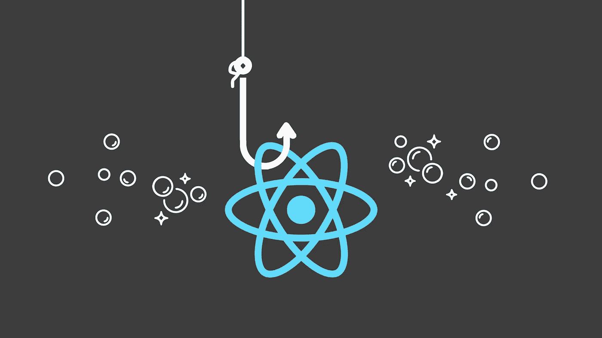
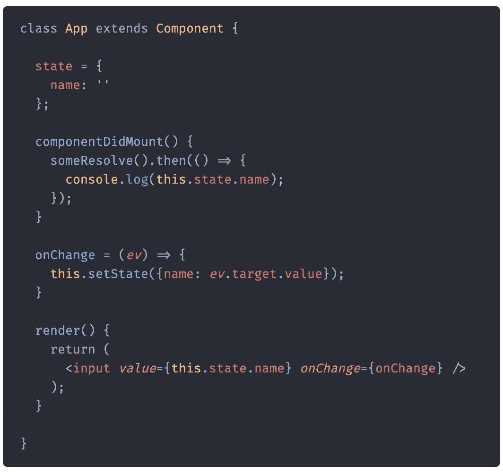
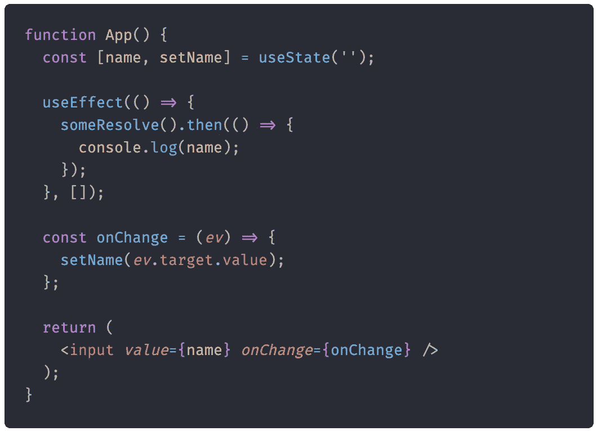

# ComponentDidMount 和 useEffect 不相同。原因如下

> 原文：<https://javascript.plainenglish.io/componentdidmount-and-useeffect-are-not-the-same-heres-why-cea02f474c82?source=collection_archive---------0----------------------->

当一个组件被挂载来执行像网络调用这样的任务时，需要一些设置是很常见的。在钩子被引入之前，我们被教导使用像`componentDidMount()`这样的函数。在过渡到功能组件时，寻找等效的挂钩是很自然的。

TL；DR、hooks 和生命周期方法基于非常不同的原理。像`componentDidMount()`这样的方法围绕生命周期和渲染时间，而钩子则围绕状态和与 DOM 的同步来设计。

很多程序员认为他们可以用`useEffect(fn, [])`代替`componentDidMount()`的行为。虽然使用这种方法时似乎没有任何重大错误，但它仍然会导致一些破坏应用程序的错误。这两种方法根本不同，您可能得不到想要的预期行为。程序员不应该认为钩子是组件挂载时运行的函数。假设钩子以这种方式工作会阻碍你对钩子的理解(和学习)。

# 状态和道具捕捉方式不同

也许最明显的区别是这两种方法如何捕捉状态和道具。当使用异步方法时，这变得尤其明显。

这个组件看起来很简单。一旦它被装载，它就调用一个函数，这个函数返回一个承诺，这个承诺在一段时间后解决。一旦该承诺得到解决，它就会记录 name 变量的当前状态。让我们尝试将相同的代码移植到一个功能组件上。

上面的代码不能正常工作。`useEffect()`方法在创建时捕获状态和道具的值。因此，控制台将打印一个空行，即使用户在此时可以输入任何内容。要告诉 React 效果应该使用最新的值，必须将依赖关系直接传递到效果中。同样的逻辑也适用于道具。在这种情况下，效果比基于类的组件简单，因为它们也必须使用`componentDidUpdate()`方法。

# 这些方法在不同的时间被调用

React 可以确定状态何时在`componentDidMount()`方法中同步设置。让我们看看组件的实际生命周期:

1.  组件已安装
2.  DOM 是用从`render()`返回的内容创建的
3.  `componentDidMount()`被调用，状态被更新
4.  DOM 被重新呈现，内容被更新

有人可能会认为我们应该看到第一帧和第二帧之间的闪烁，但事实并非如此。React 检测到状态已经更新，并且只显示第二帧。如果一个组件需要一个元素的比例，而这个比例只能在呈现 DOM 时计算，那么这就很有用。

钩子和`useEffect()`都在组件安装后运行。不同之处在于，钩子也是在 DOM 内容被绘制之后运行的。因此，如果在一个效果方法中同步更新状态，当第一帧被第二帧替换时，用户将会看到闪烁。

您可以通过使用`useLayoutEffect()`方法获得带有钩子的旧行为，该方法在内容提交到页面之前被调用。然而，大多数应用程序不需要使用这个钩子，大多数程序员应该坚持使用`useEffect()`。

基于类的组件是围绕生命周期和时间设计的。相反，函数类的目标是与 DOM 同步状态。未能改变心态会导致一些奇怪的怪癖和错误，没有适当的知识很难解决。简而言之，人们应该考虑“根据状态，我的组件应该是什么样子，以及它应该在什么时候重新呈现。”这些问题将确保您的功能组件正常运行。