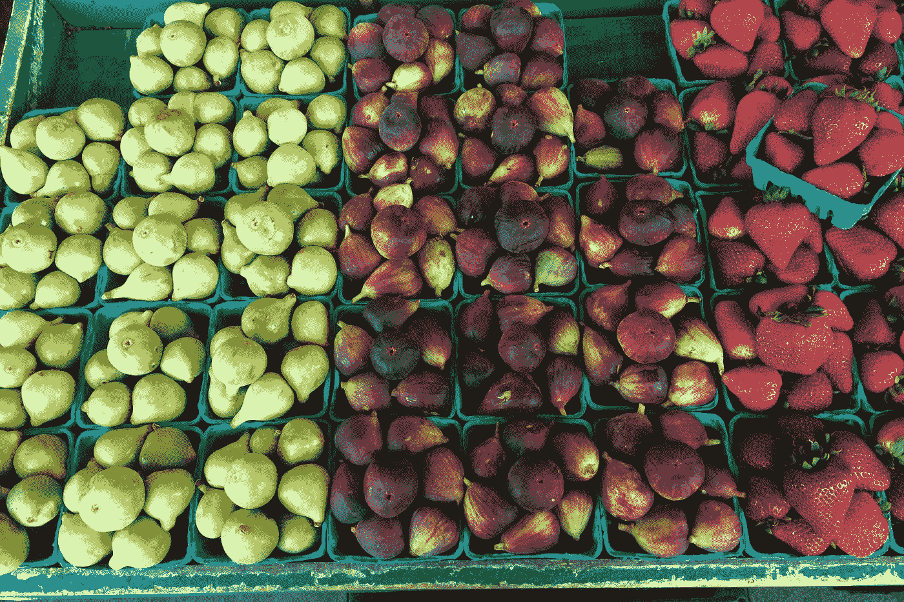

# 用重选库计算派生状态

> 原文：<https://javascript.plainenglish.io/computing-derived-state-with-the-reselect-library-5f177cc82002?source=collection_archive---------10----------------------->



Photo by [Bodie Pyndus](https://unsplash.com/@bpyndus?utm_source=medium&utm_medium=referral) on [Unsplash](https://unsplash.com?utm_source=medium&utm_medium=referral)

有了 Redux，我们可以用它在 JavaScript 应用程序的中央位置存储数据。它可以单独工作，当与 React-Redux 结合使用时，它也是一个受欢迎的 React 应用程序状态管理解决方案。

在本文中，我们将查看从现有状态计算派生状态的重新选择库。

# 装置

我们可以通过编写以下代码运行 NPM 来安装一个包:

```
npm i reselect
```

# 使用重新选择库将状态合并为一个

一旦我们安装了库，我们就可以导入库，如下所示:

```
import { createSelector } from "reselect";
```

我们可以在下面的例子中使用它:

```
import { createSelector } from "reselect";const shopItemsSelector = state => state.shop.items;
const taxPercentSelector = state => state.shop.taxPercent;const subtotalSelector = createSelector(
  shopItemsSelector,
  items => items.reduce((acc, item) => acc + item.price, 0)
);const taxSelector = createSelector(
  subtotalSelector,
  taxPercentSelector,
  (subtotal, taxPercent) => subtotal * (taxPercent / 100)
);export const totalSelector = createSelector(
  subtotalSelector,
  taxSelector,
  (subtotal, tax) => ({ total: (subtotal + tax).toFixed(2) })
);let shoppingCart = {
  shop: {
    taxPercent: 8,
    items: [{ name: "grape", price: 1.2 }, { name: "banana", price: 0.89 }]
  }
};console.log(subtotalSelector(shoppingCart));
console.log(taxSelector(shoppingCart));
console.log(totalSelector(shoppingCart));
```

在上面的代码中，我们创建了从对象返回属性的函数，方法是传入一个对象，然后返回我们想要返回的属性，如下所示:

```
const shopItemsSelector = state => state.shop.items;
const taxPercentSelector = state => state.shop.taxPercent;
```

完成后，我们可以创建如下计算状态:

```
const subtotalSelector = createSelector(
  shopItemsSelector,
  items => items.reduce((acc, item) => acc + item.price, 0)
);const taxSelector = createSelector(
  subtotalSelector,
  taxPercentSelector,
  (subtotal, taxPercent) => subtotal * (taxPercent / 100)
);export const totalSelector = createSelector(
  subtotalSelector,
  taxSelector,
  (subtotal, tax) => ({ total: (subtotal + tax).toFixed(2) })
);
```

在`subtotalSelector`中，我们通过传入上面定义的`shopItemsSelector`函数来分配从`createSelector`返回的对象，在这里我们返回我们想要计算的属性。

然后，我们将该函数传递给第二个获取`item`的参数，我们从`shoppingCart`返回`items`数组。

函数`price`取值并返回。

同样，我们有`taxSelector`，它从`shopItemsSelector`获取`shoppingCart.shop.items`，从`taxPercentSelector`返回`state.shop.taxPercent`。

然后由`subtotalSelector`返回的内容被传递给回调的`subtotal`参数的。接下来，`taxPercentSelector`返回的内容被传递给`taxPercent`参数，然后`subtotal * (taxPercent / 100)`返回。

我们做同样的事情来创建`totalSelector`。

最后，我们运行`console.log`:

```
console.log(subtotalSelector(shoppingCart));
console.log(taxSelector(shoppingCart));
console.log(totalSelector(shoppingCart));
```

然后我们从`console.log`中看到以下内容:

```
2.09
0.1672
{total: "2.26"}
```

从`shoppingCart.shop.items`计算小计，得到 2.09 美元

`taxSelector(shoppingCart)`计算出税额。然后通过上面的`subtotalSelector`和`taxSelector`计算总数，得到 0.1672。

正如我们所看到的，我们用它通过`subtotalSelector`和`taxSelector`组成选择器，然后在`totalSelector`中使用两者的返回值。这让我们`{total: “2.26”}`。

返回的`subtotal`和`tax`被返回。


Photo by [Artificial Photography](https://unsplash.com/@artificialphotography?utm_source=medium&utm_medium=referral) on [Unsplash](https://unsplash.com?utm_source=medium&utm_medium=referral)

# 结论

我们可以使用 Reselect 从其他状态中派生出状态。我们所做的就是创建从对象返回属性的函数，然后将这些函数传递给`createSelector`函数，这样我们就可以用它们来计算新的值。

为了计算新值，我们可以编写函数来获取那些从选择器函数返回的派生状态，然后使用它们来计算新值。

## **用简单英语写的 JavaScript 笔记**

我们已经推出了三种新的出版物！请关注我们的新出版物:[**AI in Plain English**](https://medium.com/ai-in-plain-english)，[**UX in Plain English**](https://medium.com/ux-in-plain-english)，[**Python in Plain English**](https://medium.com/python-in-plain-english)**——谢谢，继续学习！**

**我们也一直有兴趣帮助推广高质量的内容。如果您有一篇文章想要提交给我们的任何出版物，请发送电子邮件至[**submissions @ plain English . io**](mailto:submissions@plainenglish.io)**，并附上您的 Medium 用户名，我们会将您添加为作者。另外，请让我们知道您想加入哪个/哪些出版物。****