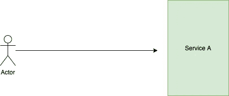
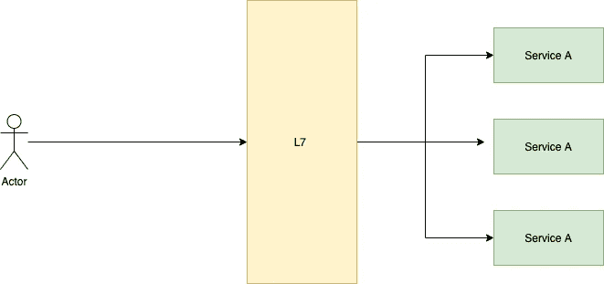
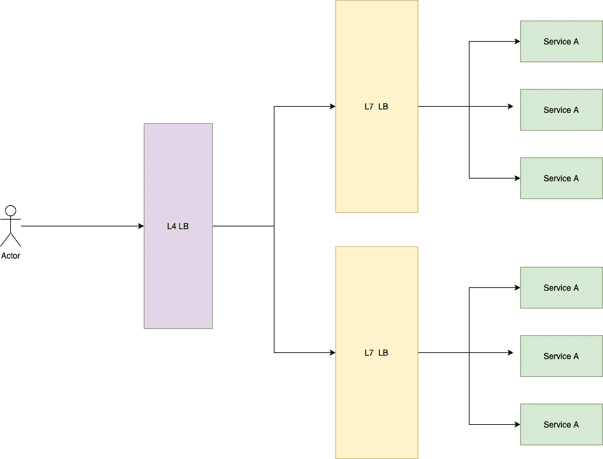
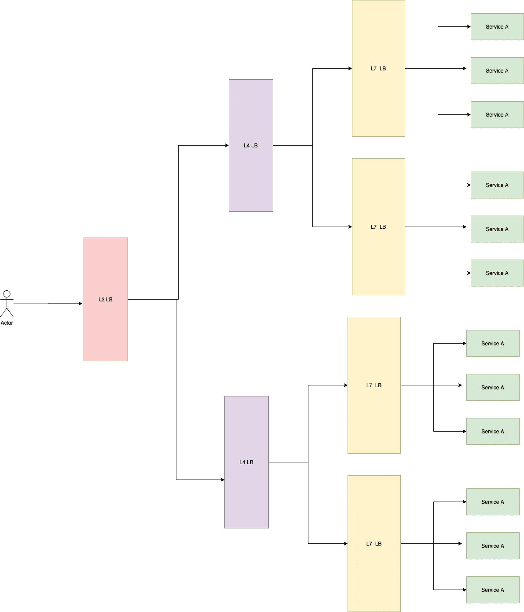
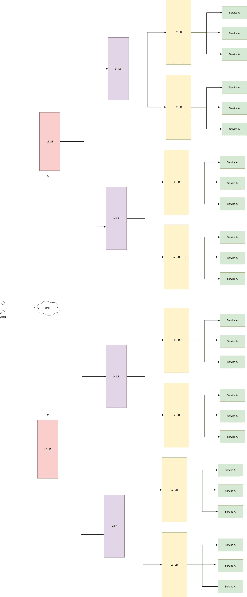
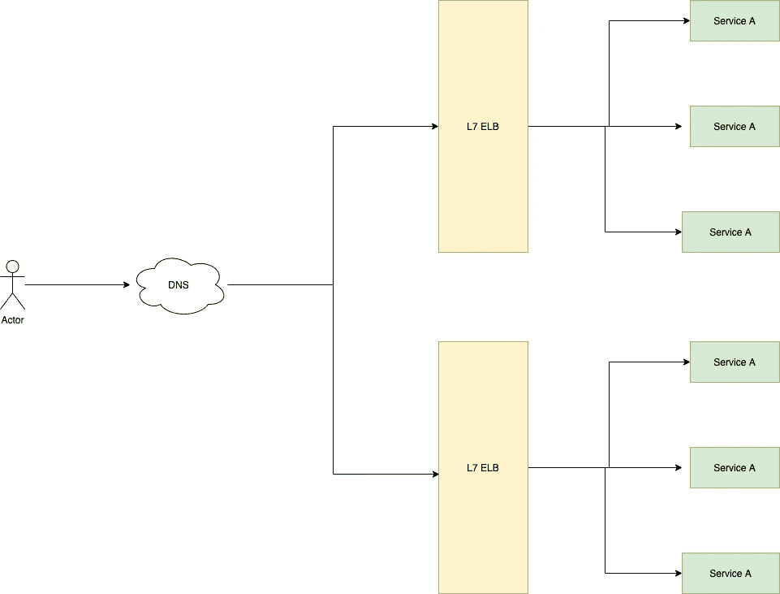
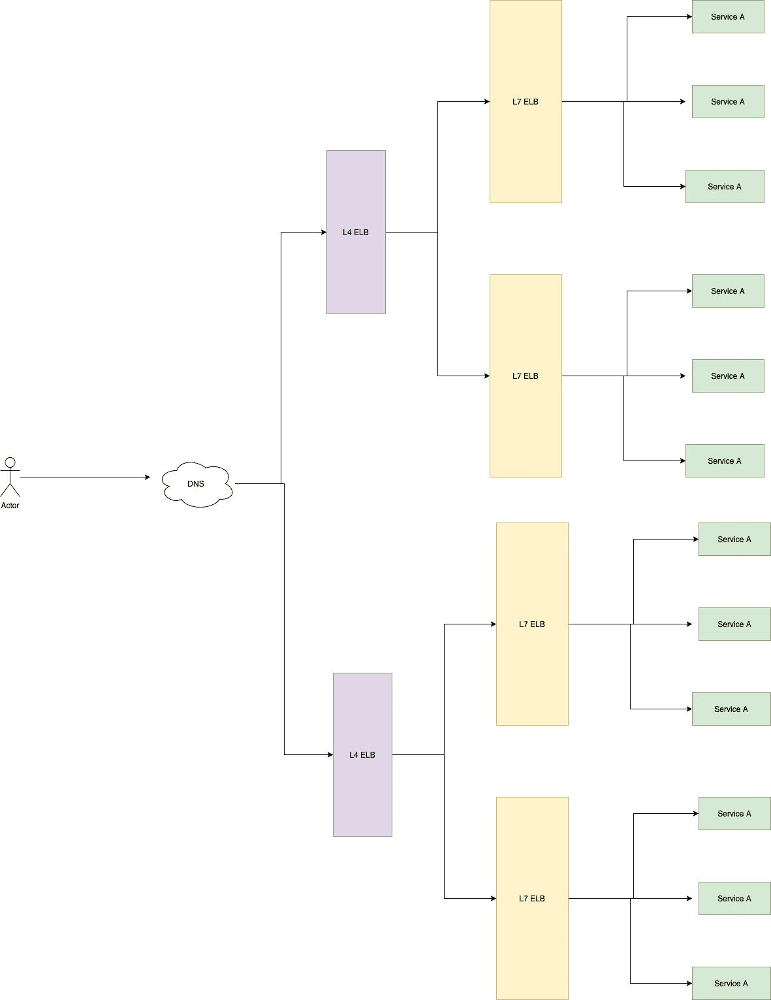

# 负载平衡的概念

> 原文：<https://javascript.plainenglish.io/concepts-of-load-balancing-a53e545fcdf2?source=collection_archive---------7----------------------->

对于一个正在快速扩张的公司来说，处理负荷是非常重要的。跨不同组织使用的负载平衡技术通常保持不变。如果使用 AWS，可以使用弹性负载均衡器(ELB ),这将有助于在多个实例之间分配流量。在本文中，我们将尝试理解负载平衡在内部是如何工作的。为了理解这个概念，我们将在单个实例上部署我们的服务，并不断增加机器的负载。



我们有一个服务 A，它直接与互联网交互，为整个负载提供服务。现在，如果该机器上的负载增加，即请求数量增加，CPU 或内存利用率增加，并且该机器将无法处理负载。那时，我们就有必要扩展我们的服务。

有两种扩展服务的方式-

1.**水平扩展** —增加服务 A 的实例数量来处理负载

2.**垂直扩展** —增加分配给机器的资源，即 CPU、RAM、磁盘等的数量。垂直缩放不能超过某个限制。



L7 Load balancer in front of our service

为了横向扩展我们的服务，我们将把我们的服务放在服务前面的 L7 负载平衡器后面。 **L7 代表第七层或应用层**。这个负载平衡器能够读取请求的内容，并且能够将其重定向到实例。一般来说， **Nginx** 或 **HAProxy** 用于实现 L7 负载均衡器。使用 Nginx 的负载平衡示例如下:

*   Nginx 上基于请求类型的 L7 负载平衡:在这个例子中，我们可以基于请求重定向流量。我们还可以将请求重定向到一台机器或一组机器。Nginx 配置示例如下:

```
upstream backend  {
  least_conn;
  server 10.128.1.4;
  server 10.128.1.5;
}
server { location /admin/ {
    proxy_set_header Host $host;
    proxy_pass  <http://10.128.1.2>;
  } location /category/ {
    proxy_set_header Host $host;
    proxy_pass  <http://10.128.1.1>;
  } location / {
    proxy_set_header Host $host;
    proxy_pass  <http://backend>;
  }} 
```

*   基于 Nginx 健康检查的 L7 负载平衡:我们还可以使用 Nginx 来平衡健康/不健康实例之间的负载。配置示例如下:

```
server {
    location / {
        proxy_pass   <http://backend>;
        health_check port=8080;
    }
}http {
    upstream backend {
        zone backend 64k;
        server backend1.example.com;
        server backend2.example.com;
        server backend3.example.com;
        server backend4.example.com;
    }
}
```

如果健康检查失败，Nginx 不会将流量重定向到该节点。

# 进一步增加负载

进一步增加负载，我们的 L7 负载平衡器将无法处理流量。在这种情况下，我们需要由一个 L4 负载平衡器来平衡多个 L7 负载平衡器。 **L4 代表第 4 层或传输层负载均衡器**。当第 4 层负载平衡器收到请求并做出负载平衡决策时，它还对请求数据包执行网络地址转换(NAT ),将记录目的地 IP 地址从其自己的地址更改为其在内部网络中选择的内容服务器的地址。L4 负载平衡器根据从 TCP 流的前几个数据包中提取的地址信息做出路由决定，并且不检查数据包内容。



第 4 层负载平衡通常使用 HAProxy 实现。在这一层，我们根据它们使用的网络层协议类型(即 TCP/UDP)来平衡流量。

# 进一步增加负载

在负载进一步增加的情况下，我们可以在 2 个 L4 负载平衡器之前放置一个第 3 层负载平衡器。 **L3 代表第三层或网络层。**第 3 层负载平衡器使用 ECMP，后者通常使用等价多路径路由(ECMP)。这些设计是为了避免将来自任何特定网络流的所有数据包沿单一确定性路径发送，同时平衡多条路径上的多个流的问题。



# 进一步增加了负载

DNS 是将名称转换成 IP 地址的系统。DNS 服务可以为特定请求返回多个 IP 地址。这是一种常见的负载平衡技术。DNS 提供了一些常见的负载平衡技术

2.  ****循环 DNS** —这是最简单的负载均衡技术。DNS 服务器以 Robin Robin 方式用服务器的 IP 进行响应。**

****

**上述技术可以根据您的要求以不同的方式组合。几种替代风格如下—**

*   ****DNS 到 L7 ELB****

****

**DNS to L7 LB**

*   ****从 DNS 到 L4 ELB****

****

**DNS to L4 ELB**

# **摘要**

**当您的服务由于负载增加而耗尽时，您可以旋转服务的另一个实例，并使用 L7 负载平衡器在服务之间平衡负载。您可以使用 L3、L4 和 L7 负载平衡器的组合来平衡系统上的流量。您必须使用什么组合主要取决于您的系统类型。您可以尝试多种组合并测量系统的吞吐量，然后选择具有最大吞吐量和最小延迟的组合。**

****参考文献:****

*   **[https://www.youtube.com/watch?v=IqpwSgRM2hY&t = 67s](https://www.youtube.com/watch?v=IqpwSgRM2hY&t=67s)**
*   **[https://docs . AWS . Amazon . com/elasticloadbalancing/latest/Network/introduction . html #:~:text = Target % 20 groups-，Network % 20 load % 20 balancer % 20 overview，group % 20 for % 20 the % 20 default % 20 rule](https://docs.aws.amazon.com/elasticloadbalancing/latest/network/introduction.html#:~:text=Target%20Groups-,Network%20Load%20Balancer%20overview,group%20for%20the%20default%20rule)。**
*   **[https://www . nginx . com/resources/glossary/DNS-负载平衡/](https://www.nginx.com/resources/glossary/dns-load-balancing/)**
*   **[https://docs . nginx . com/nginx/admin-guide/load-balancer/http-load-balancer/](https://docs.nginx.com/nginx/admin-guide/load-balancer/http-load-balancer/)**