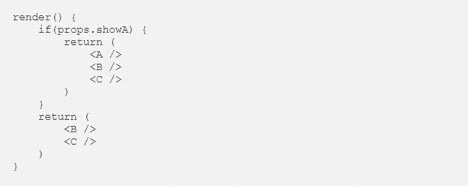
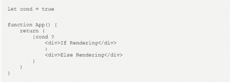
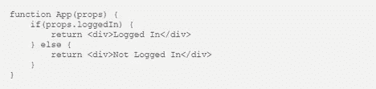
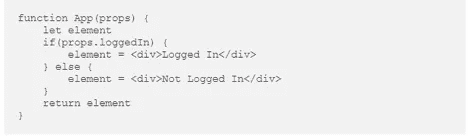
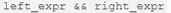
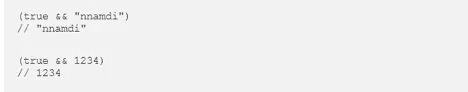
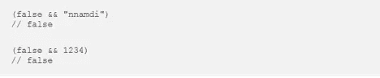
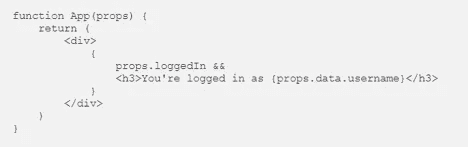
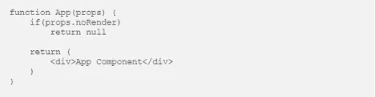

# React 中的条件渲染

> 原文：<https://javascript.plainenglish.io/conditional-rendering-in-react-22e890dfdeed?source=collection_archive---------3----------------------->

React 是一个高效的声明式 JavaScript 框架，用于构建交互式 ui 或用户界面，非常灵活和简单。此外，该框架在为各种应用程序状态设计无缝视图方面提供了许多优势，并在数据更改时更容易有效地更新和呈现正确的组件。

ReactJS 是一个非常动态和有能力的应用程序，以灵活和协调的方式准备更大的 web 应用程序，其中应用程序 ui 可以以快速和可伸缩的方式设计。 *React development* 继续发展，以跟上市场的发展趋势和需求。

## **反应条件渲染**

在框架中，您可以构建可识别的组件来封装您需要的行为。然后，根据应用程序的状态，您可以只渲染其中的一部分。在 React 中，条件渲染的工作方式类似于 JavaScript 条件。

JSX 或 JavaScript XML 是一个强大的 JS 扩展，它使 *React 开发者*能够定义用户界面的组件。然而，它不直接支持条件表达式或循环。

可以使用 JS 操作符(例如 if 或条件操作符)来构建表示当前状态的元素，并允许 React 更新用户界面以匹配它们。

## **五种条件渲染方式**

随着当代 web 应用程序的负载从后端转移到前端，我们不得不花更多的时间来考虑优化性能。此外，条件渲染实现也是如此。这就是为什么要考虑花适当的时间优化你的代码，同时尽可能地重用组件。

这将有助于在运输时间和质量之间取得适当的平衡。考虑使用组件中心，如 Bit.dev 来记录、发布和组织组件。通过这种方式，所有的组件都可以在所有的开发项目中重用。

## **1。if/else**

可以应用 React 逻辑中的 if-else 条件 JSX。你应该记住，JSX 在执行前被编译成 JavaScript，这就是为什么我们用 JS 代码编写的原因。

**性能**

if-else 语句可能会导致框架中的重新渲染浪费。在中小型应用程序中，可能感觉不到这一点。无论如何，在拥有数百甚至数千个组件的大型应用程序中，performance app 仍然非常引人注目。

看看这个例子:

基于一个条件，安装组件 A、B 和 C。如果昭和道具是真的，则渲染 a、B、C。如果为假，A 将被跳过，只渲染 B 和 c。这里的问题是 React 的不同算法。框架利用该算法来确定何时避免浪费渲染。

一个真正的昭和具有根据它们的 A -> B -> C 结构渲染的组件。只要昭和是真实的并且道具没有改变，React 就不会重新渲染。尽管如此，只要 showA 变为 false，渲染结构就会改变。

结构将是 B -> C，React 将看到与前一个不同的结构，并重新呈现组件 B 和 C，即使它们的状态/属性保持不变也不需要重新呈现。这是一个浪费的重新渲染。

## **2。三元运算符**

较短的“if-else”条件形式。第一部分陈述条件，而第二部分是如果为真则返回的值。最后一个是 false 时返回的值。

**看看这个:**

## **3。元素变量条件渲染**

保存 JavaScript XML 元素，以便可以在平台组件的任何地方使用它。它使得阅读和理解代码更加容易，因为它避免了组件中的多个 return 语句。下面是实现它的标准方法:

在上面的组件中，我们有几个 return 语句。我们利用 if-else 来有条件地呈现用户界面的一部分。此外，我们可以使用元素变量来存储每个返回的条件语句的返回元素。

元素变量是我们用来保存 finale 元素的变量，该元素应该在评估语句 if-else 时呈现。通过利用元素变量，我们构建了一个易于阅读且更加简洁的代码。

**性能**

这里的关注点与前面提到的 if-else 项中的关注点相同。

## 4.(&&)和运算符

AND 运算符用于检查左右表达式是否为真。

如果表达式解析为 TRUE，那么 AND 运算符将返回正确的表达式求值结果。

但是，如果表达式解析为 FALSE，则 AND 运算符将返回 FALSE:

在这种情况下，我们可以使用这个操作符以及 AND 操作符在 React 框架中有条件地呈现 JSX。

我们利用 JavaScript XML 的 AND 运算符。花括号支持添加和计算 JSX JavaScript 表达式。

**性能**

虽然本质上它与前面两种条件呈现方式没有什么不同，但 AND (&&)和 JSX 表达式运算符被认为是更好的选择，因为它迫使您在以条件方式返回和呈现元素时返回相同的结构。

## 5.返回 Null

可以设置一个组件返回一个空值，而不是简单的 JSX 表达式，所以虽然它不会呈现任何东西，但会被计算。当组件返回 null 时，它会阻止 React 挂载组件。

如果设置了 noRender prop，则组件返回 null。这就是为什么我们会设置 noRender 道具如果你不喜欢 App 组件渲染的话。请注意，无论如何，返回 null 生命周期方法的组件都会被触发。

**表现**

即使返回的组件不会呈现任何东西，它仍然会被计算。这意味着不必要的计算，这可能会在大型应用程序中产生相当大的影响。

## **结论**

总之，我们看到了许多实现 React 条件渲染的方法。每种方法都有其优点，与其他方法相比，有些方法有助于获得更易读的代码。然而，在使用任何方法时，简单性也是一个重要的考虑因素。

所有需要的用例可能只是 if 操作符。实际上，选择最适合您的使用实例的方法。