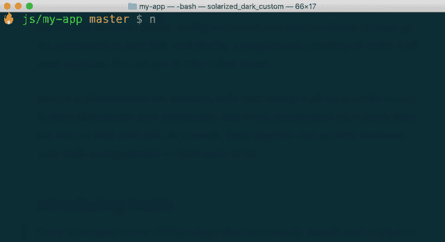
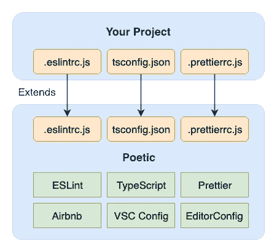
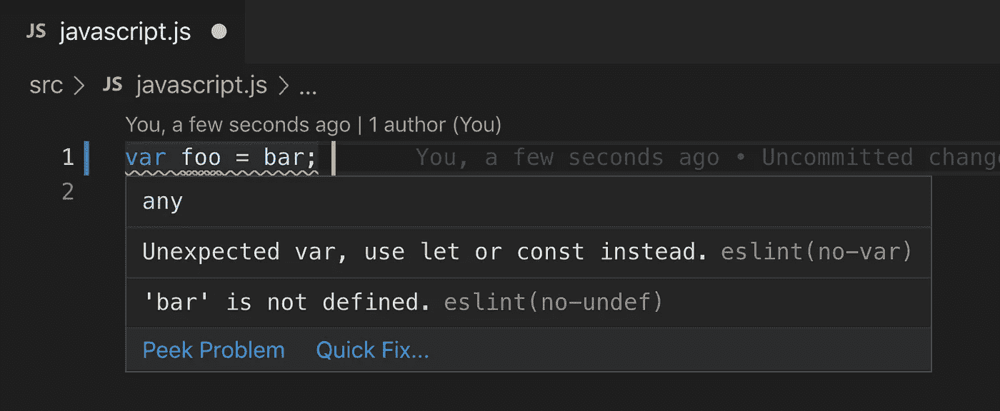

# 在一行中配置 ESLint、Prettier 和 Airbnb

> 原文：<https://javascript.plainenglish.io/configuring-eslint-prettier-and-airbnb-in-1-line-164ab8f1e8c7?source=collection_archive---------1----------------------->

## 简短的回答是:运行`npx poetic`

我们都经历过。我们有一个新项目，我们希望它遵循最佳的代码风格实践。好处是充分的——获得自动语法纠正和正确的格式听起来像一个梦。因此，我们赶紧上网获取关于如何配置 linter、格式化程序和一些规则的最新教程，但我们很快意识到，这可能是一项具有挑战性的工作，有大量的事情要做。

到目前为止，这个过程通常包括为工具、插件和林挺规则添加一堆依赖项(还要确保它们之间的兼容性)，独立配置每一个，在 IDE 中设置扩展，最后是一个漫长的调整过程，以使所有这些都能够协同工作。是的，我们拿到了！几个小时后…

Linters 和 formatters 是很棒的工具，但是设置起来很麻烦。它常常让新开发人员望而却步，更有经验的开发人员很少有时间处理它。结果，许多项目以不正确的代码风格配置或者根本没有代码风格配置而告终。

# 引入诗意

> Poetic 是一个开源的 NPM 包，它可以自动安装和配置 ESLint、Prettier 和 EditorConfig，并使用 Airbnb 和 ESLint 推荐的 JavaScript、TypeScript 和 React 规则。



Poetic 的目标是简化代码样式工具和规则的设置和维护，同时允许完全定制。

```
npx poetic
```

当您运行它时，它会将必要的配置文件添加到您的项目中，并为您安装依赖项。这个概念类似于`create-react-app`,因为您有一个单一的依赖项来管理子依赖项，所以您可以放心，它们会很好地互操作。

大多数项目使用相似的代码风格。在过去的几年里，JavaScript 社区已经取得了很大的进步，就什么被认为是*的良好实践*达成了共识，而[的 Airbnb 风格指南](https://github.com/airbnb/javascript)是最受欢迎的，因为它对每个规则背后的基本原理进行了深入的解释。然而，并不是每个项目都是一样的，其中一些项目需要最适合它们的特殊规则。

https://www.npmjs.com/package/poetic:[NPM](https://www.npmjs.com/package/poetic)

# 为您的项目定制诗意

Poetic 的座右铭是让任何项目都可以使用代码样式工具。它是完全可定制的，与您习惯的文件和配置相同。

> 您可以设置自己的 ESLint、TypeScript 和更漂亮的规则，同时保留一组在 JS 社区中广泛使用的基本规则。



Poetic 提供了一组基本配置，这些配置会随着时间的推移而保持不变，但是您可以带来自己的项目设置。因为您的配置将扩展 Poetic 的，您得到了两个世界的最好的:自动更新和定制。

这个特性使得跨项目共享配置变得特别简单。通过在它们上面安装 Poetic，可以保证它们都有相同的底层依赖关系。

# 它是 IDE 友好的

键入代码时获得即时反馈是非常棒的。它提高了我们的生产力，减少了错误。大多数现代编辑器支持插件或扩展。Poetic 是为 Visual Studio 代码预配置的，但它与任何编辑器都兼容。此外，一些 IDE，如 WebStorm，已经开箱即用。要充分利用这些功能，请确保安装以下软件:

*   [ESLint](https://marketplace.visualstudio.com/items?itemName=dbaeumer.vscode-eslint)
*   [更漂亮](https://marketplace.visualstudio.com/items?itemName=esbenp.prettier-vscode)
*   [编辑器配置](https://marketplace.visualstudio.com/items?itemName=EditorConfig.EditorConfig)



Example of an ESLint error in Visual Studio Code

# 它也是 CLI 友好的

如果您想从命令行进行 lint 或格式化——可能使用预提交钩子([带 Husky](https://github.com/typicode/husky) )或在您的 CI 管道上——您可以使用由 Poetic 添加到您的`package.json`中的一个 NPM 脚本

*   `yarn code:clean`(标签和格式)
*   `yarn code:lint`(仅棉绒)
*   `yarn code:format`(仅格式)

还有另一个方便的命令，可以检查所有的林挺规则，寻找互操作性问题。用这个来找出你的自定义 ESLint 规则是否更漂亮:

*   `yarn code:check:rules`(检查规则互操作性)

# 结论

作为开发人员，我们希望我们的代码尽可能优雅，而不必在工具上花费太多时间来完成它。诗意是一种新的选择，通过最小化设置和维护时间来促进代码风格和最佳实践。这并不意味着适合每个项目，但它是一个全面的起点，希望对您有用。

## 贡献的

我们努力让诗意对每个人都有帮助。这意味着尝试了解人们的需求，并实施通用的解决方案来节省您的时间。我们刚刚推出了支持 JS、TS 和 React 的 Poetic，但我们计划继续增加对其他流行设置的支持。

请试一试。安装只需要几秒钟，如果你不喜欢，就放弃修改。

欢迎 Github 问题和 Pull 请求。成为一个很酷的开源项目的早期贡献者是一个很好的机会。如果你有想在 Poetic 上看到的想法，请提交问题或通过 [Twitter](https://twitter.com/arian3k) 联系。

github:【https://github.com/arianacosta/poetic 

传播❤️关于诗意的说法