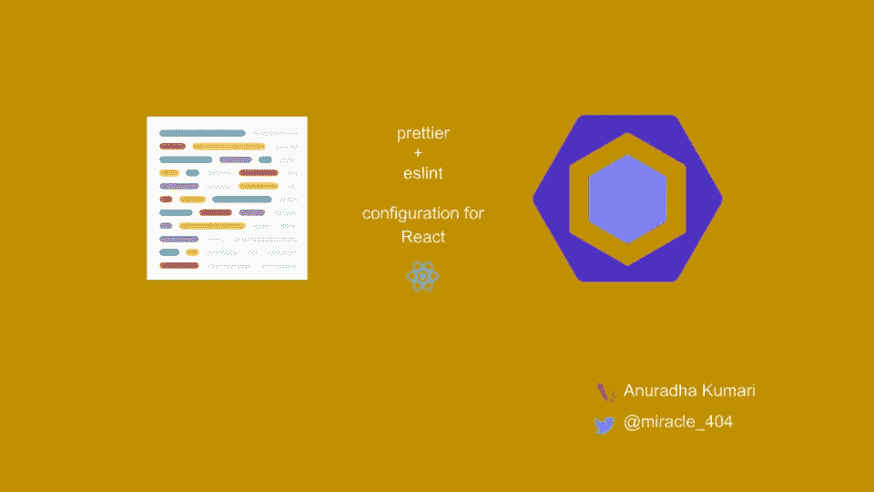

# 从头开始为 React 配置更漂亮的和 eslint 插件

> 原文：<https://javascript.plainenglish.io/configuring-prettier-and-eslint-plugins-for-react-from-scratch-cc15f65bef3f?source=collection_archive---------6----------------------->

大家好，你们好吗？今天我们将从头开始为 React 项目配置更漂亮的和 eslint 插件。



我们将使用 [VSCode](https://code.visualstudio.com/) 作为默认的 IDE，并且下面部分中的所有扩展链接都将指向 VSCode 扩展。如果您正在使用任何其他 IDE，您可以在 internet 上找到相应的扩展。

让我们按照下面的顺序一个接一个地完成这些步骤。或者，如果你想查看我们将在下一节讨论的最终版本，[去 GitHub repo 查看完整的设置。](https://github.com/anuk79/prettier-eslint-configuration-for-react)

# 步骤:

1.  创建一个名为 **react-setup** 的空文件夹(或者你喜欢的任何东西)。
2.  运行以下命令来初始化 npm 项目:

```
npm init -y
```

它将创建一个包含基本设置的 **package.json** 文件，供我们开始使用。您可以根据需要随时更新其中的细节。

3.因为我们要创建一个 [react](https://reactjs.org/) 项目，所以让我们通过运行下面的命令来安装 react 和 ReactDOM 依赖项:

```
npm install react react-dom
```

4.现在是时候添加一些代码了。在项目中创建一个 **src** 目录，添加几个文件，代码如下:

*   index.html

```
<!DOCTYPE HTML> 
<html lang="en"> 
<head> 
<meta charset="UTF-8" /> 
<meta name="viewport" content="width=device-width, initial-scale=1.0" /> 
<title>React prj setup</title> 
<link rel="stylesheet" href="./style.css" /> 
</head> 
<body> 
<div id="root"> The content was not rendered. </div> 
<script src="./app.js"></script> 
</body> 
</html>
```

*   app.js

```
import React from "react"; 
import { render } from "react-dom";const App = () => ( 
 <main> 
  <h1>Welcome</h1> 
  <p> Let's practice configuration of prettier and eslint plugins for a React application from scratch. 
  </p> 
 </main> 
);render(<App />, document.getElementById("root"));
```

*   style.css

```
html {
  width: 100%;
  height: 100%;
}

body {
  margin: 0;
  padding: 50px;
  background: 
  linear-gradient(
    45deg, 
    #d6c7ec 0%, 
    #f6d18d, 
    #eba2c4 100%);
  line-height: 1.5;
}

main {
  font-size: 1.2em;
  border-radius: 5px;
  padding: 20px;
  background-color: white;
}

h1 {
  font-variant: small-caps;
  font-size: 2.2em;
}
```

5.安装[package](https://parceljs.org/getting_started.html)bundler 来构建项目并使其能够在本地运行

```
npm i -D parcel-bundler
```

您也可以使用 webpack，它的配置超出了本文的范围。

6.在包 json 中添加一个 **dev** 脚本，用于启动本地 dev 服务器:

```
"scripts": {
  "dev": "parcel src/index.html"
}
```

**注意**:指向你的 index.html 文件的路径。对于我的例子，我已经将它添加到了 src 目录，因此也添加到了那个路径。如果您的公共目录中有它，您需要将其添加为**parcel public/index . html**

7.现在让我们在终端中执行 dev 命令:

```
npm run start
```

您将看到运行在 URL[http://localhost:1234](http://localhost:1234)的本地服务器。在浏览器中转到这个 URL，您应该会看到呈现的内容。

8.接下来，让我们通过运行下面的命令来安装更漂亮的:

```
npm install -D prettier
```

在这里，我们使用了-D，因为我们希望仅作为一个 dev 依赖项安装得更漂亮，并且它对于我们的应用程序的生产版本不是必需的。

9.成功安装后，我们将看到自动添加到 package.json 中的漂亮条目:

```
"devDependencies": {
  "parcel-bundler": "^1.12.4",
  "prettier": "^2.1.2"
}
```

10.我们需要添加脚本来格式化文件。为此，让我们向 package.json 中的脚本添加一个 **format** 命令

```
"format": "prettier \"src/**/*.{js,html,css}\" --write"
```

在这里，我们说，运行更漂亮的文件扩展名为 js，html 或 css。
**— write** 标志用于将格式化后的代码实际写入各自的文件中。否则，当我们运行 format 时，它只会输出文件的格式化版本。
继续执行 format 命令，检查您的文件是否已格式化:

```
npm run format
```

11.默认情况下，当我们在文件上运行 format 命令时，文件将被格式化。但是，如果在我们保存文件时文件可以被格式化，而不需要一次又一次地运行这个命令，那会怎么样呢？很酷，对吧？

嗯，我们可以通过我们的 IDE 设置来实现。对于 VSCode，按照以下步骤在保存时启用格式**:**

*   [安装更漂亮的扩展](https://marketplace.visualstudio.com/items?itemName=esbenp.prettier-vscode)
*   [打开 vscode 设置](https://supunkavinda.blog/vscode-editing-settings-json)。搜索“格式保存”选项并选中它。
*   搜索“需要配置格式化”并检查它。只有当前项目中存在更漂亮的配置时，才会在保存时格式化，这样我们就不会在所有其他不需要更漂亮的项目中强制我们的设置。
*   通过创建一个名为**的文件来添加更漂亮的配置文件。prettierrc** 并在其中添加一个空对象，这表明我们将使用 prettier 的所有默认配置。所以我们的。prettierrc 文件将如下所示:
*   现在尝试编辑 app.js 文件中的内容，然后点击 save。你会注意到文件会自动格式化。太神奇了，不是吗？

12.接下来，我们要添加 [eslint](https://eslint.org/) 。让我们通过执行下面的命令来为 prettier 添加 eslint 插件:

```
npm install -D eslint eslint-config-prettier
```

成功安装后，您会注意到这些依赖项被添加到 package.json 中的 devDependencies 部分

```
"devDependencies": {
  "eslint": "^7.13.0",
  "eslint-config-prettier": "^6.15.0",
  "parcel-bundler": "^1.12.4",
  "prettier": "^2.1.2"
}
```

13.在继续配置 eslint 之前，让我们先探讨一下 prettier 和 eslint 之间的[差异。](https://prettier.io/docs/en/comparison.html)

*   **更漂亮的**:是代码格式化器。它处理诸如缩进、关键字间距、缺少分号、逗号样式等样式问题。
*   eslint :它与代码质量规则有关，比如未使用的变量，不正确的变量名等等。Eslint 可以捕捉代码中的 bug。
*   更漂亮和 eslint 是相辅相成的，但两者之间存在一些样式规则冲突。这就是为什么我们安装了**eslint-config-appellister**。它有助于自动禁用 eslint 的所有冲突规则。

14.让我们添加一个名为**的文件。eslintrc** 为我们的项目配置 eslint:

```
{
  "extends": [
    "eslint:recommended", 
    "prettier", 
    "prettier/react"
  ], 
  "plugins": [],
  "parserOptions": {
    "ecmaVersion": 2018,
    "sourceType": "module",
    "ecmaFeatures": {
        "jsx": true
    }
  },
  "env": {
    "es6": true,
    "browser": true,
    "node": true
  }
}
```

15.现在，让我们在包 json 中添加 **lint** 脚本:

```
"lint": "eslint \"src/**/*.{js,jsx}\" --quiet"
```

我们使用 **quiet** 标志来忽略 eslint 的警告，否则，它可能会变得过于嘈杂。

16.让我们也为 VSCode 添加 [eslint 扩展。如果您正在使用任何其他 IDE，您也可以检查它的扩展。](https://marketplace.visualstudio.com/items?itemName=dbaeumer.vscode-eslint)

17.现在，我们需要添加 React 特定的 eslint 插件。为此，我们在终端中运行以下命令:

```
npm install -D babel-eslint eslint-plugin-react eslint-plugin-react-hooks eslint-plugin-jsx-a11y eslint-plugin-import
```

让我们把它拆开，看看每一个都做了什么:

*   [**babel-eslint**](https://github.com/babel/babel-eslint) :根据其 Github:

> ESLint 的默认解析器和核心规则只支持最新的最终 ECMAScript 标准，不支持 Babel 提供的实验性(比如新特性)和非标准(比如 Flow 或 TypeScript 类型)语法。

babel-eslint 是一个解析器，允许 eslint 在由 babel 转换的源代码上运行。

*   [**eslint-plugin-import**](https://www.npmjs.com/package/eslint-plugin-import):引用 npm 网站为之:

> 此插件旨在支持 ES2015+ (ES6+)导入/导出语法的林挺，并防止文件路径和导入名称拼写错误的问题。ES2015+静态模块语法旨在提供的所有优点，在您的编辑器中标记出来。

探索 elsint-plugin-import 的 [github repo 以获得更多见解。](https://github.com/benmosher/eslint-plugin-import)

*   [**eslint-plugin-react**](https://www.npmjs.com/package/eslint-plugin-react):包含了针对 ESLint 的 React 特定林挺规则。您可以查看文档以了解详细的规则信息。
*   [**eslint-plugin-react-hooks**](https://www.npmjs.com/package/eslint-plugin-react-hooks):顾名思义，它执行 React 钩子的规则。只有当我们使用 React 钩子时，我们才需要添加它(我们大多数人可能已经这样做了)。如果你没有在你的项目中使用 React 钩子，可以跳过添加这个插件。
*   [**eslit-plugin-jsx-a11y**](https://www.npmjs.com/package/eslint-plugin-jsx-a11y):这是一个针对 jsx 元素的可访问性规则的静态 AST 检查器。它支持许多可访问性规则，并且在我看来，它是 reaction(反应)的*必备插件之一。探索插件的[文档，了解更多关于这个插件支持的规则。](https://github.com/jsx-eslint/eslint-plugin-jsx-a11y)*

18.添加插件后，现在是时候更新*了。esintrc*配置文件:

```
{
  "extends": [
    "eslint:recommended", 
    "plugin:import/errors",
    "plugin:react/recommended",
    "plugin:jsx-a11y/recommended",
    "prettier",
    "prettier/react"
  ], 
  "rules": {
    "react/prop-types": 0,
    "no-console": 1,
    "react-hooks/rules-of-hooks": 2,
    "react-hooks/exhaustive-reps": 1  
  },
  "plugins": [
    "import", 
    "react", 
    "jsx-a11y", 
    "react-hooks"
  ],
  "parserOptions": {
    "ecmaVersion": 2018,
    "sourceType": "module",
    "ecmaFeatures": {
        "jsx": true
    }
  },
  "env": {
    "es6": true,
    "browser": true,
    "node": true,
    "commonjs": true
  },
  "settings": {
    "react": {
        "version": "detect"
    }
  }
}
```

19.现在，当您进一步编码时，您应该开始看到 lint 错误或警告。

# 成功

祝贺你，你已经成功地为一个反应项目配置了基本的更漂亮的插件和 eslint 插件。您可以根据具体的项目要求添加更多的规则。npm 网站或各自插件的 GitHub 库将是探索这些规则的最佳场所。

学分:灵感来自前端硕士布莱恩·霍尔特[完成反应 v5 课程的学习。](https://frontendmasters.com/courses/complete-react-v5/)

如果你觉得这个有用，或者有什么建议，请在评论中告诉我。此外，请随时通过[推特](https://twitter.com/miracle_404)或 [linkedin](https://www.linkedin.com/in/anuradha15/) 与我联系。

祝你快乐学习，继续闪耀。永远记住，你是最棒的🙌

*最初发布于*[*https://peer-eslit-configuration-for-reaction . netlify . app/*](https://prettier-eslint-configuration-for-react.netlify.app/)