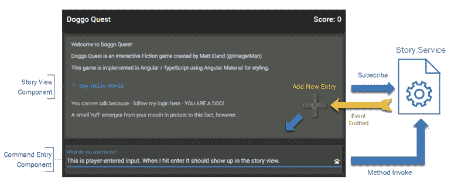
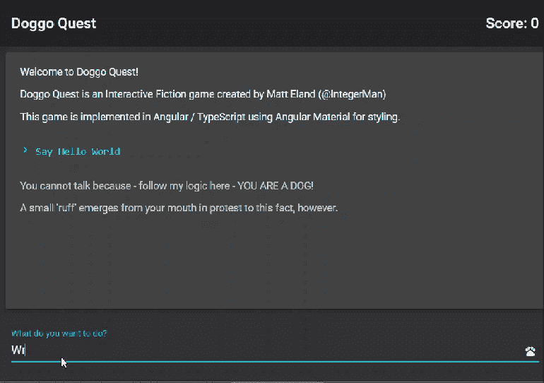
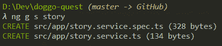
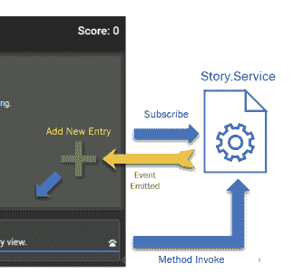

# 将角度组件与事件、绑定和服务连接起来

> 原文：<https://javascript.plainenglish.io/connect-angular-components-with-events-bindings-and-services-5d9ec1f4baf5?source=collection_archive---------2----------------------->

在本文中，我们将探索如何使用角度双向绑定、事件和服务来连接用户界面，并允许不同的组件相互交互，而不会彼此紧密联系。我们将通过使用`ngModel`从用户那里收集命令，将它们发送给服务，并让另一个组件在输入命令时订阅来自服务的事件。

# 该项目

在这篇文章中，我们将从我目前正在开发的一个名为[“Doggo Quest”](https://killalldefects.com/2020/02/01/game-design-with-event-modeling/)的基于文本的游戏开始。游戏有一个[已经创建的用户界面](https://killalldefects.com/2020/02/05/from-mockup-to-angular-material/)，有一个故事视图和一个玩家输入区。然而，这个游戏目前什么也不做，因为这些区域根本不互相交流。

在本文中，我们将通过使用角度双向绑定、事件、事件发射器、服务和订阅来将用户界面链接在一起。用户将能够输入一个命令，并看到它出现在游戏的故事视图中，以及一个通用的响应。

*注意:在本系列的后面，我们可能会探索* [*NgRx*](https://ngrx.io/) *，*[*RxJs*](https://www.learnrxjs.io/)*以及更复杂的处理事件和状态管理的方式，但是现在我想从管理基本 Angular 中的状态和事件的最简单的方式开始。*

如果你想从头开始，看看 Doggo Quest 库的标签。本文最后的代码[也是可用的](https://github.com/IntegerMan/DoggoQuest/tree/AngularEventEmitters)。

# 创建服务

现在我们的用户界面只是一个输入框和一个按钮，什么也不做。为了将命令输入组件连接到主故事显示，我们将添加一个服务。

服务是为应用程序的其他领域提供一些功能而设计的类。它们非常接近于普通对象，除了一个区别:Angular 可以自动将服务注入到其他组件的构造函数中(稍后将详细介绍)。

为了创建一个组件，我们将启动我们的命令行并导航到项目目录，然后键入`ng g s <name-of-service>`to**g**generate a new**s**service。请记住，您不要输入您的服务名称`service`，因为 Angular 会自动为您终止您在`.service`的服务。

在我的例子中，我运行`ng g s story`来生成`story.service`。

# 构建服务方法和 EventEmitter

接下来，我们将通过添加一个`EventEmitter`和一个`handlePlayerInput`方法来充实服务，如下所示:

让我们停下来讨论一下事件发射器。`EventEmitter`是一个可以发出事件(顾名思义)的对象，其他代码可以订阅这些事件，并在事件发生时得到通知。

通过调用`EventEmitter`上的`.emit`并提供发射器的泛型类型的一个实例，可以简单地发射事件，如上面第 24 行所示。

订阅者将收到一个以该对象作为参数的事件。在本文的后面，我们将看到这对于订阅者来说是什么样子。您应该记住，任何`EventEmitter`都可以没有订阅者或者有许多不同的订阅者。这种灵活的体系结构使服务与依赖它们的各个组件相分离。

现在，所有这些只是将消息记录到控制台，但是在本文的后面，我们将设置一个事件发射器，以便其他组件可以订阅命令事件。

# 向服务发送命令

好了，现在我们有了一个服务，我们可以利用 Angular 内置的依赖注入功能来为我们的`command-entry.component`提供`story.service`。我们只需将它作为参数添加到构造函数中，如下面第 12 行所示:

您不需要担心服务如何到达组件。Angular 自动从您的应用模块为您提供服务。

现在来说说`submitCommand`法。这是我们的组件模板将调用的方法(我们将在下一节看到更多内容)，该方法将从`Command`字段中提取值并将其传递给服务。

请注意，在向服务发送命令后，我们将清除`Command`字段。我们将在下一部分详细讨论这一点。

# 角度分量中的事件

让我们来看看`command-entry.component`的用户界面:

其中大部分是标准的标记，尽管它使用了[棱角分明的材料](https://killalldefects.com/2020/02/05/from-mockup-to-angular-material/)进行一些额外的润色。

让我们在这个类中关注一些绑定和基于事件的语法，我们将按照复杂程度从下往上开始。

第 6 行的`(click)`处理程序告诉 Angular 注意按钮上的点击事件，并在事件发生时调用组件的类定义中的`submitCommand`方法。这就是我们的用户界面如何知道调用该方法。

类似地，在第 4 行我们看到了`keyup.enter`上的一个句柄。这是一种奇特的角度语法，只监听与 enter 键相关的 keyup 事件。在这种情况下，出于可用性目的，我们希望在用户点击 enter 时调用`submitCommand`方法。

# 双向装订

顺便说一下，在 Angular 中，模板`()`中的括号表示*事件*，而括号`[]`表示*绑定*。可以认为`()`表示某些东西进入了*组件的类定义*，而`[]`表示某些东西来自于类定义。

现在让我们看看上面代码片段第 3 行的语法:`[(ngModel)]="Command"`

这个语法是 Angular 最需要适应的东西之一。它通常被称为“盒子里的香蕉”，暗指嵌套在括号内的圆括号。

把这个`[()]`语法简单地看作是我们的属性绑定`[]`语法和事件绑定`()`语法的组合*。换句话说，当我们使用`[()]`时，我们想要一个双向绑定，其中组件的用户界面从类的字段接收更新，并且可能影响源字段的更新(比如用户在文本框中输入)也被推回到类中。*

迷茫？回想一下这个组件的代码隐藏。我们有一个`Command`字段，当用户在输入框中输入内容时，该字段通过绑定进行更新。

此外，在我们调用`submitCommand`之后，我们将`Command`字段清空为一个空字符串。双向绑定开始生效，Angular 的[变化检测](https://blog.angular-university.io/how-does-angular-2-change-detection-really-work/)告诉用户界面将输入框的值设置为空字符串。

# 订阅事件发射器

现在我们已经介绍了服务和`command-entry.component`，让我们通过关注向用户显示故事的`story-view.component`来结束。

类似于`command-entry.component`,我们将使用 Angular 的依赖注入为组件提供`story.service`。只是我们将订阅由`EntryAdded` `EventEmitter`发出的任何事件，而不是调用该服务的方法，如下所示:

让我们先看看第 12 行。该组件实现了`OnInit`和`OnDestroy`接口。这迫使我们向组件添加`ngOnInit`和`ngOnDestroy`方法。Angular 在组件上寻找这些方法，并在组件分别加载和卸载时调用它们。

我们可以使用这些方法来订阅和退订我们在其他服务中关注的事件。正如我们在第 24 行和第 29 行看到的，我们订阅和取消订阅一个`EventEmitter`，并将订阅存储在一个字段中，以便我们以后可以取消订阅。

这方面的取消订阅很重要，因为它确保组件被正确处理，并且不会导致代码在与“死”组件相关的未来事件上运行。未能取消订阅可能会导致错误和性能下降。

最后，让我们看看第 24 行。通过这一行，我们订阅了服务上的`EntryAdded`事件发射器，并将新条目添加到故事数组的末尾。Angular 的绑定和变化检测机制将根据我们之前设置用户界面的方式自动为用户界面添加一个组件。

# 结论

只需几个步骤，我们就获得了一个只存在于样式和结构中的用户界面，并使用绑定、事件、服务和`EventEmitter`将其连接在一起。

更重要的是，我们以一种非常灵活的方式做到了这一点，因此我们可以更换整个组件，而不需要在其他方面进行大量的更改。

现在，当用户输入文本时，它会立即与默认响应一起出现在 story 视图中，如下所示:

不难看出这个项目的其余部分将如何解析用户的输入并给出智能响应，但我们仍然需要讨论一些重要的概念，如可访问性和用户界面测试。

敬请关注。

*原载于 2020 年 2 月 9 日*[*【https://killalldefects.com】*](https://killalldefects.com/2020/02/08/connect-angular-components-with-events-services-and-binding/)*。*