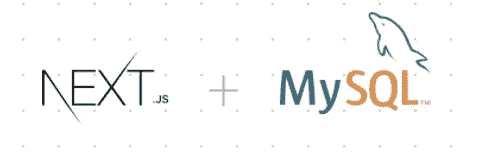
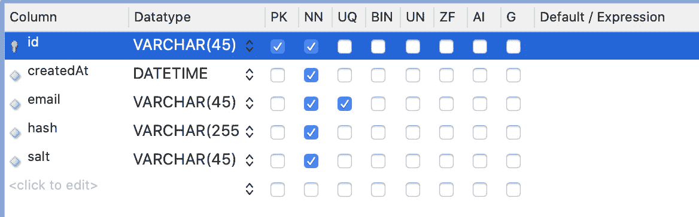
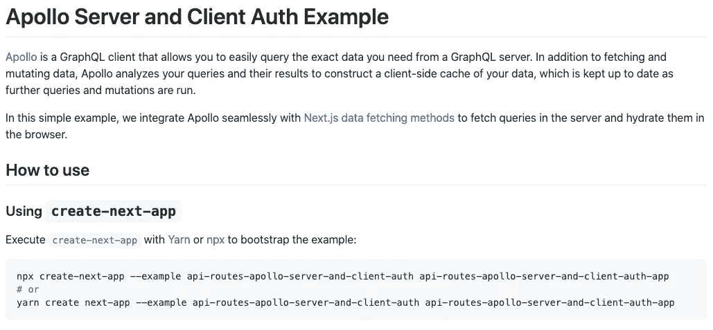
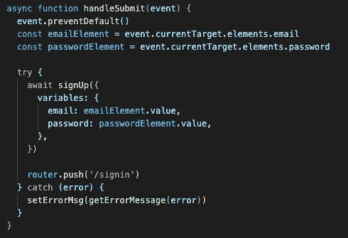
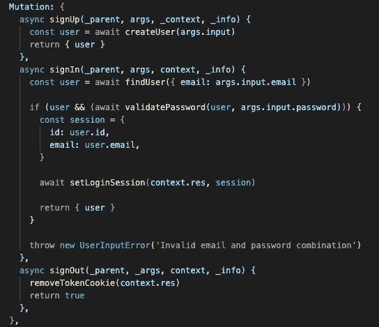

# 如何将 MySQL 和 Auth 连接到 Next.js 应用程序

> 原文：<https://javascript.plainenglish.io/connect-mysql-and-authentication-on-next-js-761d12340e4f?source=collection_archive---------0----------------------->

今天，我们将把 Next.js 应用程序连接到 MySQL 数据库，并开发一个认证特性。



# 1.设置 MySQL 数据库

首先，我会准备 MySQL 数据库进行连接。

如果你已经安装了，你可以跳过这一步。只需在 MySQL 中创建一个名为“users”的数据库和表。

让我们安装“mysql”。我使用了“家酿”软件包管理器。

```
$ brew install mysql
```

没有必要使用这种方法。根据操作系统或您的偏好，您可以使用不同的样式。

安装后，创建一个数据库和“用户”表。我用的是‘MySQL work bench’。



# 2.克隆 next.js 身份验证示例

如果数据库准备好了，我们需要一个 next.js 应用程序来连接数据库。

它还必须有一些关于认证的功能。但是从零开始开发认证特性需要太多的努力。这不是这篇文章的主要目的。

因此，我们将使用 next.js 的官方示例“API-routes-Apollo-server-and-client-auth”。我们可以通过“npx”命令或“yarn”来克隆这个项目。



让我们看看' signup.js '文件中的注册函数组件。它接收来自用户的电子邮件和密码，并在提交时调用“handleSubmit”函数。

当提交事件发生时,' handleSubmit '函数请求' signUp '突变。



signup.js

如果出现注册突变，解析器会创建一个新用户，因为该用户的密码在“apollo/resolvers”和“lib/user.js”中加密。

与此功能相同，“登录”和“注销”功能已经完成。它还支持会话管理。



resolvers.js

# 3.将下一台服务器连接到数据库

现在要连接到 MySQL，我们需要安装一个连接管理器。我们使用了“无服务器-mysql”。它是“mysql”模块的包装器。它支持“异步/等待”和监控连接。

```
$ yarn add serverless-mysql
```

并创建一个“lib/db.js”文件。

```
// db.jsimport mysql from 'serverless-mysql';const db = mysql({ config: { host: process.env.MYSQL_HOST, port: process.env.MYSQL_PORT, database: process.env.MYSQL_DATABASE, user: process.env.MYSQL_USER, password: process.env.MYSQL_PASSWORD }});export default async function excuteQuery({ query, values }) { try { const results = await db.query(query, values); await db.end(); return results; } catch (error) { return { error }; }}
```

要运行这段代码，我们必须设置 env 变量。如果你用过 webpack，你会很熟悉。

我们可以通过制作' next.config.js '文件来定义这些变量。

```
// next.config.js module.exports = { env: { 'MYSQL_HOST': '127.0.0.1', 'MYSQL_PORT': '3306', 'MYSQL_DATABASE': {database_name}, 'MYSQL_USER': {user_name}, 'MYSQL_PASSWORD': {user_password}, }}
```

然后，检查应用程序是否连接到数据库。从 db.js 导入' excuteQuery '并在' createUser '函数中调用它。

lib/user.js

然后输入“http://localhost:3000/signup”。如果您记下新用户的电子邮件和密码并提交，您可以看到新用户是在 MySQL 数据库中创建的。

```
mysql> SELECT * FROM users;
```

“签到”功能也不太难。我们只是使用“选择”查询，而不是“用户”常量变量。


现在我们可以成功地使用身份验证功能了。

## [***Github 源代码***](https://github.com/wkddngus5/nextjs-apollo-tutorial/tree/step5/connect-to-mysql)

***参。***

[](https://vercel.com/guides/deploying-next-and-mysql-with-vercel) [## 使用 MySQL 数据库创建一个 Next.js 应用程序，该数据库使用 Vercel - Vercel 指南进行构建和部署

### 在本指南中，我们将带领您使用最流行的开源数据库创建和部署 Next.js 应用程序…

vercel.com](https://vercel.com/guides/deploying-next-and-mysql-with-vercel) [](https://nextjs.org/docs/api-reference/next.config.js/environment-variables) [## 环境变量| Next.js

### 自从 Next.js 9.4 发布以来，我们现在有了更直观、更符合人体工程学的体验来添加环境…

nextjs.org](https://nextjs.org/docs/api-reference/next.config.js/environment-variables) 

## 进一步阅读

[](/i-built-a-serverless-live-chat-app-with-next-js-fauna-and-wundergraph-for-graphql-live-queries-b671d9646f6) [## 我用 Next.js、Fauna 和 WunderGraph 为 GraphQL 实时查询构建了一个无服务器的实时聊天应用程序

### 使用无服务器技术创建可扩展的实时聊天应用程序的分步指南，来自…

javascript.plainenglish.io](/i-built-a-serverless-live-chat-app-with-next-js-fauna-and-wundergraph-for-graphql-live-queries-b671d9646f6)  [## 如何使用最小特权原则自动化 AWS IAM 最佳实践

### 云是一项神奇的技术，可用于构建可扩展的应用程序，轻松提供对弹性计算的访问…

简明英语. io](https://plainenglish.io/blog/how-to-automate-aws-iam-best-practices-using-the-principle-of-least-privilege) [](https://plainenglish.io/blog/which-database-should-you-use-for-your-next-js-app) [## Next.js 应用程序应该使用什么数据库？

### 如果你在 2022 年要开发一个全栈应用，选择流行的 Next.js 会让你有 95%的机会…

简明英语. io](https://plainenglish.io/blog/which-database-should-you-use-for-your-next-js-app) [](https://plainenglish.io/blog/how-to-build-a-graphql-ecommerce-app-from-scratch) [## 如何从头开始构建一个 GraphQL 电子商务应用程序

### 这就是你要建造的东西！埃森哲的一项调查(19 个国家的 20，000 多名消费者)发现，47%的人…

简明英语. io](https://plainenglish.io/blog/how-to-build-a-graphql-ecommerce-app-from-scratch) [](https://blog.bitsrc.io/next-js-13-what-do-the-new-bleeding-edge-features-actually-do-d3e5fd418563) [## Next.js 13:新的前沿特性实际上是做什么的？

### 你听说过 Next.js 13 是一个游戏改变者，但是为什么？让我们看看有哪些新功能，有哪些变化，以及它们…

blog.bitsrc.io](https://blog.bitsrc.io/next-js-13-what-do-the-new-bleeding-edge-features-actually-do-d3e5fd418563) 

*更多内容请看*[***plain English . io***](https://plainenglish.io/)*。报名参加我们的* [***免费周报***](http://newsletter.plainenglish.io/) *。关注我们关于*[***Twitter***](https://twitter.com/inPlainEngHQ)[***LinkedIn***](https://www.linkedin.com/company/inplainenglish/)*[***YouTube***](https://www.youtube.com/channel/UCtipWUghju290NWcn8jhyAw)*[***不和***](https://discord.gg/GtDtUAvyhW) *。对增长黑客感兴趣？检查* [***电路***](https://circuit.ooo/) *。***