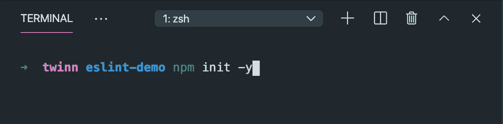
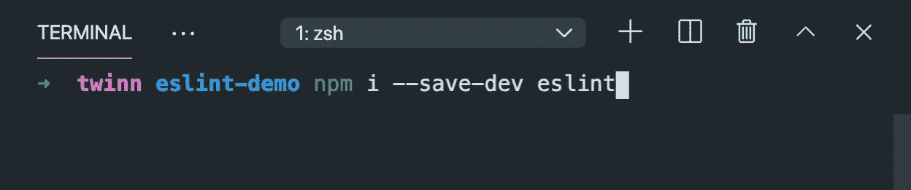
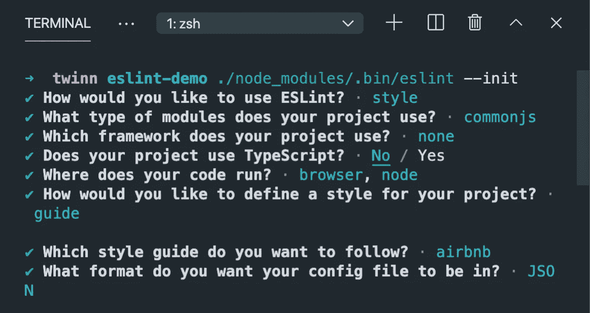
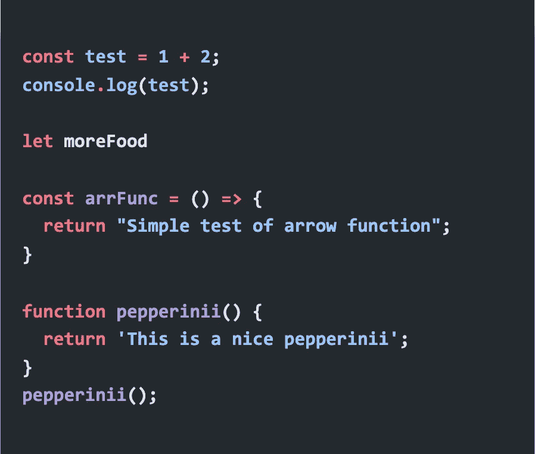
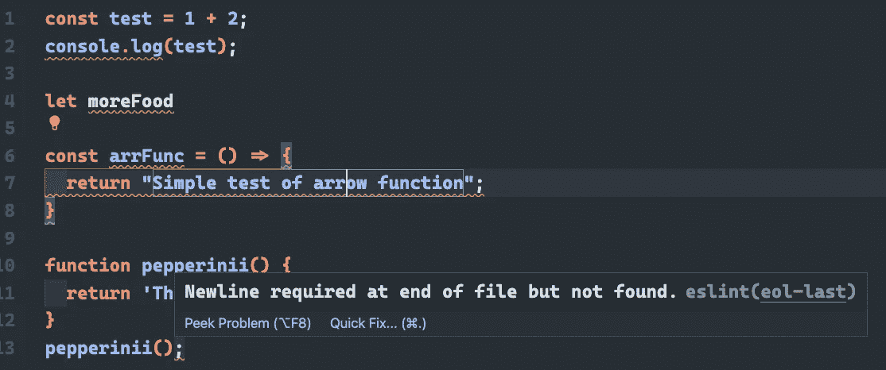
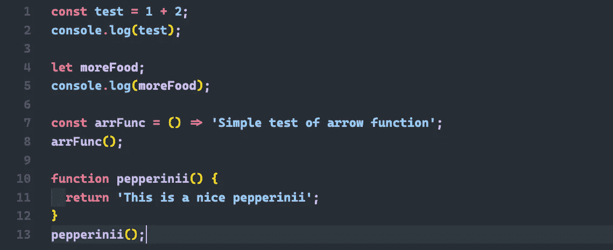

# 与 ESLint 一致的 JavaScript 语法

> 原文：<https://javascript.plainenglish.io/consistent-javascript-syntax-with-eslint-5cb512780132?source=collection_archive---------14----------------------->


如果你不知道 ESLint 是什么，那么你来对地方了。ESLint 可以被称为可插入的 JavaScript linter。这意味着什么？它基本上是一个用于识别和报告 JavaScript 问题的工具。这使得您的代码更容易维护。

你接下来会说什么？让我们打开文本编辑器和终端，开始演示过程！

# **命令**

创建一个文件夹，如果你还没有的话，然后`cd`进入那个目录。拉起控制台运行`npm init -y`，这将创建一个`package.json`文件。这里有`-y`标志，所以它不会提示我们命令中所有常见的问题。



运行该命令后，我们现在应该在文件结构中看到一个`package.json`文件。目前为止干得不错。我们现在想运行`npm i --save-dev eslint`，这将允许 eslint 被安装并保存为一个 dev 依赖项。



接下来我们要做的是将 eslint 初始化到我们的项目中。为此，我们将在终端中运行`./node_modules/.bin/eslint --init`。这将进入 node_modules 目录，该目录是在我们安装 eslint 时创建的，然后我们初始化 eslint。然后会出现一个向导提示您如何配置 eslint。以下是向导的提问和我的回答。



当然，选择符合你需求的答案。运行这个命令后，我们现在可以看到 ESLint 能为我们做什么。

# **ESLint 在行动**



这里我们有一些示例代码来演示 ESLint 是什么样的。现在上面的代码没有任何问题。一切都将按预期运行，但是 ESLint 将帮助我们在代码中保持一致的风格。根据下面所有的曲线下划线，我们可以看到许多可能的语法错误的迹象。



看最后一行，第 13 行，在这里我们调用了我们的`pepperinii()`函数，我们看到一个错误，说在文件的末尾需要一个新行。

一个简单的解决方法是在文件末尾给我们的代码库一个新行。如果我们看一下第 4 行。我们将看到两个错误——这些是来自 ESLint 的默认规则，可以在我们之前的命令生成的`eslintrc.json`文件中更改。

现在我们面临的错误是:第 4 行末尾应该有分号，我们的`moreFood`变量已经定义但从未使用过。简单的重新声明`moreFood = 'some value'`并不能解决它没有被使用的错误。要了解更多“正在使用”的含义，请查看下面的文档。

[](https://eslint.org/docs/rules/no-unused-vars) [## 无未用变量规则

### 配置文件中的" extends": "eslint:recommended "属性启用此规则。声明的变量和…

eslint.org](https://eslint.org/docs/rules/no-unused-vars) 

下面是所有被适当重构的东西的样子；我们总是可以在`eslintrc.json`文件中修改我们想要的规则。我们可以从 eslint 网站访问“规则”,添加和删除我们需要的内容。



正如我们在这里看到的，我添加了`no-console`并将其设置为“off ”,以禁用我们在代码库中使用 console.log 时收到的错误。`eol-last`也被设置为 off，以消除要求我们在文件末尾换行的错误。

```
// .eslintrc.json
"rules": {
  "no-console": "off",
  "eol-last": "off"
}
```

有一大堆规则可以玩，适合你的需要。比如用双引号代替单引号，缩进预期等等。请随意查看以下链接，了解更多关于 ESLint 的信息。

## **资源**

[](https://eslint.org/) [## 可插入的 JavaScript

### ESLint 静态分析你的代码，快速发现问题。ESLint 内置于大多数文本编辑器中，您可以运行…

eslint.org](https://eslint.org/)