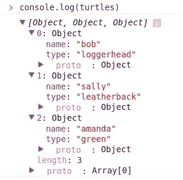
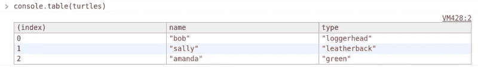
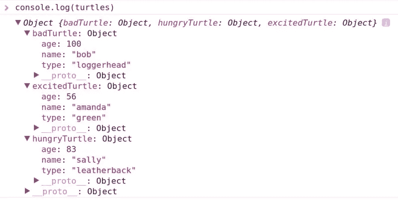
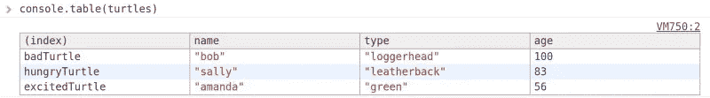
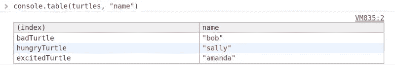
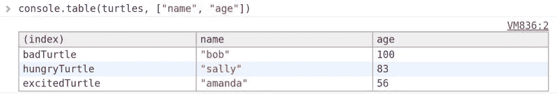

# JavaScript 调试提示:Console.table()

> 原文：<https://javascript.plainenglish.io/console-table-javascript-debugging-tips-hungry-turtle-code-be7347a2f151?source=collection_archive---------18----------------------->

## 控制台日志是唯一的选择吗？

像我一样，你们中的很多人可能经常使用 console.log()来调试你的 [JavaScript](https://hungryturtlecode.com/tags/javascript/) 代码。这个问题还没有大到需要设置断点的程度，但是您不希望出现像 alert()这样的侵入性问题。

Console.log()非常适合这种情况。但它总是最好的解决方案吗？

# 让我们把所有的事情都摆到桌面上来

你们中的一些人可能已经知道了 console.log()的一个不太为人知的兄弟，console.table()。尽管如此，我猜你们中的许多人从未听说过它。我当然直到最近才听说这件事。

我真的不知道为什么它是一个如此晦涩的东西，因为它非常有用。

# 控制台. log 调试或控制台. table()？

所以今天就简单介绍一下。正如您可能已经知道或已经猜到的，console.table 允许您向控制台打印出数组和对象。

这很好，因为它组织得很好，不像我们在控制台时得到的标准下拉列表。除此之外，您还可以对列进行排序，以快速了解您需要什么。

让我们自己创建一个数组来练习:

```
var turtles = [
    {
        name: "bob",
        type: "loggerhead"
    },
    {
        name: "sally",
        type: "leatherback"
    },
    {
        name: "amanda",
        type: "green"
    }
];
```

所以，在这里，我们有一群快乐的海龟，可以打印在我们的桌子上。

# console.log()如何输出此信息？

仅供参考，我们在控制台用`console.log(turtles)`打印出这个数组:



# 现在让我们用控制台做得更好

以下是我们使用`console.table(turtles)`时的输出:



您可以单击每列的标题对该列进行排序。这是一个很好的功能，如果您知道数据应该在哪里，可以快速查看一些数据。

# 使用一些 JSON 怎么样？

一个更可能的用例是快速查看从 API 调用中接收到的一些 JSON 数据。让我们通过构建一个测试对象来模拟这种情况:

```
var turtles = {
    badTurtle: {
        name: "bob",
        type: "loggerhead",
        age: 100
    },
    hungryTurtle: {
        name: "sally",
        type: "leatherback",
        age: 83
    },
    excitedTurtle: {
        name: "amanda",
        type: "green",
        age: 56
    }
}
```

这个对象与我们之前的数组非常相似，除了我们现在给每只乌龟增加了一个年龄属性，原因很快就会变得更清楚。

这里再次引用`console.log(turtles)`的输出:



这是`console.table(turtles)`的辉煌成果:



这里请注意，它将实际使用分配给每个对象的名称作为索引，而不是像对数组那样按索引号列出。这显然为查看数据提供了另一个层次的便利。

# 如果我们的对象有 20 个属性呢？

当然，如果我们处理的对象有很多属性，这可能会出现问题，这将转化为我们表中的很多列。这可能会有问题，因为数据变得很难再次读取。

幸运的是，console.table API 允许使用传入可选的第二个参数，该参数将指定我们关心的列，并且只打印出这些列。

可以这样做:`console.table(turtles, "name&")`

这将产生以下输出:



如果需要很多列，第二个参数可以是一个数组，包含任意多的属性。

按照我们的海龟示例，我们可能只需要每只海龟的名字和年龄(这就是为什么我向对象添加了第三个属性，以允许选择多个列，而不是全部选择)。

```
console.table(turtles, ["name", "age"]
```

现在，我们将在控制台中看到以下内容:



这是[控制台 API](https://developer.mozilla.org/en/docs/Web/API/console) 的一个非常强大的部分，我觉得很少有开发者意识到这一点。我希望你能利用这些知识，成为一名更好的开发人员。

直到下次，看看更多的 [JavaScript 技巧和诀窍](https://hungryturtlecode.com/tags/javascript/)。

保持饥渴，继续编码。

艾德里安(男子名)

如果你觉得有用，请告诉你的朋友们！

*最初发表于*[*https://hungryturtlecode.com*](https://hungryturtlecode.com/tutorials/console-log-table/)*。*