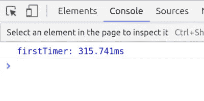
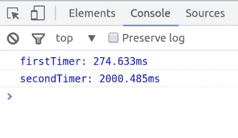
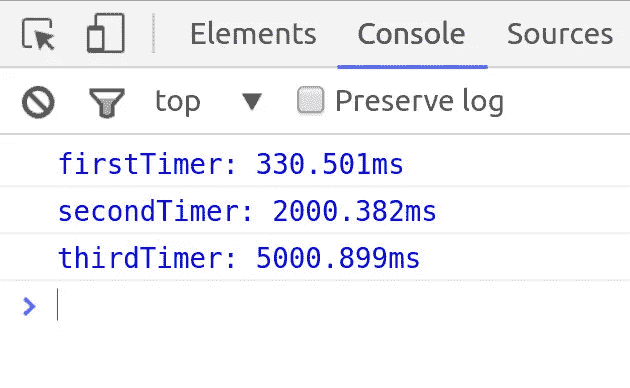

# JavaScript 调试技巧:Console.time()

> 原文：<https://javascript.plainenglish.io/console-time-javascript-debugging-tips-hungry-turtle-code-55c3293155e8?source=collection_archive---------14----------------------->

## 及时—控制台.时间

我见过一些计算 JavaScript 代码运行时间的惊人方法。获取时间戳并进行比较是一种常见的方法。但是 console.time 是控制台 API 中的一个方法，它可以让您毫不费力地做到这一点。

这不是我给出的第一个 JavaScript 调试技巧。你可以查看一下[控制台.表格](https://hungryturtlecode.com/tutorials/console-log-table/)和[控制台.跟踪](https://hungryturtlecode.com/tutorials/console-trace/)，如果你还没有的话。

首先，这是我开始使用的非常无聊的 HTML。

```
<!DOCTYPE html>
<html lang="en">
<head>
	<meta charset="UTF-8">
  <title>Console.Time</title>
</head>
<body>
  <h1>Experimenting With console.time()</h1>

  <script src="script.js"></script>

</body>
</html>
```

# 让我们慢慢来

如果我们想计算一段代码运行需要多长时间，我们可能首先需要一些运行需要一段时间的代码。没有必要计算两个数相加需要多长时间。

条件句需要一点时间来计算，所以让我们有很多！我们可以创建一个 for 循环来循环数百万次，并且在每次循环时，检查它是否是循环的结束。这需要一些时间来运行。

```
for(var i = 0; i &lt; 100000000; i++){
  if(i == 99999999){

  }
}
```

现在我们有了这个，我们可以使用 console.time 来实际计时运行需要多长时间。为此，我们需要在 for 循环开始之前调用 console.time，并在 for 循环运行之后调用 console.timeEnd。

您还可以在任何给定的时间点运行许多 console.time 实例。为了区分它们，可以给它们起一个名字，这是 console.time 和 timeEnd 各自采用的参数。我们就称这个为“第一次”。

```
console.time("firstTimer");

for(var i = 0; i &lt; 100000000; i++){
  if(i == 99999999){
	  console.timeEnd("firstTimer");
  }
}
```

# 运行代码

如果您在执行完该代码后检查控制台，您将看到以下内容:



它循环了 1 亿次，并对每一次都进行了条件检查，全部在 0.315 秒内完成。我觉得这很神奇。电脑是吗？

但是为什么就此打住呢？我说过可以在同一个代码中运行多个 console.time 实例。所以让我们试试。

这次我想我会用 setTimeout 来“浪费”一些时间。我可以将它设置为在下一个代码运行之前需要一定的时间，这将是 console.timeEnd 调用。

```
console.time("secondTimer");

setTimeout(function(){

  console.timeEnd("secondTimer");

}, 2000);
```

在浏览器中运行所有这些代码，我们会看到:



第一个计时器的运行方式和它一样，但是我们得到了对 console.time 的第二次调用。注意它比我们在超时中设置的 2000 稍微多一点。这将是实际调用代码中涉及的函数的开销。

# 你能同时运行两个控制台吗？

当然啦！让我们试一试。让我们在调用第二个控制台的同时调用第三个控制台。但是将第二个 setTimeout 放在第一个 setTimeout 中，并且只在第二个超时完成时结束第三个 console.time。

```
console.time("secondTimer");
console.time("thirdTimer");

setTimeout(function(){

  console.timeEnd("secondTimer");

  setTimeout(function(){

	  console.timeEnd("thirdTimer");

  }, 3000);

}, 2000);
```

在浏览器中运行它，我们得到三个定时器值。前两个和我们过去看到的一样。然后我们还得到第三个，第一个超时 2000 毫秒，第二个超时 3000 毫秒，总共 5000 毫秒，再加上之前的一点开销。



给你。这就是关于 console.time 的全部内容。走出去，在您自己的项目中使用它，通过了解您的瓶颈在哪里，使您的代码更加高效。

直到下一次，

保持饥渴，继续编码，

艾德里安(男子名)

如果你觉得有用，请告诉你的朋友们！

*最初发表于*[T5【https://hungryturtlecode.com】](https://hungryturtlecode.com/tutorials/console-time/)*。*