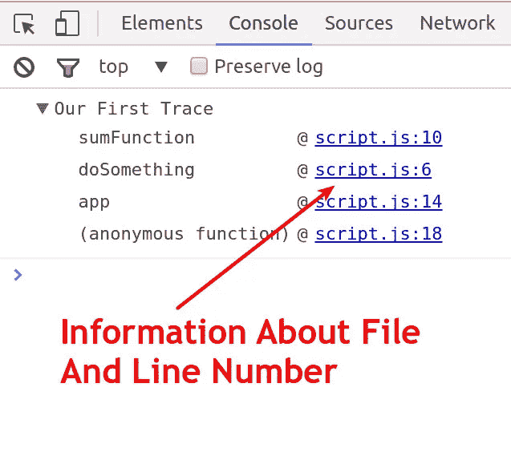

# JavaScript 调试技巧:Console.trace()

> 原文：<https://javascript.plainenglish.io/console-trace-javascript-debugging-tips-hungry-turtle-code-e67668244aa4?source=collection_archive---------9----------------------->

## 鲜为人知但功能强大的工具——console . trace()

不久前，我发布了一个关于使用 console.table 作为 JavaScript 调试工具的帖子和视频。我得到了很大的反响，许多人说他们很震惊它并不出名。现在我将继续使用 console.trace。

这篇文章是我的[系列](https://hungryturtlecode.com/tags/javascript/)的一部分，讲述更多你可以使用的强大工具——查看另一篇关于[控制台的文章](https://hungryturtlecode.com/tutorials/console-log-table/)

首先，我创建了一个简单的 HTML 结构，允许我们调用一个 [JavaScript](https://hungryturtlecode.com/tags/javascript/) 文件。这没什么意思，但我还是会给你看代码。

```
<html lang="en">
<head>
  <meta charset="UTF-8"/>
	<title>Console.Trace</title>
</head>
<body>
  <h1>Experimenting With console.trace()</h1>

  <script src="script.js"></script>
</body>
</html>
```

现在是有趣的部分…

# JavaScript 代码

这是我开始使用的 JavaScript。

```
function app(){
    function doSomething(){
        var a = 1;
	var b = 2;
	alert( sumFunction(a, b) );
    }
    function sumFunction(a, b){
        return a + b;
    } doSomething();
}app();
```

当然，这段代码有点做作，在现实世界中不是很有用，但它将很好地服务于我们的目的。重要的部分是有很多函数调用其他函数。这将创建一个称为调用堆栈的东西——一个所有被调用函数的列表，按照它们被调用的顺序排列。

这段代码非常简单。我们有一个在文件底部调用的 app 函数。app 函数包含另外两个函数——do something 和 sumFunction。

在 app 函数的底部调用 doSomething 函数。doSomething 然后声明两个变量，并将它们作为参数传递给 sumFunction。

sumFunction 只是将这两个数字相加并返回结果，然后输出警报。


# Console.trace 到底是做什么的？

简单地说，console.trace 会将调用 console.trace 时存在的调用堆栈记录到控制台中。

这为什么有用？

好吧，让我们假设我上面展示的 JavaScript 是一个巨大代码库的一小部分。有许多文件和许多不同的功能。

我们已经确定代码在某个地方有一个 bug，但是我们不确定具体在哪里。我们已经把范围缩小到调用 sumFunction 之前的某个地方。

不幸的是，sumFunction 在许多不同的地方、在许多不同的文件中被调用。不可能马上知道是哪个函数调用产生了 bug。

# 一些开发者会如何解决这个问题？

我见过许多不知道 console.trace 的开发人员，他们通过在代码中加入大量带有不同消息的 console.logs 来解决这种困境。然后运行代码，当错误发生时，控制台中最后记录的消息可能是罪魁祸首。

当然，这种方法没有错——它很有效。但是，这确实意味着要进行大量冗余的键入、复制和粘贴工作，以便将所有的控制台日志添加到代码中，然后在完成后再将它们全部删除。更不用说，如果您在代码中忘记了一个，您可能会在生产代码中记录消息——非常混乱！

# 在步骤 console.trace 中

相反，我们可以在代码中我们想要回溯的地方调用 console.trace。因此，在上面的 JavaScript 中，我们希望从 sumFunction 进行回溯，所以我们将 console.trace 放在那里，如下所示:

```
function sumFunction(a, b){
  console.trace("Our First Trace");

  return a + b;
}
```

请注意，我们可以在一个参数中传递它，这个参数只是特定堆栈跟踪的名称。这允许我们拥有多个不同的 console.trace 实例，我们可以区分它们，因为它们都有唯一的名称。

在运行这段代码之前，让我们再看一下代码——这次是对 console.trace 的调用——并考虑一下堆栈跟踪应该是什么样子。

```
function app(){
    function doSomething(){
        var a = 1;
	var b = 2;

	alert( sumFunction(a, b) );
    }

    function sumFunction(a, b){
        console.trace("Our First Trace");
	return a + b;
    }

    doSomething();
}

app();
```

首先，在触发 console.trace 之前调用的最后一个函数是 sumFunction。所以这将是调用堆栈的顶部。

sumFunction 是在哪里调用的？这是在 doSomething 函数内部，所以这将是调用堆栈上 sumFunction 下面的下一个调用(记住堆栈从底部开始，任何新的东西都放在顶部。因此最新的项目在顶部，最老的项目在底部)。

什么叫做 doSomething 函数？这应该是应用程序的功能。这是堆栈的下一步。

最后，什么叫 app 功能？这是在我们的 JavaScript 文件的开放空间中调用的——这是全局名称空间。所以调用 app 函数的是全局名称空间。

所以调用栈应该是这样的:sumFunction，doSomething，app，全局命名空间。

# console.trace 输出什么？

我们仍然在窗口中显示警告框，就像我们以前做的一样，但是有趣的事情发生在控制台中。

这是我们运行代码时控制台的输出。


除了栈底是(匿名函数)而不是全局命名空间，这正是我们所期望的。但是全局名称空间在 JavaScript 中只是一个未命名的函数，所以这就是为什么它告诉我们它是一个匿名函数。但是我们知道它只是全局名称空间。

我们还可以看到每个调用是从哪个文件发出的，以及它是从文件中的哪一行发出的。



这些也是互动链接。我们可以单击 doSomething 函数调用旁边的文件名和行号，它会将我们带到 Chrome Dev Tools 中的 sources 选项卡，并直接转到 doSomething 函数中调用堆栈上下一个函数的那一行。在我们的例子中，它将把我们带到第 6 行，在那里 sumFunction 被调用。


最后，这就是在调试工作流中使用 console.trace 所需要知道的全部内容。清理起来非常容易，因为您已经用一个对 console.trace 的调用代替了 JavaScript 文件中对 console.log 的多次调用。

# 额外的好处—最佳实践

作为一个额外的奖励，我将向您展示在您的本地开发环境中使用带有 Chrome 开发工具的 console.trace 的一种很好的忍者方式，这将允许您在代码中永远不会有 console.trace 调用，并始终保持您的代码库干净。

让我们假设代码中不再有 console.trace 调用 JavaScript 与上面的第一个代码片段完全一样。

现在我们在浏览器中运行它。打开 Chrome Dev Tools 并导航到 sources 选项卡。

在 sources 选项卡中，您可以键入代码，就像在编辑器中一样。这里是您键入 console.trace 调用的地方。像这样:


# 断点或手动调用该函数

不幸的是，当我们刷新浏览器时，我们感兴趣的代码已经运行了。您可以通过在 console.trace 上方设置一个断点来避免这种情况，然后再次刷新，或者您可以通过控制台手动触发 app 函数。

为了给大家看，我会在控制台再次触发 app 功能。这将再次导致 console.trace 注销调用堆栈。


请注意，这里的调用堆栈略有不同。这是因为我们从控制台调用了 app 函数，所以调用堆栈必须进一步回溯才能到达第一个调用，因为控制台在后台添加了一些魔法。但是栈顶还是和以前一样。

现在，我们可以单击链接，浏览调用堆栈中涉及的代码区域，就像以前一样。

这次的好处是，console.trace 实际上从未出现在 JavaScript 文件中，它只出现在 dev tools 内部的代码中。所以我们不必担心在部署时将它从代码中删除。少了一件需要担心的事情，这总是件好事，对吗？

这次就这么多了。

我期待着在 JavaScript 调试技巧系列的下一篇文章中见到您。

但在那之前，

保持饥渴，继续编码，

艾德里安(男子名)

如果你觉得有用，请告诉你的朋友们！

*最初发表于*[T5【https://hungryturtlecode.com】](https://hungryturtlecode.com/tutorials/console-trace/)*。*