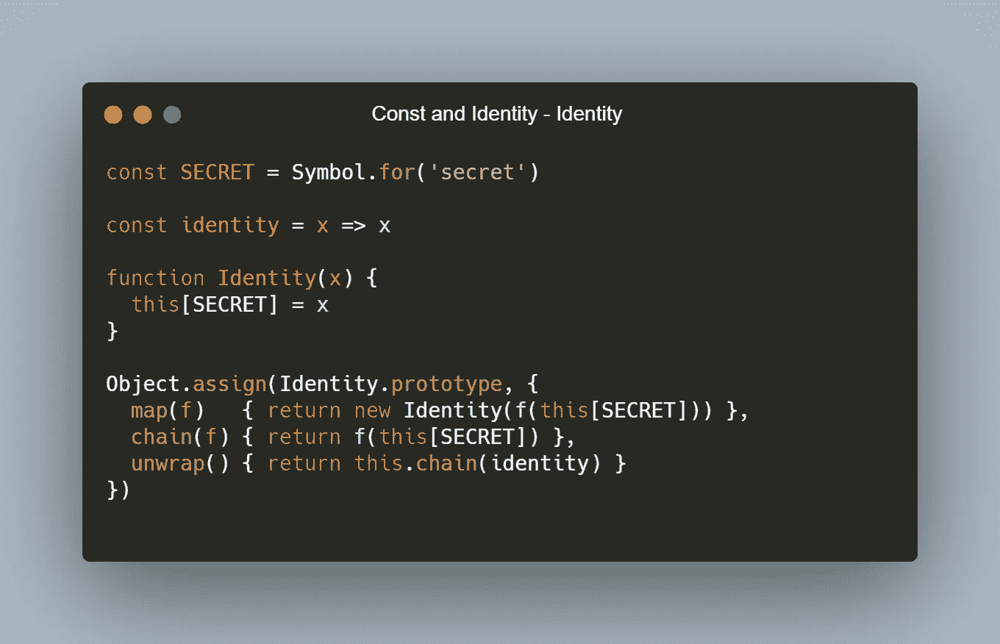
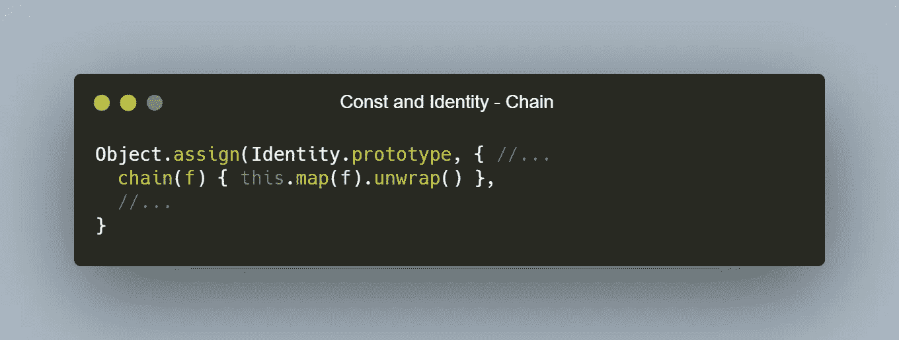
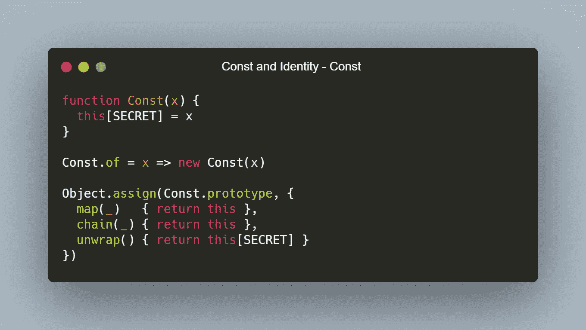
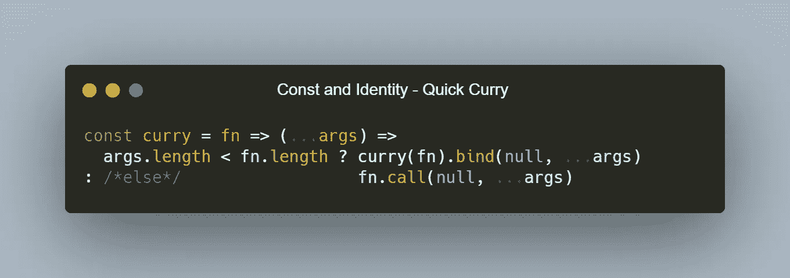
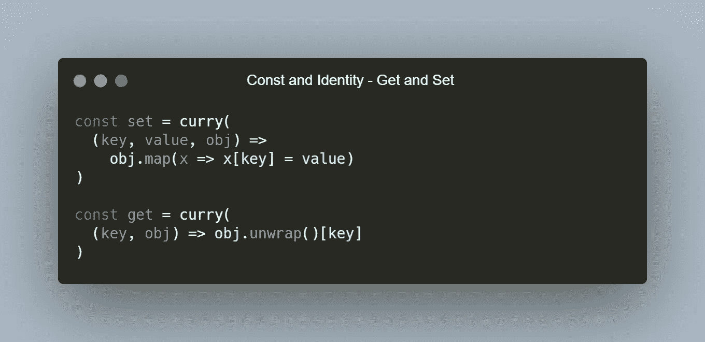
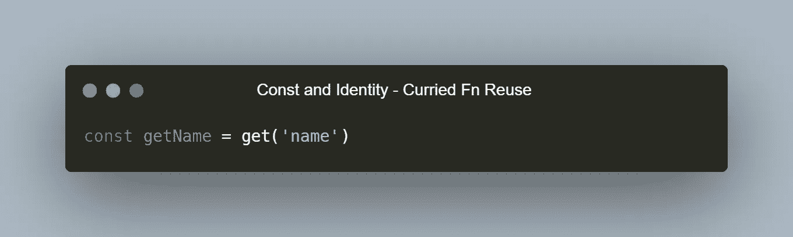
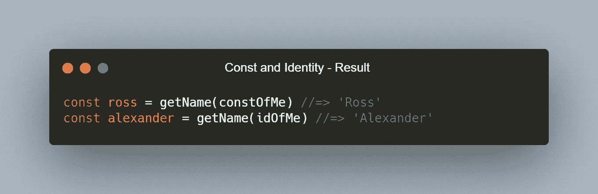

# 常数和单位单子

> 原文：<https://javascript.plainenglish.io/const-and-identity-monads-6cbeca88fc85?source=collection_archive---------9----------------------->

## 意想不到的有用构造

Photo by [Kelli McClintock](https://unsplash.com/@kelli_mcclintock?utm_source=medium&utm_medium=referral) on [Unsplash](https://unsplash.com/?utm_source=medium&utm_medium=referral)

今天我要谈谈我最喜欢的两个单子——*恒等式*和*常量。这些是基本单位单子，只保存一个值。它们可能是最容易理解的单子，但是它们有强大的含义和用途。如果你还不了解单子，可以在这里查看我对单子作为*接口* [的简单解释。](https://rossketeer.medium.com/the-monad-interface-2045e5810851)*

先说身份单子。单位单子是通过将一个简单的值放入其中构造的，可以是数字、字符串或对象。它不会对那个值做任何特别的事情，它只是把它放在我们漂亮的一元盒子里，从这里我们可以*映射*到内容，*链接*内容到一个新的一元类型，或者打开盒子找出我们得到的值是什么。我们可以简单地定义它，就像这样(我喜欢把单子的内容藏在一个符号键里):

Simple Identity Monad definition.

所以我们通过定义 *map、chain、*和 *unwrap* 方法来坚持我们的 Monad 接口。我们使用我们的秘密值来实现这些方法。如您所见，Identity 只是秘密值的包装器，并不做任何其他特殊的事情。注意我们如何定义*展开。我们将`identity`函数链接起来。identity 函数是 Identity monad 的姊妹函数——它返回您输入的任何内容。因为 chain 在 Identity 实例的秘密值上调用它提供的函数`f`，它将有效地返回那个秘密值。这可以应用于任何单子，以实现展开。这是单子的数学对称性质的一部分，我们通过我们的链定义得到了展开的自由定义。它也以另一种方式工作，(因此对称)。我们可以通过重用 map 和 unwrap 中的定义来定义 chain，就像这样:*

Alternative chain definition.

如您所见，*将*映射到 Identity 实例上，然后*展开*其内容，本质上与将`f`应用于展开的值是完全相同的结果。这使得单位单子完美地说明了单子的数学对称性。所有的单子都应该能够通过互相结合使用 map 来交换 chain 或 unwrap 的定义。这种巧妙的可互换性是单子成为单子的根本原因！

现在我们知道了所有关于同一性的东西，让我们继续讨论常数单子。Const 真的很像 Identity，除了你放入 Const monad 的东西是不可改变的。您可以随意对其进行映射，但结果将始终与您最初输入的内容完全相同。我们可以这样定义它:

The Const Monad, defined simply.

正如你所看到的，映射 Const Monad 总是产生它自己，没有修改，就像链接它一样。这背后的事实是，从技术上讲，它本身并不是一个单子。但是如果你看任一单子的左边部分，你会注意到它看起来完全像 Const——那是因为它是 Const！

那么这有什么好处呢？让我们写一个小例子来说明一个简单的用法——函数 getters 和 setters。这是“透镜”的一个例子，但是被大大简化了。镜头是一个函数，通过劫持 Identity 和 Const 构造，它可以充当 getter 和 setter。不过，我将简单地说明如何通过使用 Const 或 Identity 来阻止或允许对象属性的设置。首先，如果您正在使用 codepen 或您自己的 IDE，请复制我将提供的 curry 的定义:

A super light helper to define an auto-curried function.

如果您还不知道的话，curry 是一种为函数提供少于所需参数总数的方法，用来创建一个叫做*的部分应用程序。*人们一般把局部涂抹的过程称为*涂抹。这是函数式编程的一个主要特点。我将在另一个时间写更多关于咖喱的东西，现在这就是你继续这个例子所需要的。*

现在让我们定义一些无指针样式的 *get* 和 *set* 函数:

Curried Get and Set functions…we’ll use these shortly.

我们编写了一些函数，这些函数看着一个`obj`，我们假设它是一个带有`map`的单子。然后，我们使用`set`转换基础值，或者使用`get`返回请求的属性。涂抹它们可以让我们像这样做一些功能性的魔法:

How to use curried functions to make specialized functions.

这个定制的`get`函数允许我们预加载一个参数，返回一个接受剩余参数的函数。酷！继续看一些用法:

Some examples of our Monads in action.

我把自己定义为一个例子。我们使用`...` spread 语法复制`me`对象，因为否则我们将引用原始的`me`对象，导致我们的 Const 和 Identity 实例都指向该原始对象，这不是我们想要的行为。那么，当我们试图分别设置 Const 和 Identity 的内部值时，您认为会发生什么呢？

Seeing the results of our Const and Identity Monads contents.

如果你认为我们不能修改 Const，但是我们可以修改 Identity，那你就对了！如果您继续学习单子，您将会理解 Identity 和 Const 只是其他单子和函数运算的构建块。这里有一支笔展示我的作品:

希望您喜欢另一次函数式编程冒险。请继续关注更多内容，继续关注 FP！