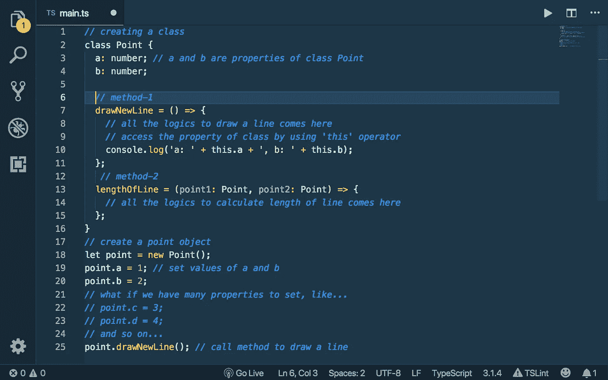
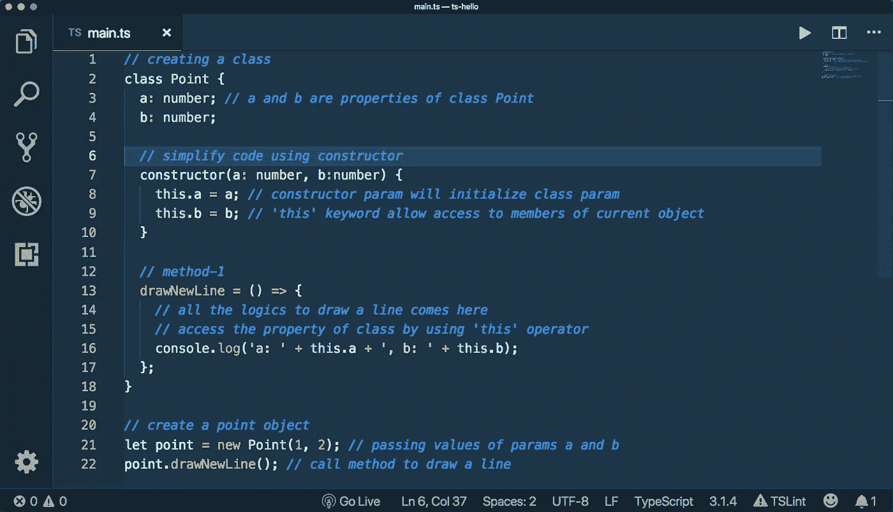
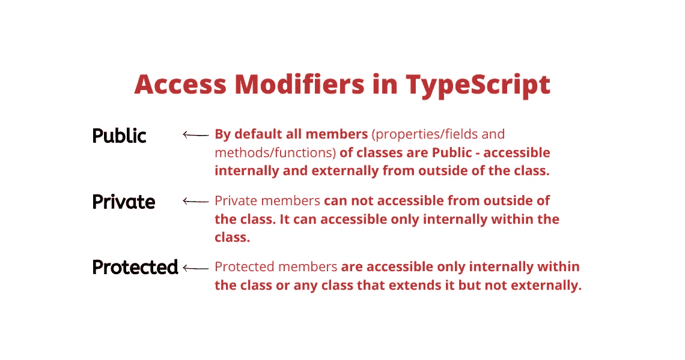
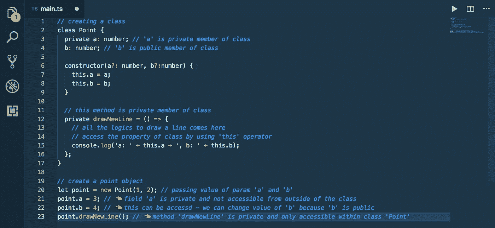
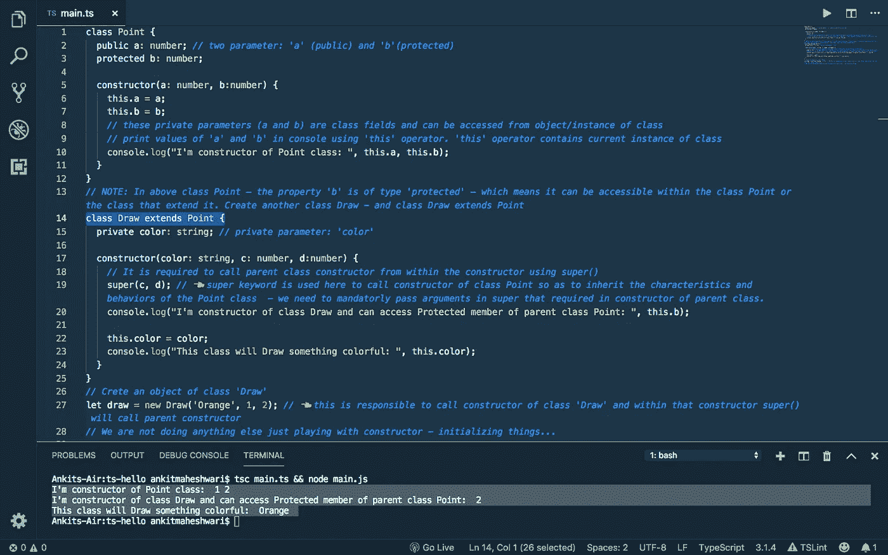
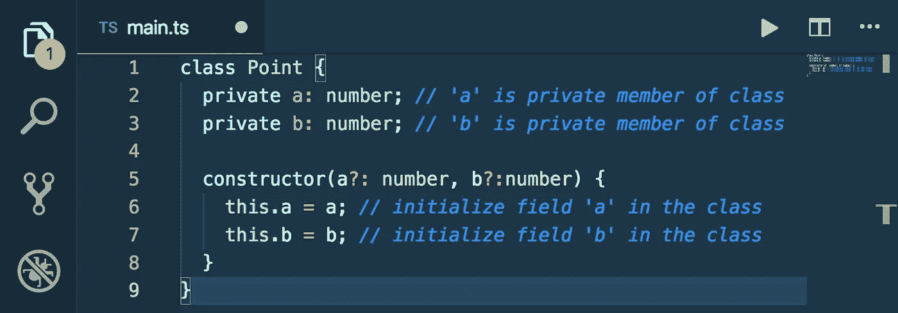
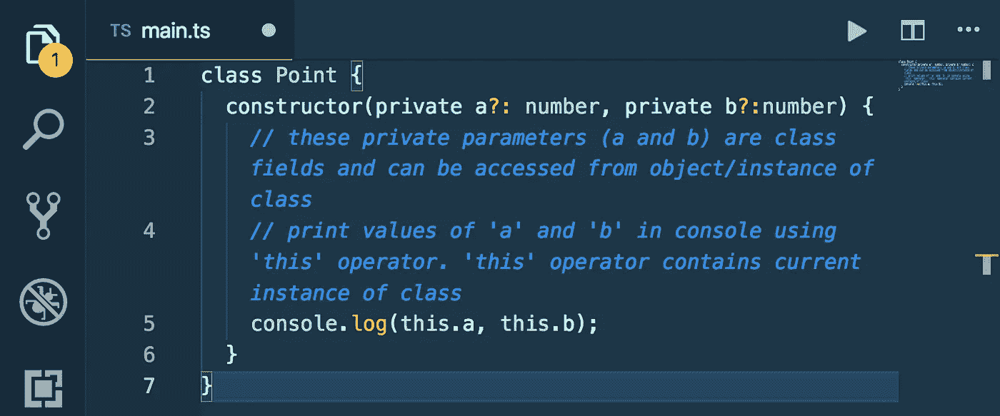

# TypeScript/Angular 中的构造函数和访问修饰符

> 原文：<https://javascript.plainenglish.io/constructors-and-access-modifiers-in-typescript-22a2d6188780?source=collection_archive---------0----------------------->

## 什么是 Angular(第 6.4 部分)/什么是 TypeScript？

[](https://medium.com/codechintan/ionic-hide-header-on-scroll-b8828a7a7f86) [## Ionic4 隐藏滚动标题。

### 如何在 Ionic 框架中隐藏内容滚动的标题？

medium.com](https://medium.com/codechintan/ionic-hide-header-on-scroll-b8828a7a7f86) 

工作原理… |如何开始…

> *如果*您还没有涉及到本系列的[部分— 6.3](https://medium.com/@AnkitMaheshwariIn/interfaces-and-classes-in-typescript-part-6-3-7fee77b7518b) ，我建议您查看这个链接→[TypeScript](https://medium.com/@AnkitMaheshwariIn/interfaces-and-classes-in-typescript-part-6-3-7fee77b7518b)中的接口和类


# 打字稿基础👇

1.  键入注释
2.  箭头功能
3.  接口
4.  班级
5.  **构造函数**
6.  **访问修饰符**
7.  性能
8.  模块

# 6.4 构造函数

```
Look down the code below...👇
```

*   在第 2 行定义一个类别(`Point` ) —
*   *类别属性——第 3 行和第 4 行的*
*   **第 7 行和第 13 行的类方法—**
*   ***在第 18 行创建了一个类(`Point` ) — *的对象(`point`****
*   **在第 19 行和第 20 行设置对象(`point` ) — *的属性值(`a`和`b`***
*   **调用类的方法在第 25 行画一条线(`drawNewLine` ) —**

***⭐️现在，如果我们在类中为一个对象设置了这么多属性，会怎么样呢？？—在第 19–24 行处查看***

******

***我们有比设置每个属性的值更好的解决方案。通过使用面向对象编程的概念，称为**构造函数**。***

***所以每个类我们都有一个**构造函数**，它基本上是一个方法，当我们创建该类的实例时，它会被自动调用。所以在上面的例子中，构造函数方法将在第 18 行调用，也就是在执行代码*的时候👉****

*   **`**constructor**`是 TypeScript 中的保留关键字。**
*   **`**constructor**` 实际上是一个可以有参数的类方法——看下面代码*第 7 行*——*我们有类型号的参数* `*a*` *和* `*b*` *。***
*   **`**this**`关键字允许访问当前对象的成员——查看第 8 行和第 9 行的代码*—*—*这里我们设置类属性的值。***
*   **当我们创建一个类的实例时，我们需要传递这些参数值`*a*` *和*`*b*`*——请看下面代码*的第 21 行*——我们传递值(1，2)这些值进入构造函数方法。***

****

*   ****注意**:在 TypeScript 中我们只能有一个`constructor`方法进入类中——但是我们可以在构造函数中有可选的参数——看第 7 行 — 我们可以通过在参数名后使用`? question mark`使`a`和`b`可选，这样这些参数就可选了。**
*   ****规则**:当一个参数成为可选参数时，该参数右侧的所有其他参数也应该是可选的——这是一条规则。如果`b?`是可选的，那么`c?`和`d?`必须是可选的。**

```
**constructor(a: number, b?:number, c?:number, d?:number)**
```

**现在我们可以通过跳过可选值来创建一个类的实例——请看下面👇*在第 21 行* —通过参数`a`的值，跳过`b`的值。**

****

**⭐ **现在，如何防止从构造函数初始化后值被改变。****

```
***// create a point object - by passing values of 'a' and 'b' for initialization***let point = new Point(1, 2);** *👈 this will set values of 'a' and 'b' by calling constructor***point.a = 3;** *👈 this will change value of 'a' AND WE WANT TO PREVENT THIS.***
```

**我们可以通过使用访问修饰符来防止在初始化之后改变`a`和`b`的值。**

# **6.4 访问修饰符**

**访问修饰符是一个关键字，我们可以将它应用于一个类的成员，以从外部控制它的访问。**

*   **在 TypeScript 中，我们有三个关键字作为访问修饰符: `public`、 `private`和`protected`**
*   **默认情况下，类的所有成员(属性/字段和方法/函数)都是公共的，可以从类外部访问。**
*   **访问修饰符用于控制从类外部对类成员(属性/字段和方法/函数)的访问。**
*   **我们可以将访问修饰符关键字应用于类属性/字段和方法/函数。**

****

# **⭐使用(公共和私有)访问修饰符:**

**看看下面的代码👇—使用访问修饰符的示例…(也请正确阅读注释以便更清楚地理解)**

****

**`*Please carefully read all the comments in the image*`**

**上面第 21 行和第 23 行的代码是无效的——因为**私有成员不允许从类**外部访问。**

> ****Typescript** 代码阻止了**私有字段**的直接**访问**，但是我们有一个间接的方法来访问…使用属性！**

****

> ****属性**允许使用 get 关键字和 set 关键字访问类外的私有成员。要了解如何操作，请点击此链接👉[TypeScript/Angular 中的属性和模块](https://medium.com/@AnkitMaheshwariIn/properties-and-modules-in-typescript-angular-a86ee23f12aa)**

# **⭐使用(受保护的)访问修饰符和类扩展了另一个类:**

*   **声明两个参数:`a` (public)和`b`(protected)——请看下面👇*在 2 号线和 3 号线***
*   **注意:在类`Point`中——属性`b`是“受保护的”类型——这意味着它可以在类`Point`或扩展它的类中被访问。**
*   **创建另一个类`Draw`——类`Draw`扩展`Point`——请看下面👇*在 14 号线***
*   **这个新类`Draw`的`Constructor`必须使用`super`关键字调用父类`constructor`——请看下面👇*在第 19 行***
*   **我们还可以访问父类`Point`的受保护成员(属性`b`)——请看下文👇*在第 20 行***
*   **最后，我们创建了一个类`Draw`的对象/实例，它负责调用类`Draw`的构造函数，从`Draw`的构造函数中，它将使用 super()调用父类`(Point`的构造函数——如下所示👇*在第 27 行，然后在第 19 行***

```
***Please carefully read all the comments in the image below...*👇👇**
```

****

**`*Please carefully read all the comments in the image*`**

**⭐接下来，如何在 TypeScript 中少用**代码:****

**我们使用`constructor`中的参数(`a?: number`，`b?:number`)来初始化类中的字段—请看下面👇*在 5 - 7 号线***

****

**⭐️ **我们可以用更少的代码在 TypeScript** 中初始化类字段——在修改上述代码之后。**

*   **从`class Point` *中删除类字段声明——从上述代码*中删除第 2 行和第 3 行👆**
*   **同时删除字段值分配*——从上述代码*中删除第 6 行和第 7 行👆**
*   **然后在构造函数中用访问修饰符给参数加前缀，也就是用关键字*给参数加前缀——查看下面代码中的第 2 行*👇**

****

**`Please carefully read all the comments in the image`**

> **之前要记住的事情👋👋**

> *****类扩展了另一个类*** (涵盖在此👇文章)[https://medium . com/@ ankitmaheshwarin/constructors-and-access-modifiers-in-typescript-222d 6188780 # 09ed](https://medium.com/@AnkitMaheshwariIn/constructors-and-access-modifiers-in-typescript-22a2d6188780#09ed)**
> 
> *****类实现了一个接口*** (在本👇article)[https://medium . com/@ ankitmaheshwarin/interfaces-and-classes-in-typescript-part-6-3-7 fee 77 b 7518 b # EBD 8](https://medium.com/@AnkitMaheshwariIn/interfaces-and-classes-in-typescript-part-6-3-7fee77b7518b#ebd8)**
> 
> *****接口扩展了另一个接口*** (涵盖在此👇文章)[https://medium . com/@ ankitmaheshwarin/interfaces-and-classes-in-typescript-part-6-3-7 fee 77 b 7518 b # 0b2d](https://medium.com/@AnkitMaheshwariIn/interfaces-and-classes-in-typescript-part-6-3-7fee77b7518b#0b2d)**

**所以这是关于**构造函数**和**访问修饰符**——下一部分再见👋👋为了涵盖另一个概念**属性**和**模块。****

> ***如果*您还没有涉及到本系列的[部分— 6.3](https://medium.com/@AnkitMaheshwariIn/interfaces-and-classes-in-typescript-part-6-3-7fee77b7518b) ，我建议您查看这个链接→[TypeScript](https://medium.com/@AnkitMaheshwariIn/interfaces-and-classes-in-typescript-part-6-3-7fee77b7518b)中的接口和类**
> 
> ***敬请期待部分—6.5* [*https://medium.com/@AnkitMaheshwariIn*](https://medium.com/@AnkitMaheshwariIn)**

**如果你不介意给它一些掌声👏 👏既然有帮助，我会非常感谢:)帮助别人找到这篇文章，所以它可以帮助他们！**

**永远鼓掌…**

****

# **了解更多信息**