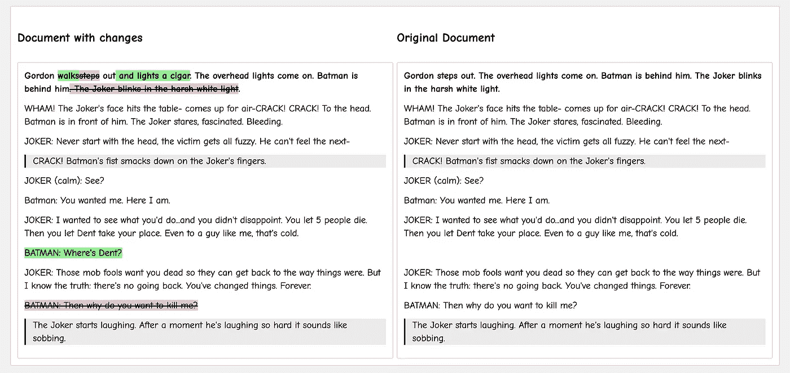

# 如何用普通 JavaScript 构建内容差异视图

> 原文：<https://javascript.plainenglish.io/content-diff-view-in-vanilla-javascript-105a00abd7ce?source=collection_archive---------2----------------------->



A diff’d version of HTML

大家好，今天我们来谈谈“不同的观点”,看看我们如何在我们的项目中实现它。可以从 tnwinc 的 repo [这里](https://github.com/tnwinc/htmldiff.js/blob/master/src/htmldiff.coffee)获取 JS 文件。虽然它是一个 CoffeeScript 代码，但是你可以使用任何在线转换器从它那里获得 JS 代码——我使用的是 [JS2。咖啡](http://js2.coffee)。或者你可以从这个 [GitHub Gist](https://gist.github.com/KPChakravarthy/8a2fcddfa11f29ddb9cc557a87449aaa) 中抓取一份我的文件

首先，这里有一些关于我们今天要实现的目标的信息。

# **场景**

比方说，我们使用一种算法在后端生成一个文档，并将其提供给前端，在前端，我们使用所见即所得编辑器允许用户根据他们的要求修改内容。现在，几年后他们想知道他们改变了什么(几乎不可能，是的，但是你明白了)。这是他们期望看到两个文档之间差异的地方。

# **抓到你了**

1.  这是纯粹的普通 JavaScript，没有任何依赖关系——这意味着你可以把文件放到任何你想要的项目上，加载它，然后砰！你可以走了。
2.  它的美妙之处在于，它可以在前端和后端代码中实现——这完全取决于您和您的需求。例如，在我的例子中，有很多参数，计算会改变，文档会在后端更新，这是一个后端密集型任务，所以我们在后端实现它。如果您的需求主要是静态的，只有一堆来自 BE 的 HTML，那么您可以选择在 FE 本身上实现它。
3.  实现的某些部分依赖于 CSS3(没什么大不了的，但更像是玩弄可见性来创造一种空行的感觉。
4.  CSS 可以通过两种方式实现(据我所知)——
    **a .**当你使用 TinyMCE 这样的编辑器时，它会在 iFrame 中呈现所有内容，这意味着你可以选择将定制的 CSS 直接插入到只与该编辑器相关的编辑器中。这是一个很好的小功能，你可以从后端发送文档和它的 CSS。
    **b.** 使用像 draft.js 这样的编辑器，你需要提供一个包装类，并确保你的自定义 CSS(现在应用于你的项目中)将只在想要的编辑器上生效。

# **要求**

1.  任何后端——NodeJS、JAVA、RoR——都由你决定。
2.  任何前端——Angular、React、Vue 甚至纯 JS——都由您决定。
3.  htmldiff.js 文件的副本。您可以将它保存在您的项目目录中，或者进行更改并将其托管在您的 CDN 上。

# 摘要

我们将采取一个 HTML 字符串，打破，撕裂和撕裂；但主要是把它拆分成字符，并与对应的字符进行比较，以显示不同之处。

完成所有这些后，让我们深入研究代码。在进入 JS 之前，让我们快速创建布局并相应地调整样式。

```
***THE HTML***<div class="card">
  <div class="row">
    <div class="col">
      <h4>Document with changes</h4>
      <div class="card current-document" id="output"></div>
    </div>
    <div class="col">
      <h4>Original Document</h4>
      <div class="card system-generated" id="outputNew"></div>
    </div>
  </div>
</div>
```

这是你的布局，我会让你的风格适合你的项目。

创建者在命名函数和变量方面做得很好，所以它们基本上是自解释的，尽管我会带你看一下主要的部分

```
is_end_of_tag = function (char) {
  return char === ">";
};
is_start_of_tag = function (char) {
  return char === "<";
};
is_whitespace = function (char) {
  return /^\s+$/.test(char);
};
is_tag = function (token) {
  return /^\s*<[^>]+>\s*$/.test(token);
};
isnt_tag = function (token) {
  return !is_tag(token);
};
```

这些函数用于确定字符“类型”——这对于知道何时何地在 

**html_to_tokens** 函数是字符串切割和字符匹配的地方。

“改变”发生在匹配字符串被映射和添加/删除的部分——**op _ map**对象。

```
op_map = {
  equal: function (op, before_tokens, after_tokens) {
    return before_tokens
      .slice(op.start_in_before, +op.end_in_before + 1 || 9e9)
      .join("");
  },
  insert: function (op, before_tokens, after_tokens) {
    var val;
    val = after_tokens.slice(op.start_in_after, +op.end_in_after + 1 || 9e9);
    return wrap("ins", val);
  },
  delete: function (op, before_tokens, after_tokens) {
    var val;
    val = before_tokens.slice(op.start_in_before, +op.end_in_before + 1 || 9e9);
    return wrap("del", val);
  }
};
op_map.replace = function (op, before_tokens, after_tokens) {
  return (
    **op_map.delete(op, before_tokens, after_tokens) +
    op_map.insert(op, before_tokens, after_tokens)**
  );
};
```

如果您注意到这里，根据 op_tokens 中的变化，我们将把它放在一个 **< ins >** 标签或 **< del >** 标签周围，这表示它被插入或删除了。这里， **return** 语句返回“删除”字符串+“插入”字符串的串联。然而，这里有一个问题。可以先显示 delete 再插入，但是要写一堆 javascript 把原始文档中删除的部分去掉。或
2。显示插入，然后删除，这样您就可以使用 CSS **visibility: hidden 来隐藏删除；**

我选择了第二行，并像这样交换了插入和删除行

```
op_map = {
  equal: function (op, before_tokens, after_tokens) {
    return before_tokens
      .slice(op.start_in_before, +op.end_in_before + 1 || 9e9)
      .join("");
  },
  insert: function (op, before_tokens, after_tokens) {
    var val;
    val = after_tokens.slice(op.start_in_after, +op.end_in_after + 1 || 9e9);
    return wrap("ins", val);
  },
  delete: function (op, before_tokens, after_tokens) {
    var val;
    val = before_tokens.slice(op.start_in_before, +op.end_in_before + 1 || 9e9);
    return wrap("del", val);
  }
};
op_map.replace = function (op, before_tokens, after_tokens) {
  return (
    **op_map.insert(op, before_tokens, after_tokens) +
    op_map.delete(op, before_tokens, after_tokens)**
  );
};
```

这给了我们一个喘息的机会来根据我们的需要编写 CSS 为了简单起见。这是 CSS 的要点—

```
.current-document ins {
  background: lightgreen;
  text-decoration: none;
}.current-document del {
  background: pink;
}.system-generated del {
  visibility: hidden;
}.system-generated ins {
  text-decoration: none;
}.system-generated ins ~ del {
  display: none;
}
```

我相信 CSS 相当简单。“当前文档”(有更改的文档)上的 **ins** 和 **del** 都被设计为显示“更改”，并且都隐藏在“系统生成的”(原始文档)上，因此看起来像“原始”文档。

因为我们在上面交换了行，我们现在可以使用兄弟选择器(~)从原始文档的 DOM 中删除 **del** 。

现在剩下的就是触发 JS 并输出结果。

```
// Diff HTML strings
let output = htmldiff(originalHTML, newHTML);
let input = htmldiff(newHTML, originalHTML);// Show HTML diff output as HTML!
document.getElementById("output").innerHTML = output;
document.getElementById("outputNew").innerHTML = input;
```

这就是这个故事的结尾。这是它的一支笔——

# 我希望你喜欢这篇文章，它在某种程度上帮助了你。

我总是乐于接受改进和改变，所以请随时在下面留言。接下来我将发表一篇关于使用 AWS 多部分上传 API 和预先设计的 URL 上传大文件到 S3 的文章，敬请关注。到那时，“*愿法典与你同在。”*👾