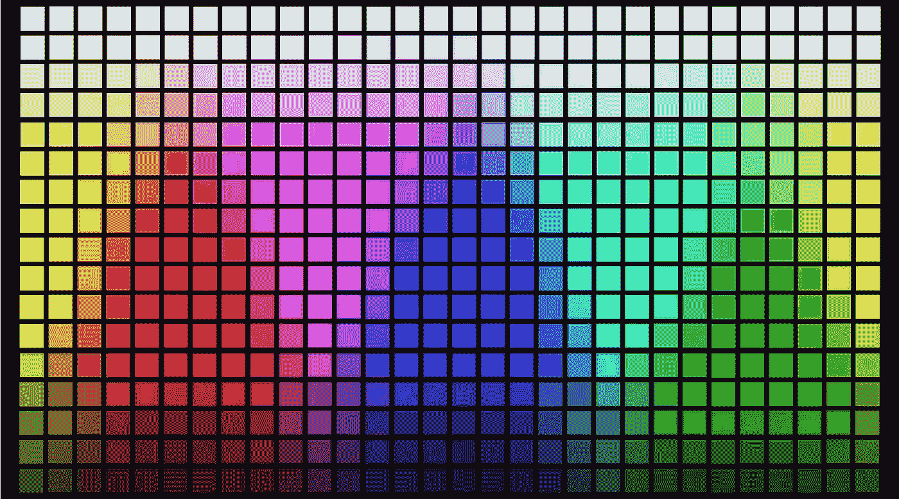

# 用 JavaScript 将十六进制转换为 RGB

> 原文：<https://javascript.plainenglish.io/convert-hex-to-rgb-with-javascript-4984d16219c3?source=collection_archive---------7----------------------->

## 如何将类似“1502BE”的十六进制颜色字符串转换为 RGB 版本的“21，2，190”。



这个例子只处理六位十六进制颜色格式。简而言之，请看看[的 PHP 版本](https://convertingcolors.com/blog/article/convert_hex_to_rgb_with_php.html)，并尝试将其改编为 JavaScript。

十六进制字符串“1502BE”已经是颜色的十六进制表示，其中第一对两位数代表红色，第二对代表绿色，最后一对代表蓝色。

我们需要做的是将字符串分成这些 RGB 对“15”代表红色，“02”代表绿色，“BE”代表蓝色。

```
var aRgbHex = '1502BE'.match(/.{1,2}/g);
console.log(aRgbHex); //["15", "02", "BE"]
```

之后，剩下的就是将十六进制表示转换成十进制表示。为此，我们使用了[parse int 函数](https://developer.mozilla.org/en-US/docs/Web/JavaScript/Reference/Global_Objects/parseInt)，并将基数 16 作为第二个参数传递。

```
var aRgbHex = '1502BE'.match(/.{1,2}/g);
var aRgb = [
    parseInt(aRgbHex[0], 16),
    parseInt(aRgbHex[1], 16),
    parseInt(aRgbHex[2], 16)
];
console.log(aRgb); //[21, 2, 190]
```

一旦我们写了，我们也可以把我们的代码移动到一个原型函数，这样我们就可以在任何字符串上执行它。

```
String.prototype.convertToRGB = function(){
    var aRgbHex = this.match(/.{1,2}/g);
    var aRgb = [
        parseInt(aRgbHex[0], 16),
        parseInt(aRgbHex[1], 16),
        parseInt(aRgbHex[2], 16)
    ];
    return aRgb;
}

console.log('1502BE'.convertToRGB()); //[21, 2, 190]
```

此外，我们应该添加一个字符串长度为 6 的检查，以避免用户以速记格式传递十六进制颜色。

```
String.prototype.convertToRGB = function(){
    if(this.length != 6){
        throw "Only six-digit hex colors are allowed.";
    }
    ...
```

# 完整的代码

```
String.prototype.convertToRGB = function(){
    if(this.length != 6){
        throw "Only six-digit hex colors are allowed.";
    }

    var aRgbHex = this.match(/.{1,2}/g);
    var aRgb = [
        parseInt(aRgbHex[0], 16),
        parseInt(aRgbHex[1], 16),
        parseInt(aRgbHex[2], 16)
    ];
    return aRgb;
}

console.log('1502BE'.convertToRGB());
console.log('ff0000'.convertToRGB());
console.log('f00'.convertToRGB());
```

# 输出

```
[21, 2, 190]
[255, 0, 0]
Only six-digit hex colors are allowed.
```

喜欢这篇文章吗？如果有，通过 [**订阅获取更多类似内容解码，我们的 YouTube 频道**](https://www.youtube.com/channel/UCtipWUghju290NWcn8jhyAw) **！**