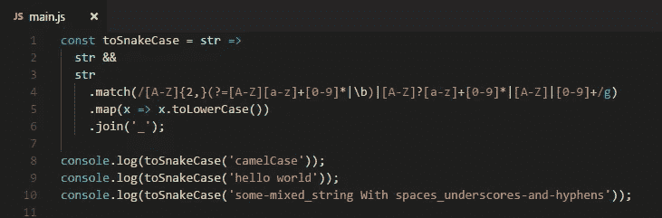
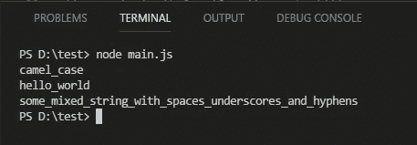
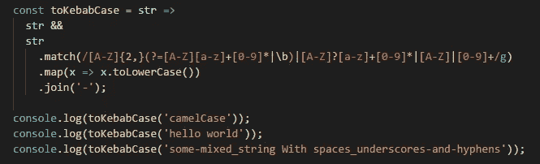
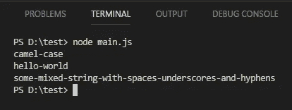
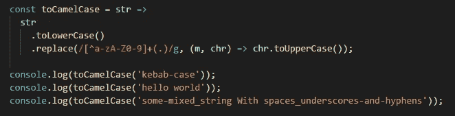
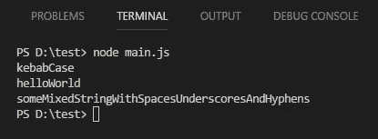
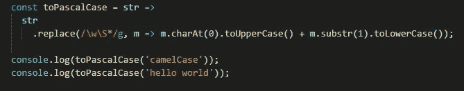
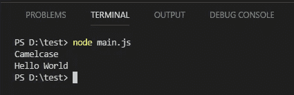

# 将字符串转换成不同的大小写样式:Snake，Kebab，Camel 和 Pascal 大小写

> 原文：<https://javascript.plainenglish.io/convert-string-to-different-case-styles-snake-kebab-camel-and-pascal-case-in-javascript-da724b7220d7?source=collection_archive---------0----------------------->

JavaScript 中字符串到不同单词组合方式的转换。


Photo by [Sergey Pesterev](https://unsplash.com/@sickle?utm_source=medium&utm_medium=referral) on [Unsplash](https://unsplash.com?utm_source=medium&utm_medium=referral)

在编程中，有几种编写复合词或短语的方法。这些实践几乎在每一种编程语言中都作为惯例使用，并不是一成不变的。命名惯例的选择总是一个有争议的问题，一些人认为他们的是最好的，而另一些人认为是次等的。

接下来，在我们可以进行一些字符串转换之前，我们需要首先识别大小写样式。我们将学习 4 种不同的案例风格，分别是:

1.  蛇案
2.  烤肉串盒
3.  骆驼箱
4.  帕斯卡案例

# 1.蛇案


Photo by [David Clode](https://unsplash.com/@davidclode?utm_source=medium&utm_medium=referral) on [Unsplash](https://unsplash.com?utm_source=medium&utm_medium=referral)

Snake case 是编写复合词的实践，其中单词由一个**下划线**字符分隔，没有空格。第一个字母要么大写，要么小写。它通常用于声明变量名、函数名，有时也用于声明计算机的文件名。

例子

```
Hello_world
it_department
```

# 2.烤肉串盒

在烤肉串的情况下，所有的字母都用小写字母书写，单词之间用一个**连字符**或**减号**隔开。kebab 符号通常用作命名文件名的约定。

例子

```
kebab-case
football-match
```

# 3.骆驼箱

Camel case 描述了这样一种书写短语的实践，即短语中间的每个单词或缩写以大写字母**开始，中间没有空格或标点符号。**

例子

```
camelCase
myLaptop
```

# 4.帕斯卡案例

Pascal 大小写类似于 camel 大小写，但第一个字母是大写的**。没有空格和连字符来分隔单词。在许多编程语言中，pascal case 经常被用作创建类的约定。**

**例子**

```
MainBuilding
RedDress
```

**让我们从字符串转换开始，因为我们已经认识到了上面的每种大小写样式。**

# **字符串转换**

**在 Javascript 中，有多种方法可以将字符串转换成上面提到的 4 种大小写样式。我将分享我使用的方法，那就是使用 **RegEx** (正则表达式)。**

**您可以创建一个名为`main.js`的新 js 文件，并使用以下命令在您的终端/控制台窗口中运行它:**

```
node main.js
```

****1。串到蛇盒****

****

**Convert string to snake case**

**正则表达式**

```
/[A-Z]{2,}(?=[A-Z][a-z]+[0-9]*|\b)|[A-Z]?[a-z]+[0-9]*|[A-Z]|[0-9]+/g
```

**结果**

****

**Result of conversion to snake case**

****2。串到烤肉串盒****

****

**Convert string to kebab case**

**我使用的正则表达式与上面转换成蛇的情况相同。**

**结果**

****

**Result of conversion to kebab case**

****3。** **串骆驼案****

****

**Convert string to camel case**

**正则表达式**

```
/[^a-zA-Z0-9]+(.)/g
```

**结果**

****

**Result of conversion to camel case**

****4。字符串到 Pascal 大小写****

****

**Convert string to pascal case**

**正则表达式**

```
/\w\S*/g
```

**结果**

****

**Result of conversion to pascal case**

# **结论**

**在这篇文章中，我们学习了如何区分 4 种 case 风格，这在任何编程语言中都是常见的惯例。**

**我们也知道了如何将字符串转换成这 4 种大小写样式。如果你认为这篇文章是有帮助的，不要忘记与你的朋友分享。**

# **资源**

1.  **[https://en.wikipedia.org/wiki/Snake_case](https://en.wikipedia.org/wiki/Snake_case)**
2.  **https://www.computerhope.com/jargon/c/camelcas.htm**