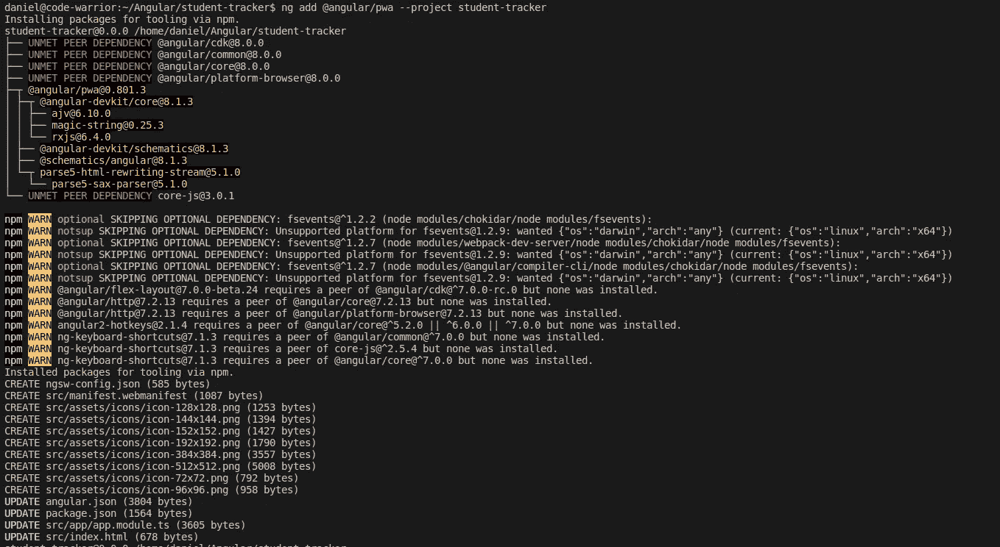
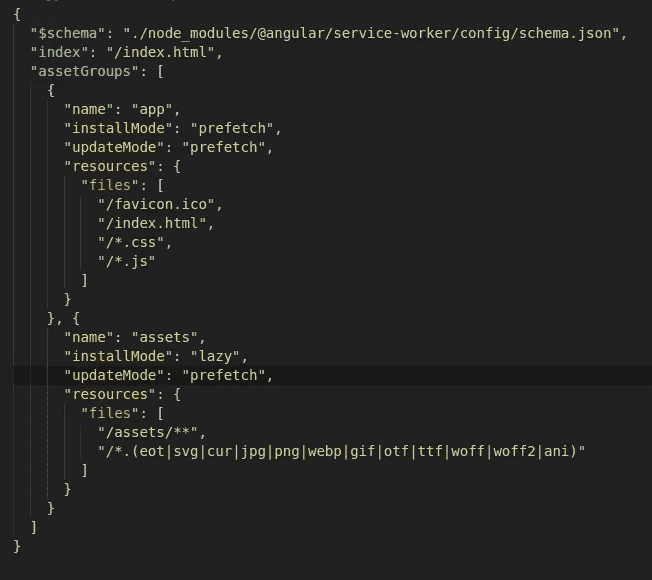

# 如何在 2020 年将你的 Angular 应用程序转换为 PWA——5 岁儿童的无痛指南。

> 原文：<https://javascript.plainenglish.io/convert-your-angular-app-into-a-pwa-in-2019-the-painless-guide-bbf523d2ce72?source=collection_archive---------3----------------------->

关于如何将 Angular 应用程序转变为渐进式 web 应用程序的 pimple-simple 指南**和**提供了惊人的用户体验。


我不相信偷别人的东西。

和一个战友跑了**雷**不是吧。

但是我喜欢一个简单的参考指南，我可以参考，而不是通过挖掘有角度的文件。

没有进一步的喧嚣或嘈杂，它在这里。

## 1.添加服务人员。

```
ng add [@angular/pwa](http://twitter.com/angular/pwa) --project *project-name*
```

您可以在您的 *angular.json* 文件中找到项目名称。



Installing Angular service worker.

过去，这需要专家花费数小时或数天时间才能完成。现在一个 3 岁的剃须刀可以在你阻止他之前安装这个。这个命令做了大量繁重的工作。

有几件事你应该知道…

1.  在 app 模块中自动导入并注册服务人员。
2.  更新*index.html*以包含 *manifest.json* 文件，该文件包含有关 progress web 应用程序的详细信息。
3.  创建图标文件以支持 PWA。这些图标贴在 *src/assets/icons* 文件夹中，应该用应用图标进行更新，以便进行品牌推广。
4.  创建 *src/ngsw-config.json* 。该文件用于配置服务人员。

## 2.配置服务人员。

默认服务工作程序将自动缓存以下文件。

*   index.html
*   favicon.ico
*   所有的构建工件(JavaScript 和 CSS 包)。
*   位于资产文件夹中的任何文件。
*   配置的`outputPath`(默认为`./dist/<project-name>/`)或`resourcesOutputPath`下的图片和字体。



Configuring the service worker

[**安装模式**](https://angular.io/guide/service-worker-config#installmode)

我们可以为不同的资产设置一个`installMode`。

`lazy`模式是一种按需缓存方法，意味着从不被请求的资源也不会被请求。`prefetch`模式用于确保尽快请求和缓存所有资源。

[**更新模式**](https://angular.io/guide/service-worker-config#updatemode)

`updateMode`用于确定当发现应用程序的更新版本时如何处理缓存。

`prefetch`模式用于用新资源立即更新缓存。`lazy`模式仅在新资源被明确请求时才会将其存储在缓存中。

## 3.你完了！

我希望这个简短的指南对你有所帮助。请点击它给它更多的能量👏按钮。

别忘了通过媒体关注我的[。谢谢你！](https://medium.com/@dkreider09)

[](https://medium.com/@dkreider09/why-i-choose-angular-instead-of-react-and-why-you-should-to-aef005c6d145) [## 为什么我选择有角度的…而不是反应。以及为什么你应该这么做。

### 那么…为什么那么多 React 粉丝认为 Angular 是一个要避免的很深很黑的框架？还是说太难学了？或者…

medium.com](https://medium.com/@dkreider09/why-i-choose-angular-instead-of-react-and-why-you-should-to-aef005c6d145) [](https://medium.com/@dkreider09/a-basic-rxjs-guide-for-beginners-part-1-22b8847c2536) [## 初学者 RxJS 基础指南。(第一部分)

### RxJS 不觉得有点吓人吗？这完全可以理解。当我看到……时，我的眼睛转动了一下

medium.com](https://medium.com/@dkreider09/a-basic-rxjs-guide-for-beginners-part-1-22b8847c2536) [](https://medium.com/@dkreider09/how-to-add-semantic-ui-components-to-your-angular-8-app-without-getting-frustrated-341bb16dddbd) [## 如何将语义 UI 组件添加到 Angular 8 应用程序中…而不会感到沮丧。

### 说…所有这些奇怪的吞咽错误令人沮丧。没有更简单的方法吗？

medium.com](https://medium.com/@dkreider09/how-to-add-semantic-ui-components-to-your-angular-8-app-without-getting-frustrated-341bb16dddbd)