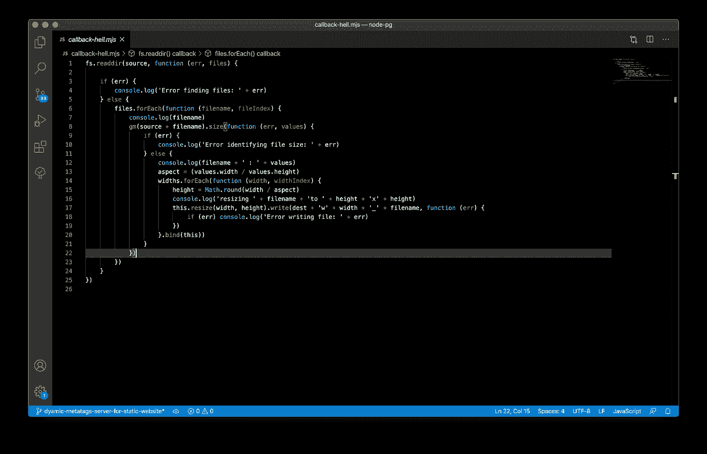

# 将基于回调的函数转换为 JavaScript 中的承诺

> 原文：<https://javascript.plainenglish.io/converting-callback-based-functions-to-promises-in-javascript-ab22f55a24e?source=collection_archive---------2----------------------->

## 使用基于回调的库时避免回调地狱

使用 Promises，您可以编写更整洁、更可读的代码，但仍然有许多包是用回调函数编写的，因此您可能仍然会遇到回调地狱。如果你可以得到同样的功能，但不是接受回调，它会返回一个承诺呢？

下面是一个简单的 HTTP 服务器，它服务于一个静态网站。此 web 服务器的工作原理如下

*   接收 HTTP 请求
*   检查网站目录中的请求路径(*例如，如果请求是 test.com/about/main.html，它会在网站目录*中查找 about/main.html)
*   如果路径是目录，则返回该目录中的`index.html`文件
*   如果该路径是文件的路径，则返回该文件
*   如果路径不存在，它将返回一个`404.html`文件。

两个功能`fs.lstat` & `fs.readFile`均使用回调返回响应。这是一个非常基本的示例，与实际项目毫无可比性，但它已经下降了两个回调级别。在一个产品项目中，回调或我们所说的回调地狱会很容易达到 7-8 层。

为了避免这种情况`Promise`被引入了 JavaScript。但由于这些函数是用回调实现的，很像今天可用的大多数包，所以我们仍然面临这个问题。

*由于我们不能真正更改这些函数的实现，我们可以编写一个包装函数，它将使我们能够将任何基于回调的函数更改为基于 promise 的函数。*

# 这个功能将如何运作？

姑且称之为`promisify`。以下是`promisify`必须填写的要求

应该接受基于回调的函数并返回一个新函数，而新函数应该返回一个 Promise。

当原始函数调用回调而没有错误时，承诺应该解决，而当出现错误时，承诺应该拒绝。

现在我们都有了所有必须的部分。现在我们只需要用这个回调来调用原始函数(`func`)。

这将采用任何接受回调的函数，并将返回一个返回承诺的新函数。

现在我们可以通过`promisifying``fs.lstat`&`fs.readFile`函数来重写我们的 HTTP 服务器了。

它不仅避免了回调地狱，而且还允许您使用高级`Promise`特性并标准化整个代码库，而与底层库和包的实现无关。Node.js 在实用程序中提供了`promisify`，但对于客户端的 JavaScript 却不是这样。