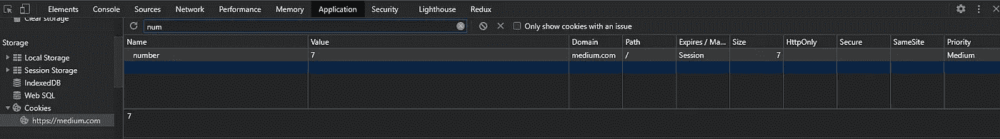
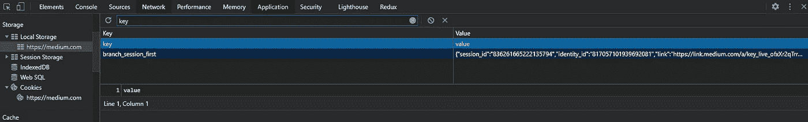
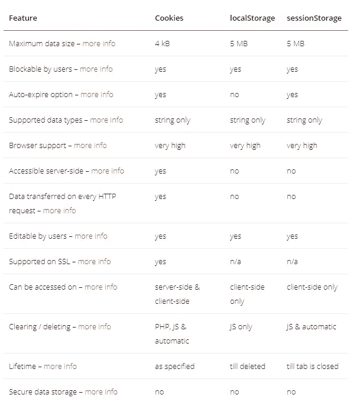

# Cookies vs 本地存储 vs 会话存储

> 原文：<https://javascript.plainenglish.io/cookies-vs-local-storage-vs-session-storage-320dd05943d3?source=collection_archive---------1----------------------->


Photo by [Richy Great](https://unsplash.com/@richygreat?utm_source=medium&utm_medium=referral) on [Unsplash](https://unsplash.com?utm_source=medium&utm_medium=referral)

# 为什么要在浏览器中存储数据？

在浏览器中存储数据的一个关键原因是**性能**。你不能总是等待服务器为每个请求发送一个响应。有时，最好在浏览器中存储一些信息，以便更快地访问。因此，基本上，有三种方法可以在浏览器中本地存储数据——cookie、本地存储和会话存储。

# 饼干

Cookies 是最古老也是最常见的数据存储方式。cookie 基本上是一些基于文本的信息。它通常由服务器设置，但也可以在浏览器中设置。工作很简单，每次浏览器发出请求时，浏览器会自动附上 cookie。现在，服务器接收在浏览器中设置的信息。

我们可以为正在设置的 cookie 设置到期时间。整个 cookie 数据只允许 4KB 的存储空间。Cookies 很有优势，因为它们在老版本的浏览器中也能工作。浏览器中的每个窗口都可以访问 cookie。

如果你想用你的浏览器手动设置一个 cookie，你可以在你的浏览器开发控制台中输入这段代码，其中`number`是键，`7`是值，然后看看你的*应用程序标签*在*cookie*下，检查它是否设置。

```
document.cookie="number=7"
```



Cookie being set

## 常见使用案例

*   对登录用户进行身份验证—每当用户成功登录时，服务器都会发送一个成功响应，并设置一个 cookie，以便将来无论何时发送请求，服务器都会识别用户已登录。
*   识别用户状态——例如，在一个电子商务网站中，每当用户添加一个新项目并刷新页面时，它会在 cookies 的帮助下自动在购物车中显示添加的项目。

# 网络存储

在 HTML5 中，引入了 Web 存储，如本地存储和会话存储。那么，发生了什么变化？引入这些的想法是为了在客户端更容易地存储和检索值。这些存储器中的数据通常以键值对的形式存储。一个特别的改进是存储的大小比 cookies 好得多。

您可以使用 Javascript 访问 Web 存储值。与 cookies 不同，这些数据都不能被服务器读取，除非我们手动将它们与请求一起传递。换句话说，您可以将这个 Web 存储视为您浏览器中的小型个人数据库。

本地存储和会话存储有许多共同之处，只有一些不同之处。让我们来看看这两者:

## 局部存储器

本地存储是一种 Web 存储，与 cookies 一样，可以在浏览器的所有窗口上访问。就存储容量而言，它可以存储高达 5-10mb，与 cookies 相比要好得多。并且本地存储中设置的值永远不会过期，除非我们手动删除它们。

在您的浏览器控制台上，使用这些命令来设置、获取、删除和清除本地存储值。

```
localStorage.setItem('key', 'value'); // to set a value to storelocalStorage.getItem('key'); // to get a value from storelocalStorage.removeItem('key'); // to remove key from storelocalStorage.clear(); // to remove all values from store
```

## 会话存储

会话存储与本地存储有很多相似之处，但是存储大小被限制在 5MB。此外，当您关闭活动选项卡时，存储的值会自动从浏览器中删除。顾名思义，这些值只适用于该会话。

在浏览器控制台上，使用这些命令来设置、获取、删除和清除会话存储值。

```
sessionStorage.setItem('key', 'value'); // to set a value to storesessionStorage.getItem('key'); // to get a value from storesessionStorage.removeItem('key'); // to remove key from storesessionStorage.clear(); // to remove all values from store
```



Values set using local storage

## 常见使用案例

*   应用程序的亮/暗模式可以存储在浏览器中。
*   同样，您可以在这里存储 web 应用程序的用户定制数据。比如，选择主题、布局等。

# 比较



Image source: [https://wpreset.com/localstorage-sessionstorage-cookies-detailed-comparison/](https://wpreset.com/localstorage-sessionstorage-cookies-detailed-comparison/)

# 你应该选择哪一个？

这个问题的答案取决于您的具体用例是什么。如果您希望您的页面总是保存一些非机密的数据，那么您可以使用`localStorage`。如果服务器需要知道一些信息，比如认证密钥，你应该使用 cookies 来存储它们。`sessionStorage`可用于存储界面的状态，即无论何时你访问一个页面，定制它，访问另一个页面并返回到同一个页面，你都希望向页面显示用户是如何定制它的。这是`sessionStorage`的一个很好的用例。

# 结论

到目前为止，我相信您已经了解了这些存储的工作原理以及它们之间的区别。我希望您在构建自己的应用程序时，能够运用这些知识。

感谢阅读！编码快乐！