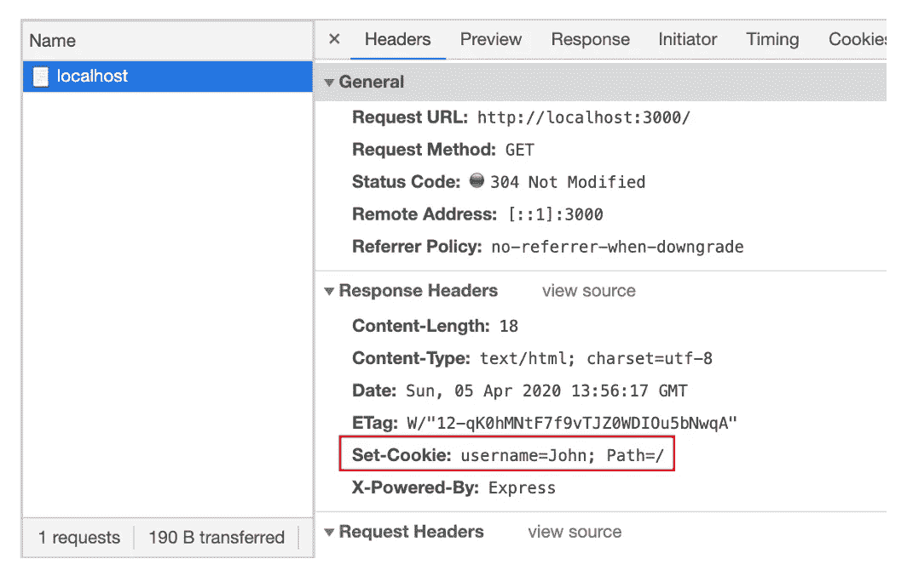
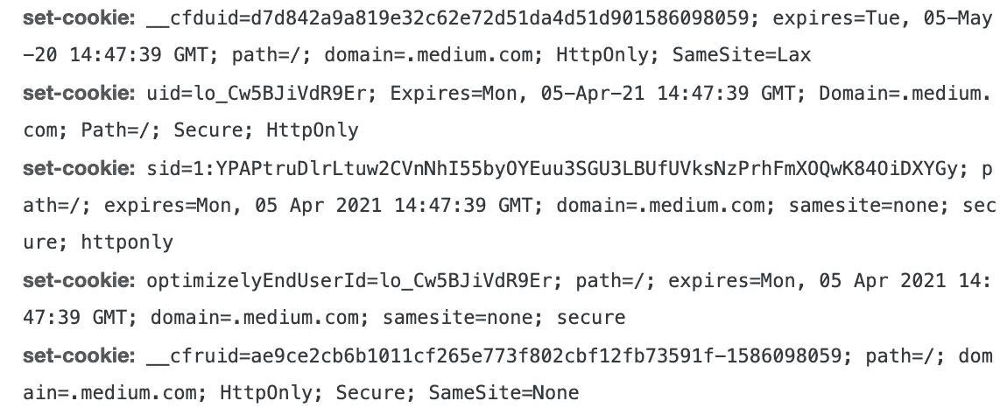
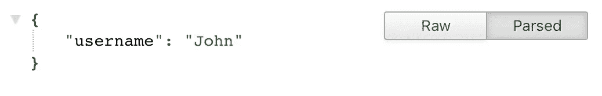
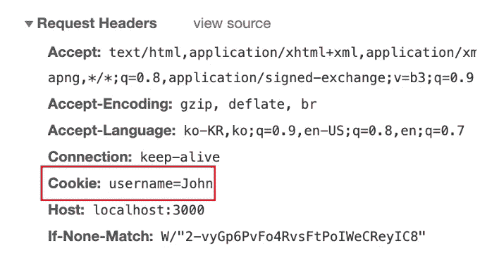
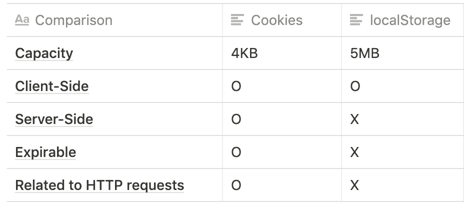

# Cookies vs LocalStorage —为您的采访提供条理清晰的答案

> 原文：<https://javascript.plainenglish.io/cookies-vs-localstorage-organized-answer-for-your-interview-54018e0f5a1e?source=collection_archive---------1----------------------->

## Java Script 语言

## 它们非常相似，但也完全不同


Photo by [Rai Vidanes](https://unsplash.com/@raividanes?utm_source=medium&utm_medium=referral) on [Unsplash](https://unsplash.com?utm_source=medium&utm_medium=referral)

各位，你们知道什么是 cookies，什么是 localStorage 吗？当我被要求解释他们的差异时，我无法真正知道答案。后来，我做了一些研究，做了一些实践的例子，我可以把握每个概念。

但是，我不希望你们所有人，我的订阅者，像我一样被冻结在面试官面前。

我带来了一些例子和一个简短的解释，以便你在记忆中更长久地记住它们。

# 阅读前

本文假设您已经了解什么是 Node，以及如何使用 express 设置非常基本的服务器示例。

# 什么是 Cookies？

当网络技术不像最近这些天的技术那么好的时候，就没有一个 ***好的*** 方法来存储客户端数据。开发人员可以将数据存储在某种东西中，称为 Cookies。

饼干很方便。它给了他们 4KB 的存储空间。开发人员可以在其中存储任何数据，只要他们为想要存储的值输入密钥字符串。此外，它还具有到期日功能。

使用 cookies 的一个好处是服务器端和客户端可以通过它相互通信。

## 从服务器端

假设您团队中的后端开发人员希望使用 Node 向客户端发送一些数据。

```
npm i -D express cookie-parser
```

`cookie-parser`帮助您向客户端发送 cookie，并以更简单的方式从客户端解析 cookie。

```
const app = require('express')();app.get('/', (req, res) => {
  res.cookies('username', 'John');
  res.send('welcome to express');
});
```

假设端口为 3000，如果您访问`/`，您将看到消息。


现在，使用`cmd` + `opt` + `i`打开开发者工具，如果你是 Mac 用户，点击网络标签。详见`localhost`信息。



你在回复标题中看到`Set-Cookie`了吗？这是来自我们的快递服务器。


当客户端收到来自服务器的响应时，所有 cookies 会自动存储在浏览器中。当然，您可以将多个 cookies 发送到客户端。例如，当您访问 Medium 的`/`时，您将看到来自服务器的几个 cookies。



They are from the Medium’s server-side

它们都来自`Medium`的服务器。它们都存储在浏览器中。

## 来自客户端

回到我们简单的 express 应用程序，让我们看看如果您想要将 cookies 从客户端发送到服务器端，您应该做什么。

这很简单。您所需要做的就是在 cookie 中设置要发送到服务器端的数据。

我将 express 应用程序的代码添加如下。

```
app.get('/cookies', (req, res) => {
  res.send(req.cookies);
});
```

现在，让我们进入`/cookies`。



I’m using JSON-formatter the Chrome extension

我没有在客户端做任何事情，但我可以从服务器上看到 cookies？打开开发工具中的网络选项卡，检查 HTTP 请求头。



The cookie data has sent to the server automatically

`{ username: 'John' }`是在`/`的响应头中的 cookie，这是前一个链接。正如我说过的，数据`Set-Cookie`储存在你的浏览器里。cookie 的另一个特性是浏览器 cookie 包含在每个发送给服务器的请求头中。虽然您没有做任何事情，但是如果您的浏览器在 cookies 中保存了一些数据，它会在每个请求中通过标头发送到服务器。

# 何时使用 Cookies？

现在你应该知道 cookies 对于浏览器与服务器的通信是很有用的。但是，您不应该在 cookies 中包含安全敏感的信息，因为任何人都可以看到这些数据，例如您的帐户密码，当然您不会这样做。

MDN 说使用 cookies 有三个主要目的。

*   会话管理
    ——登录、购物车、游戏分数或者服务器应该记住的任何东西
*   个性化
    -用户偏好、主题和其他设置
*   跟踪
    -记录和分析用户行为

另一个例子是，您的网站应该支持国际化的 i18n，因此您向服务器发送请求以获取所有相关数据。此时，您可以通过`{ lang: 'en' }`在标题中设置 cookies。然后服务器可以解析您的请求 cookies 并做适当的事情。

# 什么是 localStorage？

Cookies 对于存储数据来说非常方便。但是，当您只想在浏览器中使用数据时，这不是最佳选择。因为 cookies 是通过每个 HTTP 请求发送到服务器的。

所以，新的网络功能发布了——本地存储。localStorage 可以像 cookies 一样存储基于键值的数据。你可以通过`window`对象访问它，这意味着，无论如何你都不能在服务器端访问它。

# 结论 Cookies 与本地存储有何不同？



There are more differences further than this

您可能会说 localStorage 与 cookies 相比没有优势，但是您应该记住使用 localStorage 的目的是只在客户端保存数据。它给你更多的内存空间— 5MB。

**结论** —如果您需要向服务器发送一些与安全性无关的信息，请使用 cookies。您的 cookies 将始终包含在 HTTP 请求的请求头中。否则，如果您的数据不需要发送到服务器，请使用 localStorage。

【JavaScript 简单明了的一句话:我们一直对帮助推广高质量的内容感兴趣。如果您有文章想提交给 JavaScript，请用您的中用户名在[submissions@javascriptinplainenglish.com](mailto:submissions@javascriptinplainenglish.com)发邮件给我们，我们会将您添加为作者。

# 资源

*   [HTTP Cookies-MDN](https://developer.mozilla.org/en-US/docs/Web/HTTP/Cookies)
*   [窗口 local storage-MDN](https://developer.mozilla.org/en-US/docs/Web/API/Window/localStorage)
*   [local storage vs cookies-Stackoverflow](https://stackoverflow.com/questions/3220660/local-storage-vs-cookies)