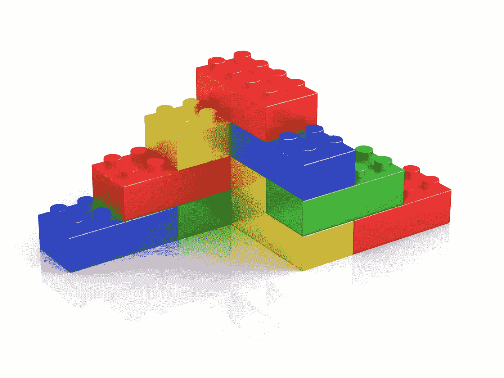
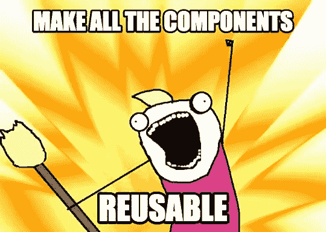

# Web 组件可以补充 JavaScript 框架的五个原因

> 原文：<https://javascript.plainenglish.io/could-web-components-actually-compliment-javascript-frameworks-5-reasons-why-i-think-so-971eee82ee85?source=collection_archive---------1----------------------->



所以有人说“ *web 组件是未来”* …但是，是的，自从 2011 年首次引入以来，我们已经听到了这些抱怨——而且(就网络开发而言)是在许多个月前！

# 什么是 web 组件？

从概念上来说，“web”组件并不是一个新事物——它们创建了可重用的组件——这就是像 Angular/React/Vue 这样的前端框架如此受欢迎的原因。

****免责声明:我知道 React 是一个*库*而不是一个*框架*，但是出于本文的目的，我将它称为框架****

此外，web 组件不提供任何比 UI 层更深的东西(*为什么要提供*)，所以开发人员已经把自己投入到像 Angular 和 Vue.js 这样的 JS 框架中。

事实上，对 web 组件的吸收相当缓慢，但最近有所增加，主要是由于浏览器支持的改进。

# 它们是如何工作的？

下面是一个如何定义 web 组件的示例:

```
class MyWebComponent extends HTMLElement {...}window.customElements.define('my-web-component', MyWebComponent);
```

下面简单介绍一下它们是如何实现的:

`<my-web-component value="something"></my-web-component>`

*有关 web 组件的更多信息，请查看此链接:*

[](https://www.webcomponents.org/introduction) [## 简介-webcomponents.org

### Web 组件是一组 web 平台 API，允许您创建新的自定义的、可重用的、封装的 HTML 标记，以…

www.webcomponents.org](https://www.webcomponents.org/introduction) 

# 当其他人把 web 组件说成是对 React/Angular/Vue 的威胁时，他们有可能真的赞美它们吗？

不要害怕，这不是另一个关于框架与框架或者框架与 web 组件的比较，我鄙视那些对话…如果我们一起努力，世界不是会变得更美好吗？

以下是我认为 web 组件实际上可以补充大型框架的 5 个原因:

# **1。Web 组件是标准的**

Web 组件的一个主要优势是它是包含在 HTML 规范中的一个定义好的标准。

有多少次我们和一些大人物一起开会，而他们却很难达成一致？Web 组件不再需要做出决定，因为标准已经在 HTML 规范中设定好了。

在这种情况下，web 组件能迫使大型框架遵守规则并努力采用标准吗？


# **2。Web 组件兼容**

我们已经确定 web 组件是 HTML 规范中的一个标准，所以这也意味着它们有本地支持。

由于它们是原生的，这就意味着它们与大框架兼容。

没有一个大的框架可以避免支持 HTML ( *因为这需要在浏览器中呈现*)，因此对 web 组件的支持是有保证的。

现在我们可以构建跨多个框架使用的可重用组件！

而且——因为它只是 HTML、CSS、JS——不需要复杂的翻译！


# **3。Web 组件很简单**

Web 组件除了提供一种用一些花哨的封装创建可重用组件的方法之外，没有做太多事情。

他们并不坚持你应该如何构建你的代码。它们不提供状态管理、数据绑定甚至组件间通信。

使用 web 组件来创建可重用的组件，并允许您的框架来处理其余部分。



# **4。Web 组件被视为**

有趣的是，所有的大玩家似乎都赞同 web 组件的想法，或者至少在考虑它们。

本文摘自[官方 React 在线文档](https://reactjs.org/docs/web-components.html):

*React 和 Web 组件是为了解决不同的问题而构建的。Web 组件为可重用组件提供了强大的封装，而 React 提供了一个声明性库，使 DOM 与数据保持同步。这两个目标是互补的。作为开发人员，您可以自由地在您的 Web 组件中使用 React，或者在 React 中使用 Web 组件，或者两者都使用。*

React 非常支持这个观点，但是 Angular 呢？

截至 Angular 6，Google 已经包含了 [Angular 元素](https://angular.io/guide/elements)，这是他们自己对… *是的，你已经猜到了* … web 组件。在 Angular 中，你现在可以将你的角度组件定义为自定义元素，就像本文开头所展示的那样。

这意味着您可以在任何 web 应用程序中使用 Angular 组件，方法是将它们作为自定义元素包含进来。*查看这篇文章了解更多:*

[](https://medium.com/@kitson.mac/wrapping-an-angular-app-in-a-custom-element-web-component-angular-element-in-4-simple-steps-ded3554e9006) [## Angular 元素(web 组件)-将 angular 应用程序包装在自定义元素中

### 在这篇文章中，我将介绍如何将整个 Angular 应用程序作为 Web 定义的自定义元素来提供服务…

medium.com](https://medium.com/@kitson.mac/wrapping-an-angular-app-in-a-custom-element-web-component-angular-element-in-4-simple-steps-ded3554e9006) 

# **5。Web 组件是未来的趋势**

我目前在一家大型金融科技公司工作，该公司有许多广泛分布的应用程序。

如果它们可以被移植到一个单一的内聚用户体验中，不管它们是原生的 Javascript、jQuery、React 还是 Angular 等等，会怎么样？

Web 组件可以为此类组件提供本机包装，允许它们共存于单个页面中。

每个应用程序可以在构建和部署过程中完全解耦，但是它们的组件被定义为 web 组件。

现在，您可以让许多应用程序团队使用 web 组件为一个具有强大封装的应用程序做出贡献。


> 感谢您花时间阅读我的文章。