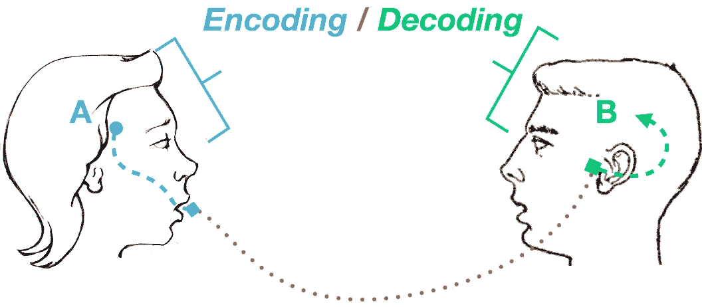

# 破解 JavaScript 编码面试

> 原文：<https://javascript.plainenglish.io/cracking-coding-interview-javascript-strings-8c26fb043cd8?source=collection_archive---------8----------------------->

## 第 1 部分:字符串

这是帮助您准备应对编码挑战的系列文章的第一部分。在本文中，我将重点讨论与 JavaScript 字符串相关的问题。

**先决条件:**在继续之前，我假设您应该对 JavaScript 有基本的了解。至少你应该知道它是如何工作的。

**注:** *这不是一本* [*格利 _ 拉克曼*](https://en.wikipedia.org/wiki/Gayle_Laakmann_McDowell) *的书。这本书太棒了。我一有时间就喜欢读它。然而，一些样本/问题取自该书。虽然这本书用 Java 解决了问题，但我已经用 JavaScript (TypeScript)解决了同样的问题。*

**字符串**:字符串是唯一的，几乎用于所有数据集。JavaScript 字符串很简单，不太复杂。然而，这也是 JavaScript 的问题。如果你不注意，它会导致记忆问题。在这里，我挑选了一些容易和常见的字符串问题。

## **1。是唯一的**

*对于给定的字符串，查找该字符串中所有的字符都是唯一的。*

有很多方法可以解决这个问题。最简单的使用字符的**映射**。遍历字符串中的所有字符，并在 map 中设置它。如果地图已经有了那个字符，函数返回 false。

```
export const isUniqueChars = (txt = "") => {
  const chars = new Map<string, true>();
  for (let i = 0; i < txt.length; i++) {
    if (chars.has(txt.charAt(i))) return false;
    chars.set(txt.charAt(i), true);
  }
  return true;
};console.log(isUniqueChars("background")); // true
console.log(isUniqueChars("bawdyhouse")); // true
console.log(isUniqueChars("rhythm")); //false
```

您也可以使用 ES6/ES2015 操作器来解决这个问题。

```
export const isUniqueChars2 = (txt = "") => {
  const chars = new Map<string, true>();
  // [...txt] is equivalent of Array.from(txt)
  return ![...txt].some((char) => {
    if (chars.has(char)) return true;
    chars.set(char, true);
  });
};
console.log(isUniqueChars2("background")); // true
console.log(isUniqueChars2("bawdyhouse")); // true
console.log(isUniqueChars2("rhythm")); //false
```

## **2。检查排列**

*给定两个字符串，找出一个字符串是否被置换成另一个字符串。即****ABC****和****ACB****相互置换。*

最简单的解决方案，您可以对字符串进行排序并匹配两个字符串。

```
const sort = (str: string) => [...str].sort().join();export const isPermuted = (str1: string, str2: string) => {
  if (str1.length !== str2.length) return false;
  return sort(str1) === sort(str2);
};console.log(isPermuted("abc", "acb")); // true
```

上面的解决方案很简单，但不是很有效。排序算法的复杂度为 ***n log(n)。我们可以通过计算字符数来解决这个问题。保留一个字符串中所有字符的计数，并与另一个字符串中字符的计数相匹配。如果不匹配，给定的字符串就不是其他字符串的排列。***

```
export const isPermuted2 = (str1: string, str2: string) => {
  if (str1.length !== str2.length) return false;
  // map to keep count
  const chars: { [key: string]: number } = {}; for (let i = 0; i < str1.length; i++) {
    if (!chars[str1.charAt(i)]) chars[str1.charAt(i)] = 0;
    chars[str1.charAt(i)]++;
  } for (let i = 0; i < str2.length; i++) {
    if (!chars[str2.charAt(i)]) chars[str2.charAt(i)] = 0;
    chars[str2.charAt(i)]--;
    if (chars[str2.charAt(i)] < 0) return false;
  }
  return true;
};console.log(isPermuted2("abc", "acb")); // true
console.log(isPermuted2("abc", "acd")); // false 
```



## **3。URLify/encodeURI**

*给定字符串用其编码值替换所有特殊字符。*

是的，你可以使用**编码组件**来编码特殊字符。然而，这个例子对于构建 util 来编码任何类型的字符串都非常有用。

```
// map to keep track of all special charsconst specialChars: { [k: string]: string } = {
  "@": "%40",
  " ": " %20",
  "#": "%23",
  "%": "%25",
  "^": "%5E",
  "&": "%26",
  ":": "%3A",
  "<": "%3C",
  ">": "%3E",
};export const encodeString = (txt = ""): string => {
  // /\W/g is reg to find not Alphabetic chars

  return txt.replace(/\W/g, (m) => specialChars[m] || "");
};console.log(encodeString("<name:deepak>")); // %3Cname%3Adeepak%3E
```

你可以使用同样的技术来构建一个表情符号文本生成器。

```
const emojiChars: { [k: string]: string } = {
  love: "💚",
  india: "🇮🇳",
  i: "ℹ️",
};
const WORD_REG = /(\w+)/g;
export const encodeString2 = (txt = ""): string => {
  return txt.replace(WORD_REG, (_, m) => emojiChars[m.toLowerCase()] || "");
};console.log(encodeString2("I love India")); // ℹ️ 💚 🇮🇳
```

在上面的解决方案中，我使用正则表达式来标记单词，并用它们的表情符号替换它们。


## **4。字符串压缩**

写一个程序来压缩一个字符串，用它的计数代替重复的字符。即。***aaabbbbb****=>****a3 B4***。

这个问题的解决方案既复杂又简单。我们可以使用 match and repeat regex 来对**字符串进行标记化，并用 HOC 函数替换**字符串的**方法。**

```
export const compress = (txt = "") => {
  return txt.replace(**/(\w)(\1+)/g**, (_, m1, m2) => `${m1}${m2.length + 1}`);
};console.log(compress("aaabbbb")); // a3b4
```

另一个解决方案是，遍历字符并计算连续的字符。 ***/(\w)(\1+)/g*** 是查找所有字符并匹配重复 **(\1)** 的正则表达式。 *`\1`* 表示重复先前匹配的字符

## **5。缩写**

*创建一个缩写函数，取一个字符串并返回一个字符串，同时取* ***第一个*** *和* ***最后一个*** *char 并用 char 的个数替换剩余的 char。比如* ***国际化*** *就会变成****i18n****。*

```
const abbrev = (text: string = "") => {
  if (text.length < 3) return text;
  const first = text.charAt(0);
  const last = text.slice(-1);
  const remLen = text.length - 2;
  return `${first}${remLen}${last}`;
};console.log(abbrev("internationalization")); // i18n
```

在上面的解决方案中，我使用方法 [String.charAt](https://developer.mozilla.org/en-US/docs/Web/JavaScript/Reference/Global_Objects/String/charAt) 和 [String.slice](https://developer.mozilla.org/en-US/docs/Web/JavaScript/Reference/Global_Objects/String/slice) 分别获取第一个和最后一个 char。我们可以用 charAt 代替*切片*。但在这种情况下，我们需要找到最后一个指数，并做一些计算。我还使用 ES2015 [模板字符串](https://developer.mozilla.org/en-US/docs/Web/JavaScript/Reference/Template_literals)来追加字符串。

让我们在添加更多边缘案例的同时，让这个变得复杂一点。让我们来转换这个函数，它可以接受由特殊字符分隔的一组单词。即*我爱 javascript！*会变成 *I l2e j8t！*

```
const word = /\w+/g;
const abbrevPlus = (text: string = "") => {
  return text.replace(word, (matched: string) => abbrev(matched));
};console.log(abbrevPlus("I love javascript!")); // I l2e j8t!
```

在上面的解决方案中，我们使用了 [String.replace](https://developer.mozilla.org/en-US/docs/Web/JavaScript/Reference/Global_Objects/String/replace) 方法，该方法接受一个 RegExp 和一个[回调函数/高阶函数](https://developer.mozilla.org/en-US/docs/Glossary/First-class_Function)来查找所有有效单词并替换为其缩写。很好！看起来比分裂和连接更简单。

希望你会喜欢这篇文章，如果你有一些常见的问题需要解决，请告诉我。