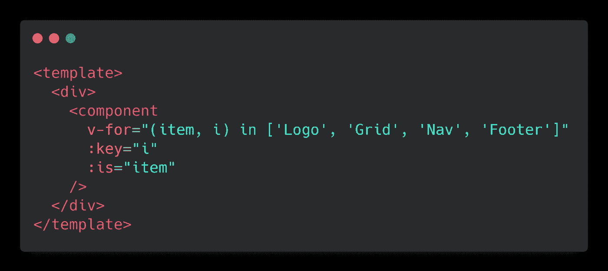
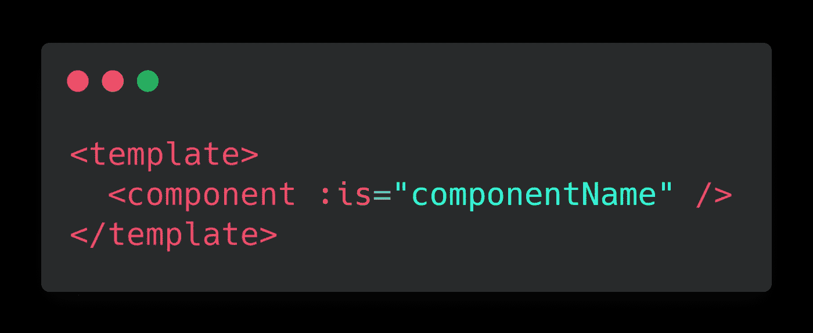
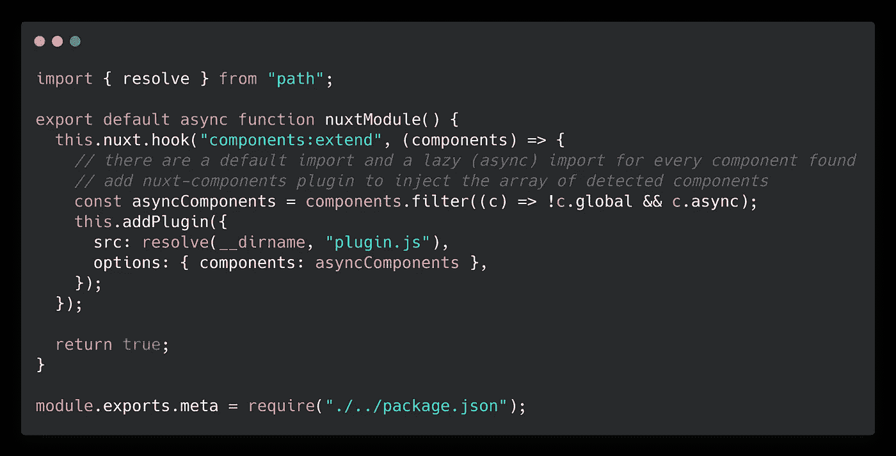
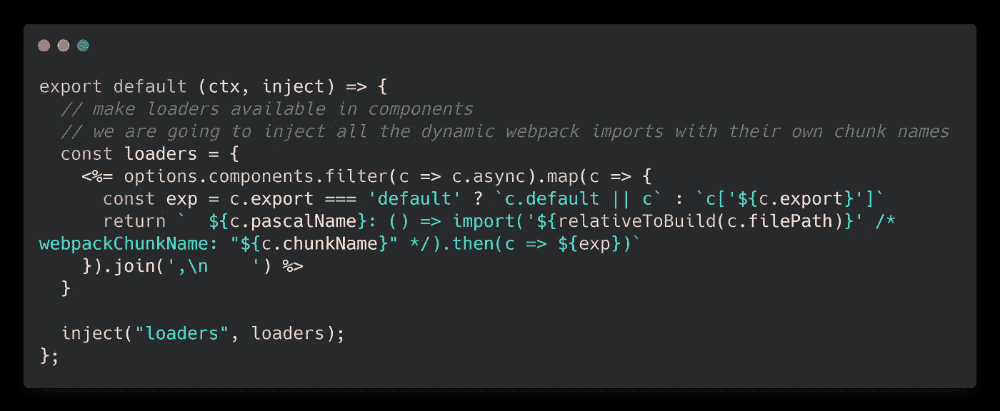
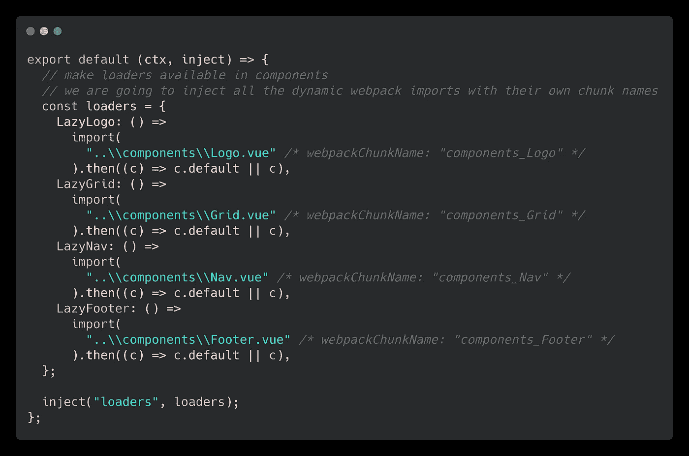
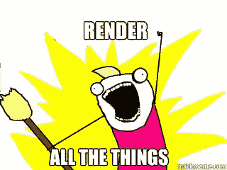
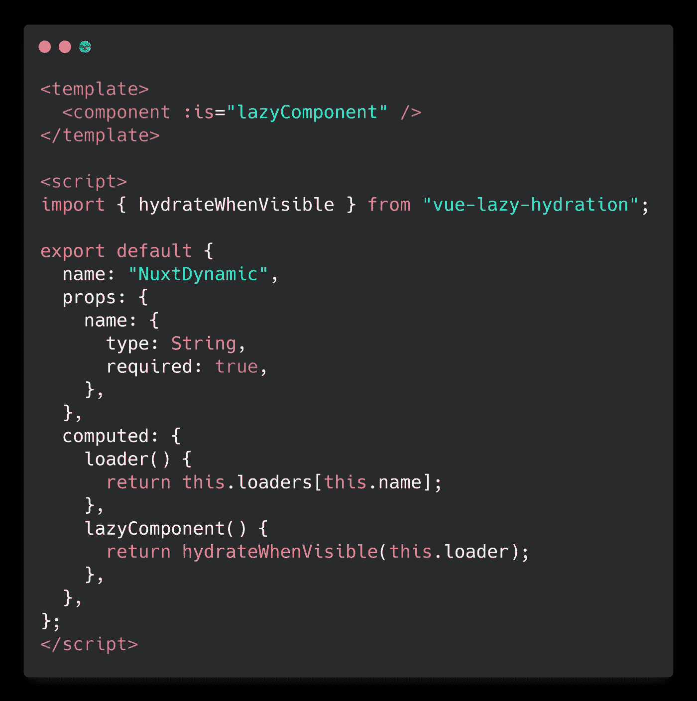
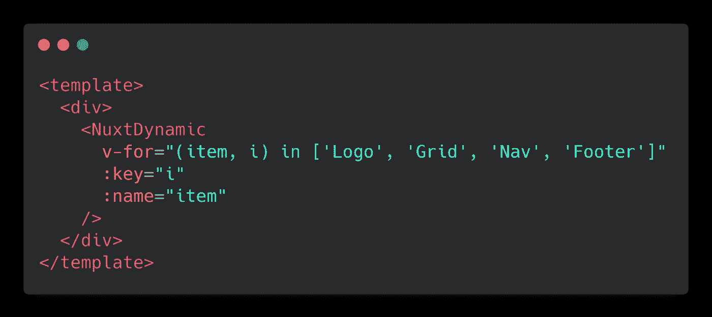

# 启动动态 Nuxt.js 组件的自动导入

> 原文：<https://javascript.plainenglish.io/crank-up-auto-import-for-dynamic-nuxt-js-components-54e7f198fc16?source=collection_archive---------1----------------------->

## 自动导入所有的东西🚀

回到过去，我们常常将所有这些组件导入到每个单独的`.vue`文件中——一次又一次地导入和注册它们变成了一项乏味的任务。

然后令人敬畏的 [Nuxt.js](https://medium.com/u/20f059d252cc?source=post_page-----54e7f198fc16--------------------------------) 团队发布了`@nuxt/components`来自动导入项目和第三方库特定的组件🚀不再需要进口了。不再注册组件。

就这样！干净的项目，干净的组件，干净的网络包块。

至少我是这么认为的。

# 无头 CMS 呢？

在我们的数字代理公司，我们有一大堆使用无头 CMS 的项目— [童话镇](https://www.storyblok.com/)就是其中之一。故事板让开发人员和客户可以自由地以所有可能的方式**嵌套组件——动态地***。*

*所以我们想**动态加载组件***。**

****

**we wanted to load the world, **dynamically****

# **没有。**

**在本文撰写之时，这是不可能的——至少在《T2》已经面世的情况下是不可能的(《T21》第 43 期)。**

**所以我决定挖掘一些代码——让我们看看这个 Nuxt.js 模块是如何工作的。**

****

**看起来该模块基于传递给`components:dirs`钩子的内容获取组件。**

**它准备了一个包含组件名称(PascalCase 和 kebb-case)及其相对文件路径的组件数组。**

**第二步，将扫描所有`.vue`文件，以加载给定模板中使用的组件(并导入这些组件)。**这就是为什么动态组件的自动导入根本不起作用的原因**。**

****

**Nuxt.js **does not auto import** dynamic components**

**回到根-手动导入所有这些组件*？**所有的 14328 种可能性？*****

## ***不可能。***

***好吧，那么——让我们试着想办法解决这个问题。***

******

# ***潜在的魔力***

***好吧，如果我们传递一个导入的 vue 组件的组件名**或者传递组件本身**，就可以渲染一个动态组件。*记住* : `@nuxt/components`知道自动导入机构的每个相对路径。所以，如果我们能让**动态 webpack 导入与那些路径**一起在一个组件中可用，我们就能加载它的子组件。***

## **救援插件**

**当我们构建一个模块时，我们能够挂钩到`components:extend`钩子并获取所有的组件名称。**

****

**module.js**

**现在我们**为插件中的所有组件构建动态导入语句**，插件将加载器注入每个 vue 组件。**

****

**dynamic webpack import for for one component**

**这可以翻译成这样:**

****

**plugin.js**

**这很简单，阿米利特？**

## **水合所有的东西**

****

**现在有可能**执行注入的异步导入**来加载特定的组件——我们将使用`vue-lazy-hydration`来这样做(非常感谢 [Markus Oberlehner](https://medium.com/u/5dda6d1399ef?source=post_page-----54e7f198fc16--------------------------------) )。**

****

**our new **NuxtDynamic** component**

**在执行惰性导入之后，可以将加载的组件传递给:is prop。`NuxtDynamic`现在可以用来自动导入每一个动态组件。**

****

****auto import** dynamic components**

**就这样，我们做到了！ **Nuxt.js 自动导入动态组件**🚀**

**可以在 [github](https://github.com/blokwise/dynamic) 上找到一个简洁精炼的版本，并作为 [npm 包](https://www.npmjs.com/package/@blokwise/dynamic)安装。**

**`@blokwise/dynamic`的**正式文件**可以在 [dynamic.blokwise.io](https://dynamic.blokwise.io) 找到。**

** [## 介绍

### 让 nuxt.js 自动轻松地为您的动态组件添加水分。

dynamic.blokwise.io](https://dynamic.blokwise.io)  [## 博客/动态

### 阅读官方文档将@blokwise/dynamic dependency 添加到您的项目:yarn Add @ blok wise/dynamic NPM install…

github.com](https://github.com/blokwise/dynamic)  [## @blokwise/dynamic

### 阅读官方文档将@blokwise/dynamic 依赖项添加到您的项目中:然后，将@blokwise/dynamic 添加到模块中…

www.npmjs.com](https://www.npmjs.com/package/@blokwise/dynamic)**