# 用 WordPress 和 Gatsby 创建一个博客——第 1 部分

> 原文：<https://javascript.plainenglish.io/create-a-blog-with-wordpress-and-gatsby-part-1-a4d78a93a28d?source=collection_archive---------7----------------------->

我爱盖茨比。我喜欢 WordPress。我喜欢盖茨比和 WordPress。今年早些时候，我利用现有的 WordPress 网站建立了几个网站，我为这两个网站管理和创建了全新的设计和前端体验。在这个系列中，我将带你经历整个事情——我们将建立一个新的网站，使用 WordPress 作为 Gatsby 的无头 CMS。我将从头开始，所以如果你对 Gatsby 或 WordPress 一无所知，希望这能让你轻松上手。如果没有，让我知道我能帮你什么！

# 第 1 部分—基础

假设你已经决定要为自己或客户建立这类网站。一切都是新的。一个域名，托管，一个崭新的开始。如果你没有重新开始，你可以跳到任何有意义的地方。

# 假设

你已经购买了一个域名(我喜欢用 [NameCheap](https://www.namecheap.com/)

你有一个托管 WordPress 站点的地方(理想情况下是你购买域名的地方)，而且它已经安装好了。

我们正在创建的网站将是 [kaleigh.tech](https://kaleigh.tech/) 和 WordPress 网站将在 [wp.kaleigh.tech](https://wp.kaleigh.tech/) 托管。你的 WordPress 站点在哪里并不重要，它可以是一个子域或者顶级域。

# WordPress 网站

不管你有很多内容还是什么都没有，你都会想在你的 WordPress 站点上安装 3 个插件。我们现在不打算把它们连接起来，因为我们没有任何东西可以指引它们，但是让我们提前把它设置好。

# 安装插件

[wp-trigger-netlify-build](https://github.com/iamtimsmith/wp-trigger-netlify-build)

[wp-graphql](https://github.com/wp-graphql/wp-graphql)

[WP-盖茨比](https://github.com/gatsbyjs/wp-gatsby)

安装这三个插件，你就可以开始激活它们了。

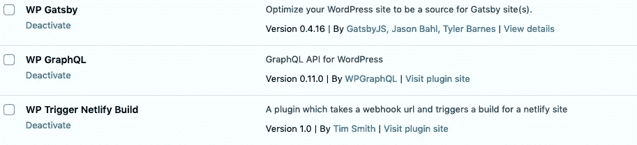

因为我是为这个教程创建这个站点的，所以我在我的 WordPress 站点上填充了一些虚拟页面和帖子。

# 启动并运行 Gatsby(本地)

现在让我们换个方式，让盖茨比重新振作起来！Gatsby 有很棒的文档，如果您还没有查看它们，请打开一个新标签，看看它们的[步骤 0 页面](https://www.gatsbyjs.org/tutorial/part-zero/)，以确保您的环境已经准备就绪。一旦你到达“使用 Gatsby 命令行界面”，回到这里。

让我们创建我们的盖茨比网站！有许多首发可供选择，但让我们选择[盖茨比首发默认](https://github.com/gatsbyjs/gatsby-starter-default)。我将把我的 repo 命名为 kaleigh-tech-tutorial，但是你可以随意命名！

`gatsby new kaleigh-tech-tutorial [https://github.com/gatsbyjs/gatsby-starter-default](https://github.com/gatsbyjs/gatsby-starter-default)`

一旦网站安装完毕，让我们进入目录并运行网站，以确保它的工作。

`cd kaleigh-tech-tutorial`

`gatsby develop`

如果一切正常，您应该看到以下内容:

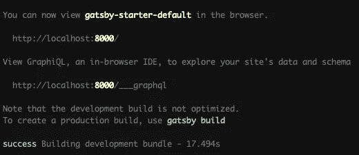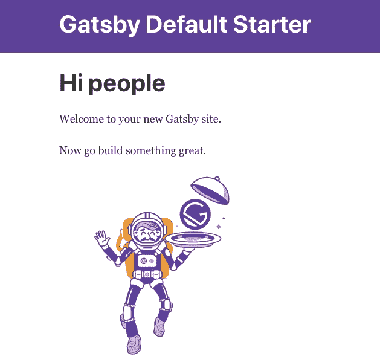

哇，你的本地网站已经上线了！

让我们让它活起来！我个人喜欢使用 GitHub 桌面来管理我的本地回购，因为我可以很容易地看到一切。

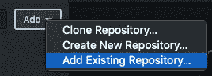

你也可以去 [GitHub 创建一个新的 repo](https://github.com/new) ，然后按照那里的步骤操作。我的回购现在是[这里](https://github.com/klgh/kaleigh-tech-tutorial)。

让我们看看 Netlify 有多棒！

# 设置网络生活

前往 Netlify 网站，如果你没有账户，就注册吧(这是免费的)。如果有，请登录，并确保 GitHub 已连接。

由于我们使用的是 GitHub repo，请点击 GitHub:

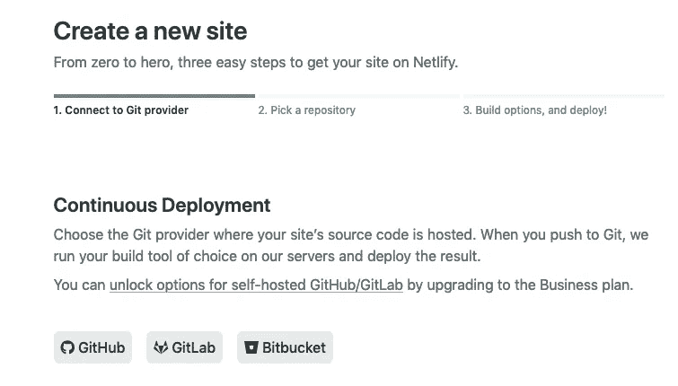

找到您刚刚创建的回购，然后单击它:

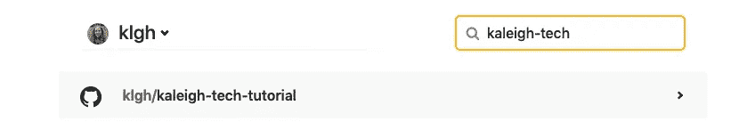

我们就用默认值吧:

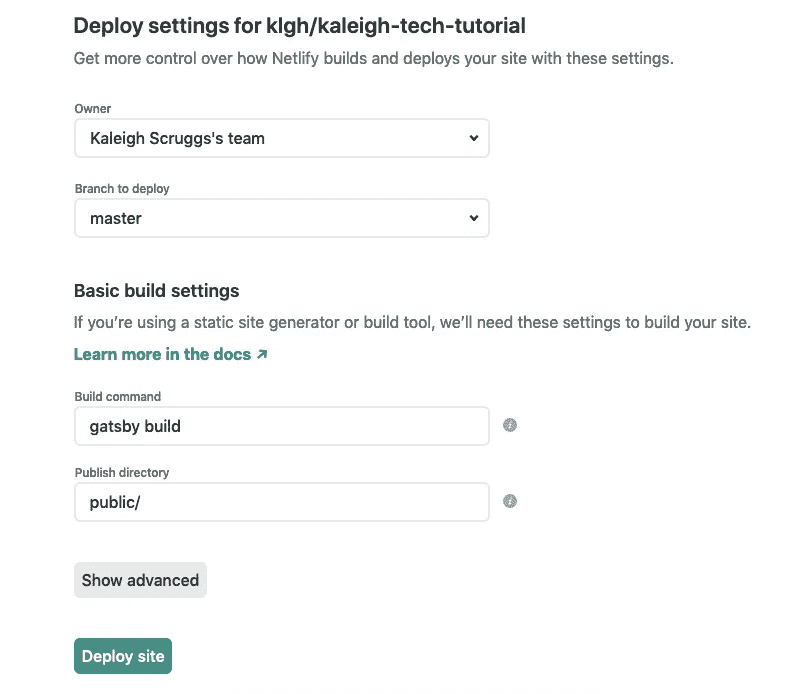

现在我的网站正在建设中！

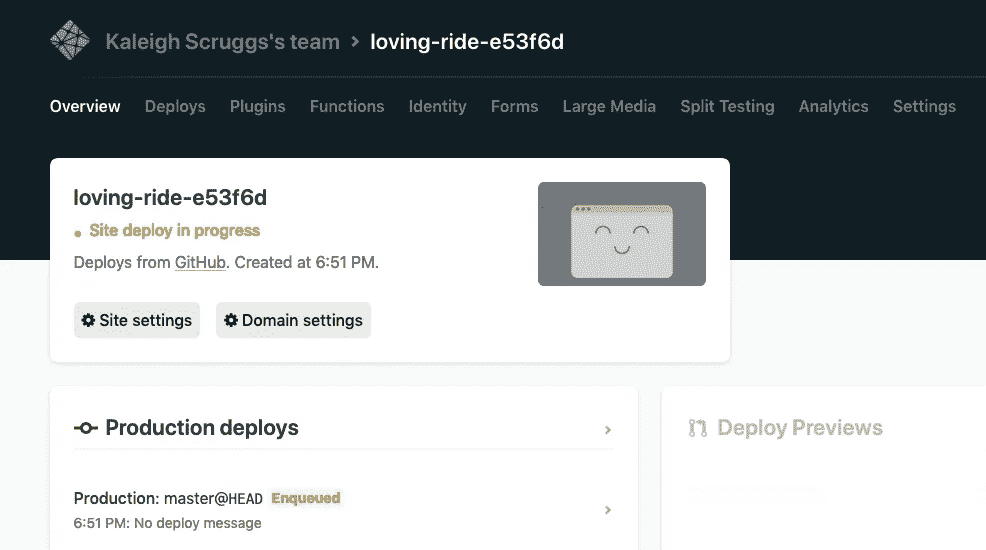

正如您将看到的，您将拥有一个不同的命名 repo。不要担心，你可以以后再改(如果你想的话)。有时候名字很搞笑！

它不应该需要太长时间来建立您的网站。现在你可以检查一下了。我的网站在这里:[https://loving-ride-e53f6d.netlify.app/](https://loving-ride-e53f6d.netlify.app/)

让我们改变网络生活中的一些事情。首先，我会将我的应用程序的名称改为与我的 GitHub repo 相同的名称，以保持一致。

# 网络构建

在 Netlify 页面的顶部，点击设置，然后点击“更改网站名称”

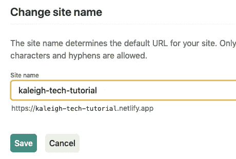

现在我的网站在 https://kaleigh-tech-tutorial.netlify.app/运行

Netlify 的一个巧妙之处在于，你可以在你的自述文件中添加一个徽章来显示你的站点状态。我们也可以把它添加到我们的 WordPress 网站上。还记得我们安装的 Netlify 插件吗？

在同一个设置页面上，向下滚动到状态标记部分:

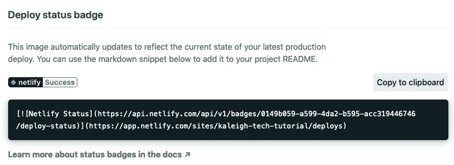

点击“复制到剪贴板”,进入你的文本编辑器，我们可以编辑你的自述文件。

我把它贴在我的自述文件的第 11 行:

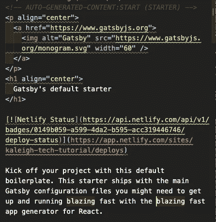

现在让我们来看看我们的 WordPress 仪表盘。在左侧点击“Netlify Build”，它将朝向菜单项的底部。

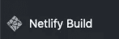

你会看到我们需要添加 3 个链接。

第一个是我们的构建钩子。回到 Netlify，进入设置，然后在左边点击“构建和部署”,找到构建钩子。创建一个新的挂钩，并使用该链接粘贴到 WordPress。

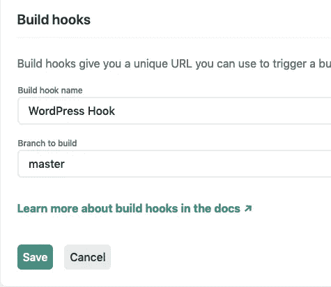

二是地位形象。那个链接应该是我上面截图的绿色文字:[https://API . netlify . com/API/v1/badges/0149 b059-a599-4d a2-b595-ACC 319446746/deploy-status](https://api.netlify.com/api/v1/badges/0149b059-a599-4da2-b595-acc319446746/deploy-status)

第三是状态链接。该链接将是上面截图中的红色文本:【https://app.netlify.com/sites/kaleigh-tech-tutorial/deploys

现在你应该有所有 3 个链接

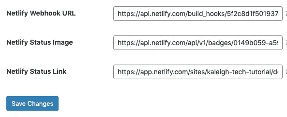

点击保存更改。这将允许你在 WordPress 上更新内容时创建一个新的部署。

当你准备好了，你可以看看[第二部分——连接](https://medium.com/@kaleighscruggs/create-a-blog-with-wordpress-and-gatsby-part-2-6e6f121bc232)！

